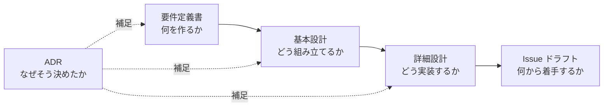

# ドキュメント地図

575（五七五でしか投稿できない SNS）の設計ドキュメント一覧です。
**初めて読む場合は上から順に読むことを想定しています。**

---

## 読む順序

---

## 1. 要件定義

| ドキュメント | 内容 | 状態 |
| --- | --- | --- |
| [01-requirements.md](requirements/01-requirements.md) | 背景・コンセプト・想定する利用者・ユースケース・機能要件・非機能要件・用語集・スコープ | ✅ 完了 |

## 2. 基本設計

| ドキュメント | 内容 | 状態 |
| --- | --- | --- |
| [01-architecture.md](design/basic/01-architecture.md) | システム構成図・コンポーネントの責務・依存の方向・縮退運転 | ✅ 完了 |
| [02-domain-model.md](design/basic/02-domain-model.md) | ドメインモデル・状態遷移図・ビジネスルール | ✅ 完了 |
| [03-database.md](design/basic/03-database.md) | ER 図・テーブル定義・インデックス設計・カーソルページネーション | ✅ 完了 |
| [04-screens.md](design/basic/04-screens.md) | 画面一覧・画面遷移図・投稿作成画面の設計 | ✅ 完了 |
| [05-api.md](design/basic/05-api.md) | API 一覧・エラー形式・ステータスコードの使い分け | ✅ 完了 |

## 3. 詳細設計

| ドキュメント | 内容 | 状態 |
| --- | --- | --- |
| [01-prosody-algorithm.md](design/detail/01-prosody-algorithm.md) | モーラ分割規則・区切り探索・スコアリング・既知の限界 | ✅ 完了 |
| [02-class-design.md](design/detail/02-class-design.md) | クラス図・シーケンス図・排他制御 | ✅ 完了 |
| [03-error-handling.md](design/detail/03-error-handling.md) | エラーの3分類・エラー一覧・ログ設計・サーキットブレーカー | ✅ 完了 |
| [04-test-design.md](design/detail/04-test-design.md) | 同値分割・境界値分析・テストケース一覧・性能テスト | ✅ 完了 |

## 4. 意思決定の記録（ADR）

設計上の分岐点で「どんな選択肢があり、どれを、なぜ選んだか」を1決定1ファイルで残します。
一覧と運用ルールは **[adr/README.md](adr/README.md)** を参照してください。

| # | タイトル | 状態 |
| --- | --- | --- |
| [0001](adr/0001-onsuritsu-tolerance.md) | 字余り・字足らずの許容範囲 | 承認 |
| [0002](adr/0002-tech-stack.md) | 言語・フレームワークの選定とサービス分割 | 承認 |
| [0003](adr/0003-morphological-analyzer.md) | 形態素解析器の選定 | 承認 |
| [0004](adr/0004-hosting-and-infrastructure.md) | ホスティング先とインフラ構成 | **置換**（[0007](adr/0007-hosting-conoha-vps.md)） |
| [0005](adr/0005-timeline-strategy.md) | タイムラインの実現方式 | 承認 |
| [0006](adr/0006-authentication.md) | 認証方式 | 承認 |
| [0007](adr/0007-hosting-conoha-vps.md) | ホスティング先を ConoHa VPS 単一ノードへ変更する | 承認 |

## 5. 性能測定の記録

実測した結果を、再現できる形で残します。数値だけを残しても
「どういう条件だったか」が分からず、後から再現できません。

| ドキュメント | 内容 | 状態 |
| --- | --- | --- |
| [0001-prosody-benchmark.md](perf/0001-prosody-benchmark.md) | 判定エンジンの応答時間・段階内訳・メモリ。NFR-01-01 の検証 | ✅ 完了 |
| [0002-timeline-explain.md](perf/0002-timeline-explain.md) | タイムラインの実行計画。カーソル方式と `OFFSET` の比較、NFR-01-02 の検証 | ✅ 完了 |

## 6. Issue 起票ドラフト

GitHub Issues に起票する前の下書きです。運用ルールと一覧は **[issues/README.md](issues/README.md)** を参照してください。

M0 から M3 までの17件がドラフト済みです。
M2 以降はバックログとして題名のみを列挙しています。

---

## ドキュメントの書き方ルール

このリポジトリのドキュメントは以下のルールに従います。

### 図
- **Mermaid で記述する**。画像ファイルを貼らない。
  - 理由: 差分がテキストで追え、レビュー時に「何が変わったか」が分かるため。
- 図に書ききれなかったことは、図の直後に文章で補足する。**図と文章の両者で1セット**とする。
- クラス実装やテーブルスキーマからの自動生成図は使わない（設計の意図が表現されないため）。

### 文章
- 「誰が読むか」を意識し、読み手が知らない前提を置かない。
- 用語は [要件定義書の用語集](requirements/01-requirements.md#用語集) に集約し、
  各ドキュメントではそこへリンクする。同じ定義を複数箇所に書かない。
- 決定の**結論**は設計書に、決定に至る**過程**は ADR に書く。設計書に迷いを残さない。

### リンク
- 関連するドキュメント間には必ず相互リンクを張る。片方向にしない。
- 「詳細は○○を参照」で済ませず、その場で分かるべきことはその場に書く。

---

## README に追記した項目

実装フェーズの開始にあたり、ルート [README.md](../README.md) へ以下を追記しました。

- [x] 開発に必要な言語・ツールとそのバージョン
- [x] 開発環境の構築手順
- [x] ビルド方法
- [x] ローカル実行方法（`docker compose up` で全サービスが起動すること）
- [x] 設定方法（環境変数・設定ファイル・コマンドライン引数の一覧と既定値）
- [x] テスト実行方法（単体・結合・カバレッジ取得）
- [x] リリース手順（リリース版の作成方法）
