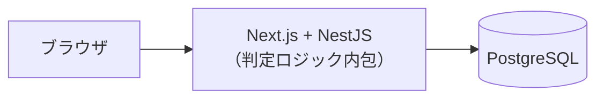
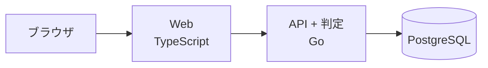
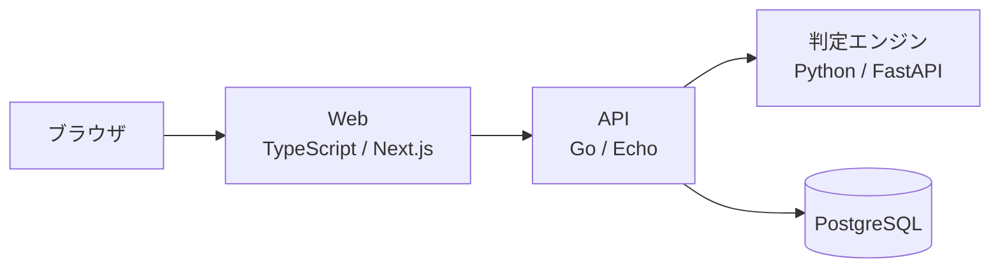
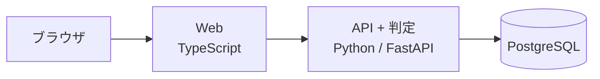
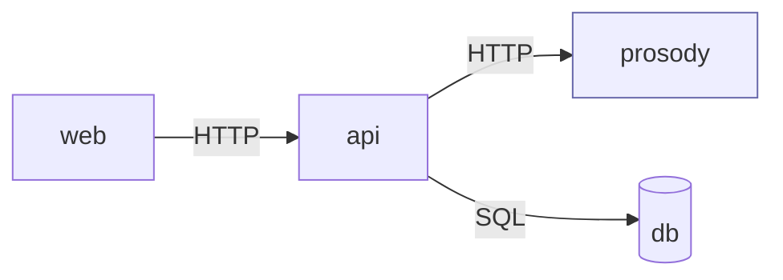

# ADR-0002: 言語・フレームワークの選定とサービス分割

| 項目 | 内容 |
| --- | --- |
| 状態 | **承認** |
| 決定日 | 2026-08-06 |
| 関連 | [要件定義 Q-02](../requirements/01-requirements.md#10-未決事項) / [NFR-02-03](../requirements/01-requirements.md#nfr-02-可用性) / [NFR-03-03](../requirements/01-requirements.md#nfr-03-拡張性) / [ADR-0003](0003-morphological-analyzer.md) |

---

## 1. 背景

575 の実装に使う言語・フレームワークと、**アプリケーションをいくつのサービスに分けるか**を決める。

この2つは分離できない。言語ごとに使える形態素解析器が異なり、
形態素解析器の選択が判定エンジンの実現性を左右するためである。
サービスを分けなければ判定エンジンと API は同一言語になり、選択肢が狭まる。

なお、形態素解析器そのものの比較は [ADR-0003](0003-morphological-analyzer.md) で行う。
本 ADR では「各言語にどの程度の選択肢があるか」というレベルまでを扱う。

---

## 2. 決定を左右する要因

| # | 評価軸 | 出典 |
| --- | --- | --- |
| A | **判定エンジンの実現性** — 日本語形態素解析・読み推定の資産が十分にあるか | [3.1 プロダクトの中核](../requirements/01-requirements.md#31-プロダクトの中核) |
| B | **判定エンジンを独立してスケールできるか** | [NFR-03-03](../requirements/01-requirements.md#nfr-03-拡張性) |
| C | **判定エンジンが落ちても閲覧を継続できるか** | [NFR-02-03](../requirements/01-requirements.md#nfr-02-可用性) |
| D | **1人開発で回せる複雑度か** | [C-01](../requirements/01-requirements.md#9-制約と前提) |
| E | **インフラコストが自己負担の範囲に収まるか** | [C-04](../requirements/01-requirements.md#9-制約と前提) |
| F | **読み推定を機械学習で改善する余地があるか** | [3.2](../requirements/01-requirements.md#32-判定エンジンに対する品質要求) |

---

## 3. 選択肢

### 案1: TypeScript フルスタック（モノリス）

Next.js（フロント）+ NestJS（API）。形態素解析は kuromoji.js。



### 案2: Go モノリス + TypeScript フロント

Go（API + 判定）+ TypeScript/React。形態素解析は kagome。



### 案3: 3サービス構成

Web（TypeScript）/ API（Go）/ 判定エンジン（Python）を分離する。



### 案4: Python フルスタック

FastAPI（API + 判定）+ TypeScript/React。



---

## 4. 比較

| | 案1: TS 一本 | 案2: Go + TS | 案3: 3サービス | 案4: Python + TS |
| --- | --- | --- | --- | --- |
| **A. 判定の実現性** | 🔺 kuromoji.js のみ。更新が停滞 | ✅ kagome が実用的 | ✅ 選択肢が最も豊富 | ✅ 選択肢が最も豊富 |
| **B. 独立スケール** | ❌ 不可 | ❌ 不可 | ✅ 可能 | ❌ 不可 |
| **C. 縮退運転** | ❌ 判定と閲覧が同居 | ❌ 同居 | ✅ 判定だけ落とせる | ❌ 同居 |
| **D. 開発の複雑度** | ✅ 最も低い | ✅ 低い | ❌ 最も高い | ✅ 低い |
| **E. 運用コスト** | ✅ 最小 | ✅ 小 | 🔺 コンテナ3種 | ✅ 小 |
| **F. ML への発展性** | ❌ ほぼ無い | 🔺 弱い | ✅ 十分 | ✅ 十分 |
| **言語数** | 1 | 2 | 3 | 2 |

### 判定エンジンを分離しないと何が起きるか（B・C・E の詳細）

**メモリの問題が決定的である。**

形態素解析器は起動時に辞書をメモリへ展開する。辞書のサイズは選択肢によるが、
**数十 MB 〜 数百 MB** に達する（[ADR-0003](0003-morphological-analyzer.md) 参照）。

判定エンジンを API サーバーに同居させると、
**API サーバーを1インスタンス増やすたびに、辞書がまるごと1つ複製される。**

```
【同居させた場合】
  API×1 = 辞書1つ分のメモリ
  API×5 = 辞書5つ分のメモリ   ← タイムライン負荷で増やしただけなのに辞書も増える

【分離した場合】
  API×5 + 判定×1 = 辞書1つ分のメモリ
```

タイムライン取得（I/O バウンド、軽い）と判定（CPU バウンド、辞書が重い）は
**負荷特性もメモリ特性もまったく違う**。これを同一プロセスに閉じ込めると、
スケール単位を分けられず、片方の都合でもう片方のコストが跳ね上がる。

自己負担でインフラを賄う制約（[C-04](../requirements/01-requirements.md#9-制約と前提)）を
考えると、これは軽視できない。案3 のコンテナ種類が増えるコストより、
辞書の重複によるメモリコストの方が効いてくる。

**縮退運転（C）も分離しないと成立しない。**
判定エンジンは 575 の中で最も重く、最初に落ちる可能性が高い処理である。
同居させると、判定が OOM で死んだ瞬間にタイムラインも見られなくなる。
「投稿はできないが閲覧はできる」という縮退は、プロセスが分かれていて初めて可能になる。

### 案1 を却下する理由

kuromoji.js は形態素解析器としては動作するが、
辞書が IPAdic ベースで更新が停滞しており、新語の読み推定に弱い。
575 では読みの誤りがそのまま「正しく詠んだのに弾かれる」という
最も避けたい体験（[3.2](../requirements/01-requirements.md#32-判定エンジンに対する品質要求)）に直結する。
プロダクトの中核部分で最も弱い選択肢を取ることになるため却下する。

### 案2 の評価

kagome は pure Go で辞書を埋め込めるため、単一バイナリで完結し Docker イメージも小さい。
開発の複雑度も低く、**判定エンジンの分離が不要であれば最有力**だった。

しかし B・C を満たせない。また Go には機械学習の実用的なエコシステムが薄く、
読み推定を ML で改善する道（F）が実質的に閉じる。

### 案4 の評価

判定の実現性（A）と ML 発展性（F）は案3 と同等で、言語が2つで済むぶん単純である。
惜しいが、B・C を満たせない点は案2 と同じ。
また API サーバーとしての性能・並行処理の扱いやすさで Go に劣る。

### 案3 のデメリットとその対処

案3 は複雑度（D）が最も高い。1人開発でこれを選ぶのは相応の負担がある。
以下で緩和する。

| デメリット | 対処 |
| --- | --- |
| ローカル環境の起動が面倒 | `docker compose up` 一発で全サービスが立ち上がる状態を維持する |
| サービス間の依存が複雑化する | 依存を **Web → API → 判定エンジン** の一方向に固定する。逆流・循環を作らない |
| 通信のオーバーヘッド | 判定 API は単一の同期呼び出しのみ。同一ネットワーク内通信の往復は数 ms で、[NFR-01-01](../requirements/01-requirements.md#nfr-01-性能) の 150ms に対して無視できる |
| 3言語の学習・保守コスト | 判定エンジンは「文字列を受け取り判定結果を返す」だけの純粋な責務に限定し、Python 側にビジネスロジックを持たせない |

---

## 5. 決定

**案3（3サービス構成）を採用する。**

| サービス | 言語 | フレームワーク | 責務 |
| --- | --- | --- | --- |
| **web** | TypeScript | Next.js（React） | 画面描画。SSR により未ログインでもタイムラインを表示する |
| **api** | Go | Echo | 認証・投稿・タイムライン・フォロー等の業務ロジック。データの永続化 |
| **prosody** | Python | FastAPI | 五七五判定のみ。状態を持たない |
| **db** | — | PostgreSQL | データの永続化 |

判定エンジンのサービス名を **prosody**（韻律）とする。
「haiku」ではないことを名前の時点で明示するためである（575 は俳句 SNS ではない）。

### 各フレームワークの選定理由

| 選定 | 理由 |
| --- | --- |
| **Next.js** | 未ログインユーザーにタイムラインを見せる要件（[FR-03-01](../requirements/01-requirements.md#fr-03-閲覧)）があり、SSR が有効。React 単体だと初回描画が空になる |
| **Echo** | 軽量で、必要なミドルウェア（ロギング・レート制限・CORS）が標準で揃う。Gin とほぼ同等だが、ミドルウェアのインターフェースがより素直 |
| **FastAPI** | 型ヒントからリクエスト・レスポンスのバリデーションと OpenAPI 定義が自動生成される。判定エンジンは入出力の契約が明確であることが重要なため相性が良い |
| **PostgreSQL** | タイムラインのカーソルページネーションで必要となる複合インデックスと、実行計画の確認手段（`EXPLAIN ANALYZE`）が充実している |

### サービス間の依存方向



**この向きを逆流させない。** prosody は api を知らず、api は web を知らない。
prosody を単体で起動してテストできる状態を保つ。

---

## 6. 結果

### この決定によって可能になること

- 判定エンジンと API を独立してスケールできる（[NFR-03-03](../requirements/01-requirements.md#nfr-03-拡張性)）
- 判定エンジンの障害時に閲覧機能を継続できる（[NFR-02-03](../requirements/01-requirements.md#nfr-02-可用性)）
- 辞書のメモリを API インスタンス数から切り離せる
- prosody を単体のサービスとしてテスト・ベンチマークできる
- 読み推定の機械学習化を、他サービスに影響を与えずに進められる

### この決定によって諦めること

- **開発環境の構築コストが上がる。** 3つのサービスと DB が同時に立ち上がらないと動作確認ができない。
  これは `docker compose` で吸収するが、そのメンテナンス自体が継続的なコストになる。
- **型定義を共有できない。** 言語が3つに分かれるため、API の契約は
  OpenAPI などのスキーマ経由で揃える必要がある。TypeScript 一本なら不要だった作業である。
- **デバッグがサービスをまたぐ。** リクエスト ID を全サービスで引き回す設計が必須になる
  （[NFR-05-02](../requirements/01-requirements.md#nfr-05-保守性運用性)）。

### 未決事項として残るもの

| 論点 | 扱い |
| --- | --- |
| 形態素解析器の具体的な選定 | [ADR-0003](0003-morphological-analyzer.md) |
| api ↔ prosody の通信プロトコル（HTTP / gRPC） | 基本設計。当面は HTTP + JSON を前提とする |
| 認証方式（セッション / JWT） | 基本設計（[Q-05](../requirements/01-requirements.md#10-未決事項)） |
| ホスティング先 | 基本設計（[Q-06](../requirements/01-requirements.md#10-未決事項)） |

---

## 関連ドキュメント

- [ADR 一覧](README.md)
- [ADR-0003: 形態素解析器の選定](0003-morphological-analyzer.md)
- [要件定義書](../requirements/01-requirements.md)
