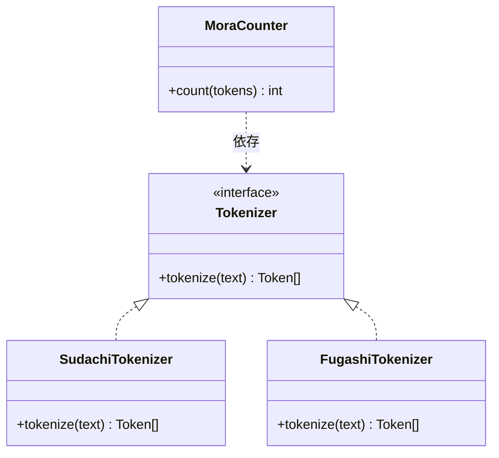

# ADR-0003: 形態素解析器の選定

| 項目 | 内容 |
| --- | --- |
| 状態 | **承認** |
| 決定日 | 2026-08-06 |
| 関連 | [要件定義 Q-03](../requirements/01-requirements.md#10-未決事項) / [ADR-0002](0002-tech-stack.md) |

---

## 1. 背景

判定エンジン（prosody）は、本文のモーラ数を数えるために **まず読みを確定** しなければならない。

```
「今日もまた会議のための会議かな」
   ↓ 読みが分からないとモーラ数が数えられない
「キョウモマタカイギノタメノカイギカナ」
   ↓ ここで初めて 17モーラ と分かる
```

表記から読みを得るには形態素解析が必要である。本 ADR ではその解析器を選定する。

[ADR-0002](0002-tech-stack.md) により prosody は Python で実装するため、
**Python から利用できる解析器**が対象となる。

---

## 2. 決定を左右する要因

| # | 評価軸 | 重み | 説明 |
| --- | --- | --- | --- |
| A | **読みが取得できるか** | 必須 | 取得できない解析器は候補にならない |
| B | **読みの精度** | 最重要 | 読みを誤ると、正しく詠んだ句を弾く（[3.2](../requirements/01-requirements.md#32-判定エンジンに対する品質要求) の最も避けたい事象） |
| C | **分割粒度を制御できるか** | 高 | 句の区切りは形態素境界でしか置けない。粒度が粗すぎると区切れる位置が足りず、細かすぎると単語の途中で切れる |
| D | **辞書の入手性とサイズ** | 中 | Docker イメージのサイズとメモリ消費に直結する |
| E | **速度** | 中 | [NFR-01-01](../requirements/01-requirements.md#nfr-01-性能) の P95 150ms を満たすこと |
| F | **メンテナンス状況** | 中 | 新語の読みに追随できるか |

### C（分割粒度）が重要である理由

判定エンジンは本文を上五・中七・下五に区切る。このとき、**単語の途中で切ってはならない**。

```
✅ 良い区切り:  古池や / 蛙飛び込む / 水の音
❌ 悪い区切り:  古池や蛙 / 飛び込む水 / の音        ← 「水の音」を分断している
❌ 不可能な区切り: 古池 / や蛙飛び込む水 / の音    ← モーラ数が合わない
```

区切りを置ける位置は形態素の境界に限られる。
したがって解析器の分割粒度が、そのまま**区切り候補の数**を決める。

粒度が粗すぎると、5モーラちょうどで切れる境界が存在せず、
本来は定型の句を破調と誤判定してしまう。

---

## 3. 選択肢

| 解析器 | 実体 | 標準辞書 |
| --- | --- | --- |
| **SudachiPy** | Sudachi（ワークス徳島人工知能 NLP 研究所）の Python 実装 | SudachiDict |
| **fugashi + UniDic** | MeCab の Python バインディング + UniDic | UniDic |
| **fugashi + IPAdic** | MeCab の Python バインディング + IPAdic | IPAdic |
| **Janome** | pure Python の形態素解析器 | IPAdic 内蔵 |

参考として、[ADR-0002](0002-tech-stack.md) で他言語を選んでいた場合の候補も挙げる（本 ADR では対象外）。

- kagome（Go）— pure Go、辞書埋め込み
- kuromoji.js（JavaScript）— 更新が停滞

---

## 4. 比較

| | SudachiPy | fugashi + UniDic | fugashi + IPAdic | Janome |
| --- | --- | --- | --- | --- |
| **A. 読みの取得** | ✅ `reading_form()` | ✅ 読み・発音の両方 | ✅ 読み | ✅ 読み |
| **B. 読みの精度** | ✅ 継続的に更新 | ✅ 学術用途で高精度 | 🔺 辞書が古い | 🔺 辞書が古い |
| **C. 分割粒度の制御** | ✅ **A / B / C の3段階を切替可能** | 🔺 短単位固定（細かい） | 🔺 固定 | 🔺 固定 |
| **D. 辞書の入手性** | ✅ pip で導入（core 約70MB） | 🔺 別途DL、数百MB | ✅ 小さい | ✅ 内蔵 |
| **E. 速度** | 🔺 中程度 | ✅ 最速 | ✅ 最速 | ❌ 遅い |
| **F. メンテナンス** | ✅ 活発 | ✅ 活発 | 🔺 辞書更新は停滞 | 🔺 低頻度 |
| **導入の手間** | ✅ pip のみ | ❌ C++ ビルド依存 | ❌ C++ ビルド依存 | ✅ pip のみ |

### 読みか、発音か

UniDic は「読み（`kana`）」に加えて「発音形（`pron`）」を持つ。
両者は助詞の「は→ワ」や長音の扱いで異なる。

| 表記 | 読み | 発音形 |
| --- | --- | --- |
| 今日は | キョウハ | キョーワ |
| 東京 | トウキョウ | トーキョー |
| お母さん | オカアサン | オカーサン |

**モーラ数を数える目的では、両者に差は出ない。**

```
キョウハ  = キョ / ウ / ハ = 3モーラ
キョーワ  = キョ / ー / ワ = 3モーラ   ← 同じ

トウキョウ = ト / ウ / キョ / ウ = 4モーラ
トーキョー = ト / ー / キョ / ー = 4モーラ   ← 同じ
```

拗音を1モーラにまとめ、「ウ」も「ー」もそれぞれ1モーラとして数える限り、
読みと発音形は常に同じモーラ数になる。

**したがって発音形は不要であり、UniDic を選ぶ理由が1つ消える。**
これは重要な確認である。発音形が必須だと考えると
fugashi + UniDic を選ばざるを得ず、C++ ビルド依存と数百 MB の辞書を
受け入れることになっていた。

### 分割粒度（C）における Sudachi の優位

Sudachi は同じ文を3つの粒度で分割できる。

```
入力: 「選挙管理委員会」

A単位（最小）: 選挙 / 管理 / 委員 / 会
B単位（中間）: 選挙 / 管理 / 委員会
C単位（最大）: 選挙管理委員会
```

これは区切り探索に直接効く。

- **C単位** は固有名詞をまとめるため、単語の途中で切る事故が起きにくい
- **A単位** は区切り候補を増やすため、C単位では切れない位置で切れる

両方を使い分ければ「まず C単位 で自然な区切りを探し、見つからなければ A単位 に落とす」
という段階的な探索ができる。粒度が固定の解析器ではこの戦略が取れない。

### 速度（E）の検証

SudachiPy は fugashi より遅い。しかし要求は [NFR-01-01](../requirements/01-requirements.md#nfr-01-性能) の **P95 150ms** であり、
対象は最大でも20モーラ程度の短文である。

短文1件の解析は、いずれの解析器でもミリ秒のオーダーに収まると見込まれる。
150ms の予算に対して十分な余裕があり、**この用途では速度差が判断材料にならない。**

ただしこれは見込みであり、実測していない。
実装フェーズで [NFR-01-01](../requirements/01-requirements.md#nfr-01-性能) に対するベンチマークを取り、
想定を外していた場合は本 ADR を見直す。

### Janome を却下する理由

pure Python で導入が最も容易だが、速度が明確に劣り、辞書も IPAdic ベースで古い。
導入の容易さは SudachiPy も pip のみで同等であり、Janome を選ぶ利点が残らない。

---

## 5. 決定

**SudachiPy + SudachiDict-core を採用する。**

| 項目 | 決定 |
| --- | --- |
| 解析器 | SudachiPy |
| 辞書 | SudachiDict-core |
| 分割粒度 | C単位を基本とし、区切りが見つからない場合に A単位 へ段階的に落とす |

### 決定理由

1. **分割粒度を制御できる唯一の候補** であり、これが区切り探索の質を直接左右する（評価軸 C）
2. 発音形が不要と確認できたため、UniDic を選ぶ動機が消えた
3. pip のみで導入でき、C++ のビルド依存がない。Docker イメージが単純になる（評価軸 D）
4. 辞書が継続的に更新されており、新語の読みに追随できる（評価軸 F）
5. 速度は劣るが、短文1件の解析では要求性能に対して十分な余裕がある（評価軸 E）

### 解析器を差し替え可能にする

本決定は **実測前の判断** を含む（速度の見込み、読みの精度）。
実装後に精度や速度が不足する可能性がある。

そのため prosody 内部で、形態素解析器を**インターフェースの背後に隠す**。



モーラ計算・区切り探索は `Tokenizer` インターフェースにのみ依存させ、
具体的な解析器を知らない状態にする。
差し替えが必要になったとき、影響範囲を実装クラス1つに閉じ込められる。

---

## 6. 結果

### この決定によって可能になること

- 段階的な区切り探索（C単位 → A単位）が実装できる
- Docker イメージにコンパイラを含めずに済む
- 解析器を差し替える際の影響範囲が実装クラス1つに限定される

### この決定によって諦めること

- **fugashi + UniDic より解析が遅い。** 短文では問題にならない見込みだが、
  将来バッチ処理（既存投稿の一括再判定など）を行う場合は再評価が必要になる。
- **抽象化のコストを先払いしている。** 差し替えが結局起きなければ、
  `Tokenizer` インターフェースは不要な間接層になる。
  実測前に判断している以上、差し替えの可能性は十分にあると考え、これを受け入れる。

### 検証が必要な事項

実装フェーズで以下を実測し、想定と乖離していた場合は本 ADR を見直す。

| 検証項目 | 判断基準 |
| --- | --- |
| 解析1件あたりの所要時間 | [NFR-01-01](../requirements/01-requirements.md#nfr-01-性能) の P95 150ms を判定全体で満たせるか |
| 辞書ロード後のメモリ使用量 | 想定インスタンス数で運用コストが収まるか |
| 読みの精度 | 実際の投稿文サンプルで、誤読により破調と誤判定される割合 |

---

## 関連ドキュメント

- [ADR 一覧](README.md)
- [ADR-0002: 言語・フレームワークの選定とサービス分割](0002-tech-stack.md)
- [要件定義書](../requirements/01-requirements.md)
