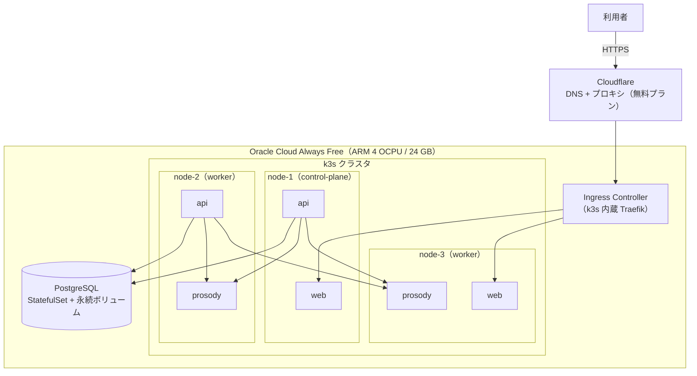

# ADR-0004: ホスティング先とインフラ構成

| 項目 | 内容 |
| --- | --- |
| 状態 | **承認** |
| 決定日 | 2026-08-06 |
| 関連 | [要件定義 Q-06](../requirements/01-requirements.md#10-未決事項) / [C-04](../requirements/01-requirements.md#9-制約と前提) / [NFR-02](../requirements/01-requirements.md#nfr-02-可用性) / [ADR-0002](0002-tech-stack.md) |

---

## 1. 背景

[ADR-0002](0002-tech-stack.md) により、575 は web / api / prosody / db の4コンポーネントで構成される。
これらをどこで動かすかを決める。

この決定は **2つの相反する制約** の間で行う必要がある。

| 制約 | 内容 |
| --- | --- |
| [C-04](../requirements/01-requirements.md#9-制約と前提) | OSS のセルフホストまたは恒久的な無料枠を優先する。期間限定の無料トライアルに依存しない |
| [NFR-02-01](../requirements/01-requirements.md#nfr-02-可用性) / [NFR-02-02](../requirements/01-requirements.md#nfr-02-可用性) | 稼働率 99.5%。単一サーバーの障害でサービス全体が停止しないこと |

**無料で冗長構成を組むのは容易ではない。** 本 ADR ではこの緊張関係を隠さず扱う。

---

## 2. 決定を左右する要因

| # | 評価軸 | 説明 |
| --- | --- | --- |
| A | **恒久的に無料か** | 期間限定の無料トライアルは不可（[C-04](../requirements/01-requirements.md#9-制約と前提)） |
| B | **冗長構成が組めるか** | 単一障害点をなくせるか（[NFR-02-02](../requirements/01-requirements.md#nfr-02-可用性)） |
| C | **リソースが足りるか** | 4コンポーネント + オーケストレーション基盤が載るメモリ・CPU |
| D | **独自ドメインで HTTPS 公開できるか** | [FR](../requirements/01-requirements.md#7-機能要件) の前提。第三者がアクセスできる形で公開する必要がある |
| E | **落ちたときに自力で復旧できるか** | 1人運用（[C-01](../requirements/01-requirements.md#9-制約と前提)）で維持できる複雑度か |

---

## 3. 選択肢

### 案1: Oracle Cloud Infrastructure（OCI）Always Free

OCI の Always Free 枠で ARM インスタンスを確保し、その上で k3s を動かす。

| 項目 | Always Free の内容 |
| --- | --- |
| コンピュート | Ampere A1（ARM）合計 **4 OCPU / 24 GB RAM** |
| インスタンス数 | 上記の枠内で最大4台に分割可能 |
| ブロックストレージ | 合計 200 GB |
| 外向き通信 | 月 10 TB |
| 期限 | **なし**（Always Free） |

### 案2: Google Cloud 無料枠

`e2-micro`（2 vCPU バースト / 1 GB RAM）を1台、30 GB のディスク。

### 案3: 自宅サーバー + 動的 DNS

手元のマシンで動かし、動的 DNS とポート開放で公開する。

### 案4: 低価格 VPS（有償）

Hetzner CX22 相当（約 €4/月 ≈ 700円/月）や国内 VPS（月 700〜1,000円）を1〜2台。

### 案5: PaaS の無料プラン（Render / Railway など）

コンテナをそのままデプロイできる PaaS の無料枠を使う。

---

## 4. 比較

| | 案1: OCI Always Free | 案2: GCP 無料枠 | 案3: 自宅 | 案4: 低価格VPS | 案5: PaaS 無料枠 |
| --- | --- | --- | --- | --- | --- |
| **A. 恒久無料** | ✅ | ✅ | ✅ | ❌ 月700円〜 | 🔺 条件付き |
| **B. 冗長構成** | ✅ 最大4台 | ❌ 1台のみ | ❌ 1台 | 🔺 台数分の課金 | ❌ |
| **C. リソース** | ✅ 24 GB RAM | ❌ 1 GB では不足 | ✅ マシン次第 | 🔺 4〜8 GB | ❌ 制限が厳しい |
| **D. 独自ドメイン HTTPS** | ✅ | ✅ | 🔺 ISP 次第 | ✅ | 🔺 プランによる |
| **E. 復旧の容易さ** | 🔺 k3s の知識が要る | ✅ | ❌ 物理対応が必要 | 🔺 | ✅ |

### 案2 を却下する理由

`e2-micro` は **1 GB RAM** である。この上に載せるものを積算すると足りない。

```
PostgreSQL                     約 200 MB
prosody（SudachiPy + 辞書）    約 400 MB   ← 辞書がメモリを食う
api（Go）                      約  50 MB
web（Next.js）                 約 150 MB
OS + k3s                       約 500 MB
────────────────────────────────────────
合計                           約 1.3 GB   ← 1 GB を超える
```

k3s を諦めて docker compose にしても、辞書のメモリだけで枠を圧迫する。
[ADR-0003](0003-morphological-analyzer.md) で SudachiPy を選んだ以上、この構成は成立しない。

### 案3 を却下する理由

初期費用ゼロで最もリソースが潤沢だが、以下が [NFR-02-01](../requirements/01-requirements.md#nfr-02-可用性)（稼働率 99.5%）と両立しない。

- **停電・回線断で即停止する。** 月間ダウンタイム 3.6時間の予算を、1回の停電で使い切る
- **住宅用回線の利用規約** でサーバー公開が禁止されている場合がある
- **障害時に物理的な対応が必要** になり、外出中は復旧できない
- 固定 IP がなく、動的 DNS の切り替わり中はアクセスできない

「無料だが要件を満たせない」典型例であり、要件の方を下げない限り採用できない。

### 案5 を却下する理由

無料プランは一定時間アクセスがないとコンテナが停止し、次のアクセス時に起動する（コールドスタート）。
prosody は辞書のロードに時間がかかるため、コールドスタート後の初回判定が
[NFR-01-01](../requirements/01-requirements.md#nfr-01-性能)（P95 150ms）を大幅に超える。

また無料プランの条件は事業者の都合で変更されやすく、
[C-04](../requirements/01-requirements.md#9-制約と前提) が求める「恒久的な無料枠」とは言い難い。

### 案1 と案4 の比較

案1 は無料で 24 GB RAM と最大4台という、他の追随を許さない枠である。
案4 は月 700円程度の出費と引き換えに、確実性を買う。

案1 の**最大のリスクは、ARM インスタンスの在庫確保**である。
Ampere A1 は人気が高く、リージョンによっては「Out of capacity」で作成できないことがある。
これは無料枠であるがゆえの制約で、事業者側の都合であり、こちらでは制御できない。

一方、この構成が確保できれば **4台構成で冗長化まで無料で到達できる**。
案4 で同等の冗長性を得るには VPS を2〜3台契約することになり、月 1,500〜2,000円になる。

---

## 5. 決定

**案1（OCI Always Free + k3s）を採用する。案4 をフォールバックとして明記する。**

### 構成



### コンポーネントごとの選定と費用

| 用途 | 採用 | 費用 | 選定理由 |
| --- | --- | --- | --- |
| コンピュート | OCI Always Free（ARM A1） | **0円** | 恒久無料で唯一 24 GB RAM と複数台構成が得られる |
| オーケストレーション | **k3s** | 0円 | 通常の Kubernetes より軽量で、少ないリソースで動く。マネージド Kubernetes は有償 |
| Ingress / ロードバランサ | k3s 内蔵 **Traefik** | 0円 | クラウドのロードバランサは有償。k3s に同梱されており追加導入が不要 |
| TLS 証明書 | **Let's Encrypt**（cert-manager） | 0円 | 自動更新まで含めて無償 |
| DNS | **Cloudflare**（無料プラン） | 0円 | DNS・DDoS 対策・キャッシュが無料枠に含まれる |
| ドメイン | Cloudflare Registrar | **年 約1,500円** | 唯一の有償項目（後述） |
| データベース | **PostgreSQL** をクラスタ内でセルフホスト | 0円 | マネージド DB は最小構成でも月数千円。無料枠がない |
| CI/CD | **GitHub Actions** | 0円 | パブリックリポジトリなら実行時間が無制限 |
| 監視 | **Prometheus + Grafana** をセルフホスト | 0円 | 監視 SaaS の無料枠はデータ保持期間が短い |
| エラー収集 | **GlitchTip**（セルフホスト） | 0円 | Sentry 互換の OSS。Sentry の無料枠はイベント数の上限が低い |

**月額のランニングコストは 0 円**、年間で **ドメイン代のみ約1,500円** となる。

### 唯一の有償項目: 独自ドメイン

独自ドメインだけは無償で代替できない。

- 無料ドメイン（`.tk` 等）は突然失効する事例があり、公開サービスの基盤にできない
- サブドメインを間借りするサービスは、提供元の都合で消える

Cloudflare Registrar は登録料を原価で提供しており、`.com` で **年 約1,500円**（月換算 約125円）である。
これは受け入れる。

---

## 6. NFR-02（可用性）に対する正直な評価

本構成で [NFR-02](../requirements/01-requirements.md#nfr-02-可用性) を **完全には満たせない**。
以下に達成できる範囲とできない範囲を明示する。

| 要件 | 達成状況 | 内容 |
| --- | --- | --- |
| NFR-02-02 単一サーバー障害での全断回避（**アプリケーション層**） | ✅ 達成 | web / api / prosody を複数ノードに分散配置し、1ノード停止時も稼働を継続する |
| NFR-02-03 判定停止時の縮退運転 | ✅ 達成 | prosody が全滅しても web / api / db は動作し、閲覧を継続できる |
| NFR-02-02 単一サーバー障害での全断回避（**データベース層**） | ❌ **未達成** | PostgreSQL は単一インスタンス。**ここが唯一の単一障害点として残る** |
| NFR-02-01 稼働率 99.5% | 🔺 **未検証** | 上記の DB 単一障害点と、OCI 無料枠の SLA が保証されないことによる |

### PostgreSQL が単一障害点として残る理由

PostgreSQL を冗長化するには、レプリケーション構成（Primary / Standby）と
自動フェイルオーバーの仕組みが要る。これは無料で構築可能ではあるが、
**1人運用（[C-01](../requirements/01-requirements.md#9-制約と前提)）で維持できる複雑度を超える。**

フェイルオーバーの誤作動によるスプリットブレインは、
単一インスタンスの停止よりも深刻なデータ破損を招く。
**中途半端な冗長化は、冗長化しないより危険である。**

### 代わりに取る対策

冗長化しない代わりに、**復旧できる状態**を担保する。

| 対策 | 内容 |
| --- | --- |
| 定期バックアップ | `pg_dump` を CronJob で日次実行し、OCI Object Storage（無料枠 20 GB）へ保存する |
| リストア手順の文書化と訓練 | 手順を書くだけでなく、実際にリストアを実行して所要時間を計測する |
| 永続ボリュームの分離 | DB のデータをノードのローカルディスクではなくブロックボリュームに置き、ノードが死んでも付け替えられるようにする |

### この未達成をどう扱うか

**要件を下げるのではなく、未達成であることを記録して運用開始する。**

99.5% という目標は初版のリリース判定基準にはしない。
リリース後に実際の稼働率を計測し、DB 障害が現実に発生した場合に
初めてレプリケーション構成を検討する。

発生していない障害に対して複雑度を先払いすることは、
1人運用のプロダクトでは割に合わない。

---

## 7. 結果

### この決定によって可能になること

- 月額ランニングコスト 0 円で、独自ドメイン + HTTPS の公開サービスを運用できる
- アプリケーション層は複数ノードに分散し、1ノード障害に耐える
- k3s 上に載せるため、将来クラスタを増強・移設する際にマニフェストを再利用できる

### この決定によって諦めること・抱えるリスク

| リスク | 内容 | 対処 |
| --- | --- | --- |
| **ARM インスタンスの在庫** | Ampere A1 が「Out of capacity」で確保できない可能性がある | 複数リージョンで試行する。3か月試して確保できなければ案4（低価格 VPS）へ切り替え、本 ADR を「置換」とする |
| **ARM アーキテクチャ** | すべての依存パッケージが ARM 向けビルドを提供している必要がある | 環境構築の最初のタスクで、SudachiPy を含む全依存の ARM 動作を検証する |
| **DB の単一障害点** | 6章のとおり未解決 | バックアップとリストア訓練で復旧可能性を担保する |
| **無料枠の条件変更** | 事業者が Always Free の内容を変更する可能性 | k3s 上に構築することで、他環境へマニフェストごと移設できる状態を保つ |
| **リポジトリの公開** | GitHub Actions を無制限に使うにはパブリックリポジトリにする必要がある | 認証情報をコミットしない運用（[NFR-04-07](../requirements/01-requirements.md#nfr-04-セキュリティ)）を徹底する。設定値は Secrets で注入する |

### 検証が必要な事項

| 検証項目 | 実施時期 |
| --- | --- |
| OCI で Ampere A1 インスタンスを実際に確保できるか | 環境構築の最初 |
| 全依存パッケージが ARM で動作するか（特に SudachiPy） | 環境構築の最初 |
| 24 GB RAM に4コンポーネント + k3s + 監視が収まるか | 環境構築時に実測 |
| `pg_dump` からのリストア所要時間 | 初回デプロイ後 |

---

## 関連ドキュメント

- [ADR 一覧](README.md)
- [ADR-0002: 言語・フレームワークの選定とサービス分割](0002-tech-stack.md)
- [ADR-0003: 形態素解析器の選定](0003-morphological-analyzer.md)
- [要件定義書](../requirements/01-requirements.md)
