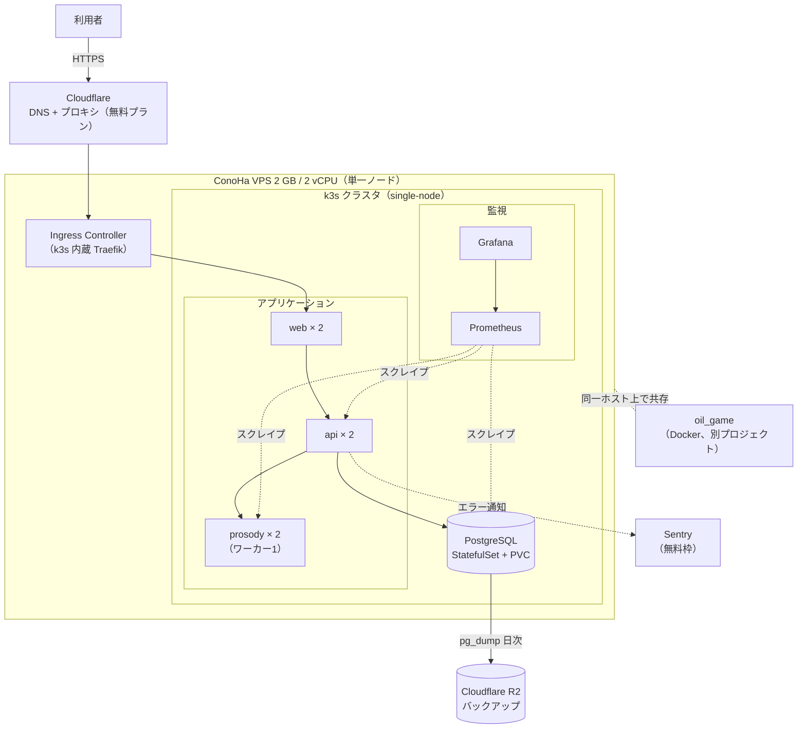

# ADR-0007: ホスティング先を ConoHa VPS 単一ノードへ変更する

| 項目 | 内容 |
| --- | --- |
| 状態 | **承認** |
| 決定日 | 2026-08-09 |
| 関連 | [要件定義 Q-06](../requirements/01-requirements.md#10-未決事項) / [C-04](../requirements/01-requirements.md#9-制約と前提) / [C-05](../requirements/01-requirements.md#9-制約と前提) / [NFR-02](../requirements/01-requirements.md#nfr-02-可用性) / [ADR-0004](0004-hosting-and-infrastructure.md)（本 ADR が置換する） |

---

## 1. 背景

[ADR-0004](0004-hosting-and-infrastructure.md) は、OCI Always Free の ARM インスタンス（Ampere A1、4 OCPU / 24 GB RAM）を確保できることを前提に、
その上で k3s の複数ノードクラスタを組む決定をした。

同時に、その前提が崩れる可能性を最大のリスクとして記録し、撤退条件を明示していた。

> [複数リージョンで試行する。3か月試して確保できなければ案4（低価格 VPS）へ切り替え、本 ADR を「置換」とする](0004-hosting-and-infrastructure.md#この決定によって諦めること抱えるリスク)

**本 ADR は、この撤退条件を期限より前に発動するものである。**

理由は「3か月試して確保できなかった」ではなく、**待つ理由がなくなった**ことにある。

| 事実 | 内容 |
| --- | --- |
| VPS を既に契約している | 別プロジェクト（oil_game）のため ConoHa VPS 1 GB（月 762円）を稼働中。575 のためにサーバーを1台増やす必要はない |
| ARM 在庫は制御できない | Ampere A1 の「Out of capacity」は事業者側の都合であり、確保できる時期を見積もれない。着手時期が読めない状態が続く |
| メモリ積算が実測で更新された | [判定エンジンの性能測定](../perf/0001-prosody-benchmark.md) により、ADR-0004 が見積りで書いた数値が実測値に置き換わった |

3つ目が特に効く。ADR-0004 は**実測前の見積り**でリソースを積算しており、
その積算が過大だったことが分かった今、必要なメモリ量の前提が変わっている。

---

## 2. ADR-0004 から変わった前提

### 2.1 メモリの実測値

[docs/perf/0001](../perf/0001-prosody-benchmark.md#d-メモリ使用量) の測定結果。

| サービス | ADR-0004 の見積り | 実測 |
| --- | ---: | ---: |
| prosody | 400 MB | **64 MiB**（ワーカー1）/ **315 MiB**（ワーカー4） |
| web | 150 MB | **34.7 MiB** |
| db | 200 MB | **39.5 MiB** |
| api | 50 MB | **2.6 MiB** |
| 合計 | 800 MB | **392 MiB**（ワーカー4） |

prosody は**ワーカー数に比例して増える**（ワーカーごとに辞書が複製されるため）。
逆に言えば、ワーカー数を絞れば大幅に減らせる。この性質が本 ADR の構成を成立させる。

### 2.2 稼働中サーバーの実測値

ConoHa VPS 1 GB（2 vCPU）で oil_game が稼働している状態の実測。

```
Mem:  total 960Mi   used 456Mi   free 90Mi   buff/cache 577Mi   available 503Mi
Swap: total 2.0Gi   used  63Mi

oil_game-dev-1   90.89 MiB
oil_game-app-1    2.47 MiB
────────────────────────
コンテナ計       約 93 MiB
差分 363 MiB = OS + Docker デーモン + containerd + sshd 等
```

**コンテナよりも OS + Docker のオーバーヘッドの方が大きい**（363 MiB）。
ここは削減余地がある（後述）。

### 2.3 ARM 固有のリスクが消える

ConoHa VPS は x86_64 である。ADR-0004 が抱えていた
「すべての依存パッケージが ARM 向けビルドを提供している必要がある」というリスクと、
その検証タスクが不要になる。

---

## 3. 決定を左右する要因

| # | 評価軸 | 説明 |
| --- | --- | --- |
| A | **増分費用** | [C-04](../requirements/01-requirements.md#9-制約と前提) は無料枠を優先する。有償を選ぶなら、増分がいくらで、なぜ代替できないかを説明できること（[C-05](../requirements/01-requirements.md#9-制約と前提)） |
| B | **着手できる時期** | 在庫待ちで着手時期が読めない状態を避けたい |
| C | **実測に基づくリソース充足** | 見積りではなく実測値で、必要なものが載ると言えること |
| D | **既存プロジェクトとの共存** | oil_game を巻き込んで落とさないこと |
| E | **非機能を実証できるか** | コンテナオーケストレーション・監視・負荷試験・バックアップを、設計だけでなく**動く形**で示せること |

E は ADR-0004 にはなかった軸である。
単一ノードで冗長化を諦める以上、**非機能への取り組みを他の形で示せるか**が構成の良し悪しを分ける。

---

## 4. 選択肢

### 案1: ADR-0004 のまま、OCI の在庫確保を待つ

3か月の試行期間を最後まで使い、Ampere A1 が取れるのを待つ。

### 案2: ConoHa 1 GB のまま、docker compose で動かす

プラン変更せず、現契約の 1 GB に 575 を同居させる。k3s と監視は載せない。

### 案3: ConoHa 2 GB で、単一ノードの k3s を動かす

プランを 1 段上げ、k3s + 575 + 監視スタックを載せる。
（2 GB をどう確保するか — プラン変更か新規契約か — は [6章](#2-gb-をプラン変更ではなく新規契約で確保する理由)で扱う）

### 案4: ConoHa 4 GB にする

案3 と同構成で、メモリに大幅な余裕を持たせる。

### 案5: VPS を 2 台契約し、k3s で本当に冗長化する

ノードレベルの冗長化を有償で買う。

---

## 5. 比較

| | 案1: OCI を待つ | 案2: 1 GB compose | 案3: 2 GB + k3s | 案4: 4 GB + k3s | 案5: VPS 2台 |
| --- | --- | --- | --- | --- | --- |
| **A. 増分費用** | ✅ 0円 | ✅ 0円 | ✅ **月 30円** | ❌ 差額が大きい | ❌ 2台分 |
| **B. 着手時期** | ❌ 読めない | ✅ 即日 | ✅ 即日 | ✅ 即日 | 🔺 契約作業 |
| **C. リソース** | ✅ 24 GB | 🔺 アプリのみ | ✅ 実測で充足 | ✅ 余裕 | ✅ 余裕 |
| **D. 共存** | ✅ 無関係 | ❌ 余裕がない | ✅ 制限で保護 | ✅ 余裕 | ✅ 分離 |
| **E. 非機能の実証** | ✅ 冗長化まで | ❌ k8s も監視も無理 | ✅ 冗長化以外 | ✅ 冗長化以外 | ✅ 冗長化まで |

### 案1 を却下する理由

**待っている間、何も進まないことが最大のコストである。**

ARM の在庫は事業者側の都合で決まり、こちらから確保確率を上げる手段は
「リージョンを変えて試行を繰り返す」以外にない。
確保できる時期が読めない以上、それまでの期間を「待ち」に使うのは、
既に使えるサーバーが手元にある状況では合理的でない。

なお、ADR-0004 が OCI を選んだ判断そのものは、**その時点では正しかった**。
無料で 24 GB RAM と4台構成が得られる枠は他になく、在庫リスクを取る価値はあった。
覆るのは前提であって、判断の質ではない。

### 案2 を却下する理由

アプリケーションだけなら 1 GB に載る。実測 392 MiB（ワーカー1 なら 141 MiB）であり、
`available` 503 MiB に対して収まる。

しかし、**k3s（約 500 MiB）と監視スタック（約 330 MiB）が入らない。**

これは単に「監視を諦める」で済む話ではない。

- `buff/cache` 577 MiB は PostgreSQL が読み取り性能のために使っているもので、ここを削ると DB が目に見えて遅くなる
- oil_game は dev モード（`node:24-slim` + ファイル監視、PIDs 30）で動いており、リビルド時に数百 MB スパイクする。アイドル時の 93 MiB は**下限値**である
- 非機能への取り組みを動く形で示す手段（E）が丸ごと失われる

「動くには動くが、余裕がなく、示せるものが減る」構成であり、採らない。

### 案4 を却下する理由

**実測に基づけば 2 GB で足りるため、4 GB は過剰である。**

[7章のメモリ予算](#7-メモリ予算)のとおり、約 540 MiB の余裕が残る。
[C-05](../requirements/01-requirements.md#9-制約と前提) は「無料枠で足りるか」「超えたとき何が起きるか」まで検討することを求めており、
**足りると実測で言える段階で上位プランを買うのは、この制約に反する。**

先に 2 GB で運用し、実測で足りないと分かった時点で上げる方が、順序として正しい。
[新規契約で確保する](#2-gb-をプラン変更ではなく新規契約で確保する理由)ため、
後から 4 GB へ移る際も同じ手順が使える。

### 案5 を却下する理由

ノードレベルの冗長化は魅力的だが、以下の理由で採らない。

- **月額が 2 倍以上になる。** [C-04](../requirements/01-requirements.md#9-制約と前提) は有償サービスを「代替手段がない場合に限って」としており、冗長化は代替手段（バックアップとリストア）が存在する
- **ADR-0004 の判断がそのまま当てはまる。** 2台構成で PostgreSQL を冗長化するなら、レプリケーションと自動フェイルオーバーが必要になり、[1人運用で維持できる複雑度を超える](0004-hosting-and-infrastructure.md#postgresql-が単一障害点として残る理由)
- アプリケーション層だけ2台に分散しても、DB が単一である限り全断は防げない

**中途半端な冗長化は、冗長化しないより危険である**という ADR-0004 の判断は、
ホスティング先が変わっても変わらない。

---

## 6. 決定

**案3（ConoHa VPS 2 GB + 単一ノード k3s）を採用する。**

[ADR-0004](0004-hosting-and-infrastructure.md) は本 ADR により「置換」とする。

### 構成



### コンポーネントごとの選定と費用

| 用途 | 採用 | 費用 | 選定理由 |
| --- | --- | --- | --- |
| コンピュート | **ConoHa VPS 2 GB / 2 vCPU** | **月 792円**（現行 1 GB は月 762円。**増分は月 30円**） | 既存の 1 GB を置き換える形で確保する（後述） |
| オーケストレーション | **k3s**（単一ノード） | 0円 | 通常の Kubernetes より軽量。ADR-0004 から変更なし |
| Ingress / ロードバランサ | k3s 内蔵 **Traefik** | 0円 | k3s に同梱。ADR-0004 から変更なし |
| TLS 証明書 | **Let's Encrypt**（cert-manager） | 0円 | ADR-0004 から変更なし |
| DNS | **Cloudflare**（無料プラン） | 0円 | ADR-0004 から変更なし |
| ドメイン | Cloudflare Registrar | 年 約1,500円 | ADR-0004 から変更なし |
| データベース | **PostgreSQL** をクラスタ内でセルフホスト | 0円 | ADR-0004 から変更なし |
| CI/CD | **GitHub Actions** | 0円 | **サーバー上でビルドしない**（後述） |
| コンテナレジストリ | **GHCR** | 0円 | パブリックリポジトリなら無料 |
| 監視 | **Prometheus + Grafana** をセルフホスト | 0円 | ADR-0004 から変更なし |
| エラー収集 | **Sentry**（無料枠） | 0円 | **GlitchTip セルフホストから変更**（後述） |
| バックアップ保管 | **Cloudflare R2**（無料枠 10 GB） | 0円 | OCI Object Storage が使えなくなるため |

### 2 GB をプラン変更ではなく新規契約で確保する理由

既存の 1 GB を 2 GB へ「プラン変更」する方法と、2 GB を新規契約して移設する方法がある。
**後者を採る。理由は料金体系である。**

| 方法 | 月額 |
| --- | ---: |
| 既存サーバーをプラン変更する | **1,258円** |
| 2 GB を新規契約し、移設して旧サーバーを解約する | **792円** |

ConoHa の割引（まとめトク）は**新規申込にのみ適用され、プラン変更では引き継がれない**。
プラン変更を選ぶと、その時点で新プランの通常料金に乗り換わる。

**同一の構成・同一のメモリ量に対して、月 466円の差が出る。**
年額では 5,592円の差になり、移設作業（1時間弱）に対して十分に見合う。

新規契約には副次的な利点もある。

- **OS を選び直せる。** 現行サーバーの OS + Docker オーバーヘッドは実測 363 MiB あり、既定構成の常駐プロセスを含む。新規契約時に軽量なディストリビューションを選べば、[メモリ予算](#7-メモリ予算)が前提とする 250 MiB を棚卸しなしで達成できる
- **プラン変更の不可逆性を回避できる。** ConoHa のプラン変更は上位への一方通行であり、2 GB → 1 GB には戻せない。新規契約であれば、将来 4 GB が必要になった際も同じ方法が取れる

### ADR-0004 から変更した点

| 項目 | ADR-0004 | 本 ADR | 理由 |
| --- | --- | --- | --- |
| ホスティング | OCI Always Free（ARM） | ConoHa VPS（x86_64） | 在庫確保を待たない |
| ノード数 | 最大4台 | **1台** | VPS 1台のため |
| `PROSODY_WORKERS` | CPU 数に合わせる | **1** + replicas でスケール | ワーカーごとに辞書が複製されるため、レプリカで並列度を取る方がメモリ効率が良い |
| エラー収集 | GlitchTip セルフホスト | **Sentry 無料枠** | GlitchTip は内部に PostgreSQL と Redis を持ち 500 MiB 超。得られるものに対してメモリ代が見合わない |
| バックアップ保管 | OCI Object Storage 20 GB | **Cloudflare R2 10 GB** | OCI を使わないため。DNS で既に Cloudflare を使っており、アカウントが共通 |
| イメージビルド | （明記なし） | **GitHub Actions → GHCR、サーバーは pull のみ** | Next.js のビルドは 1 GB 級を要求する。サーバー上でビルドすると確実に OOM する |

### `PROSODY_WORKERS=1` + replicas=2 とする理由

prosody は[ワーカーごとに SudachiPy の辞書を複製する](../perf/0001-prosody-benchmark.md#d-メモリ使用量)ため、
ワーカー数を増やすとメモリがほぼ線形に増える（ワーカー1で 64 MiB、ワーカー4で 315 MiB）。

同じ並列度を得るなら、**1ワーカーの Pod を複数立てる方がメモリ効率が良い**。

| 構成 | 並列度 | メモリ |
| --- | ---: | ---: |
| 1 Pod × ワーカー2 | 2 | 148 MiB |
| **2 Pod × ワーカー1** | **2** | **128 MiB** |

加えて、Pod を分けることで**片方が落ちてももう片方が生き残る**（[NFR-02-03](../requirements/01-requirements.md#nfr-02-可用性) の縮退運転がプロセス単位で機能する）。
Kubernetes 上でスケールさせるならレプリカで行うのが作法としても正しい。

性能面の懸念はない。[実測](../perf/0001-prosody-benchmark.md)では形態素解析が 0.015〜0.026 ms であり、
[NFR-01-01](../requirements/01-requirements.md#nfr-01-性能)（P95 150ms）に対して4桁の余裕がある。

### 移行計画

現行の 1 GB は**1か月単位の前払い契約**であり、次の更新日は **2026-09-11** である。

移行は **2026年8月下旬を予定する。変動の可能性がある。**

| 時期 | 環境 | やること |
| --- | --- | --- |
| **第1期**<br/>2026-08-09 〜 移行まで | ConoHa 1 GB<br/>+ ローカル | ドメイン取得 / Cloudflare・R2・Sentry の準備 / CI/CD 構築 / **K8s マニフェストをローカルの kind・k3d で作成し実証** / docker compose + Caddy で暫定公開し HTTPS 化 |
| **移行**<br/>2026年8月下旬（予定・変動あり） | 両方（2〜3日並走） | 2 GB を新規契約（軽量 OS を選択）→ oil_game と 575 を移設 → 動作確認 |
| **第2期**<br/>移行後 | ConoHa 2 GB | 旧 1 GB を 2026-09-11 の更新日で終了させる / k3s 構築 / 第1期のマニフェストを適用 / Prometheus + Grafana / 本番構成での性能再測定 |

並走期間の追加費用は約 79円（2〜3日分の時間課金）である。

#### 第1期を「待ち時間」にしない

第1期に行う作業のうち、**移行で失われるのは Caddy の設定のみ**である
（k3s では内蔵の Traefik が同じ役割を担うため）。
それ以外はすべて第2期にそのまま引き継がれる。

特に **K8s マニフェストの作成は第1期に前倒しできる。**
マニフェストの作成と検証はローカルの kind / k3d で完結するため、
本番が 1 GB であることは制約にならない。
第2期は「作ってあるマニフェストを本物のクラスタへ適用する」工程になり、
移行後の立ち上がりが速くなる。

#### 第1期に暫定公開する理由

第2期まで公開を待つ選択肢もあるが、採らない。

- 公開して初めて分かる問題（DNS、証明書の更新、実トラフィック下での挙動）を、
  k3s 移行前に洗い出しておける
- 移行時に「動いていたものを移す」形になり、
  新規構築と移行の問題を切り分けられる

**捨てる作業（Caddy 設定）に対して、得られる情報の方が大きい。**

---

## 7. メモリ予算

2 GB（実効約 1,960 MiB）に対する配分。**すべて実測値または実測からの外挿**である。

```
OS（軽量ディストリビューション） 約 250 MiB
Docker + oil_game                  93 MiB
k3s（containerd 込み）         約 500 MiB
web     × 2                        70 MiB
api     × 2                         6 MiB
prosody × 2（ワーカー1）          128 MiB
postgres                           40 MiB
Prometheus + Grafana           約 330 MiB
──────────────────────────────────────────
計                           約 1,417 MiB
残り                           約 540 MiB   ← ページキャッシュ + スパイク吸収
```

### 「OS 250 MiB」の根拠

現行サーバー（1 GB）の OS + Docker オーバーヘッドは実測 363 MiB である。
既定構成には snapd など、このサーバーで使っていない常駐プロセスが含まれる。

**新規契約時に軽量なディストリビューションを選ぶことで、
棚卸し作業なしに 250 MiB 前後から始めることを狙う。**
これは新規契約を選んだ副次的な利点である（[6章](#2-gb-をプラン変更ではなく新規契約で確保する理由)）。

**この 250 MiB は本 ADR で唯一の未実測の前提であり、[9章](#検証が必要な事項)の検証項目とする。**
回収できなかった場合でも、残り約 430 MiB は確保できる。

### 余裕をどう使うか

残り 540 MiB は「空きメモリ」ではなく、以下に消費される。

| 用途 | 内容 |
| --- | --- |
| ページキャッシュ | PostgreSQL の読み取り性能はページキャッシュに依存する。ここが薄いと DB が遅くなる |
| スパイク吸収 | oil_game の dev コンテナはリビルド時にスパイクする。575 側もデプロイ時に一時的に旧 Pod と新 Pod が並走する |
| swap | 2 GB 確保済み。恒常的に使われる状態は異常だが、瞬間的な逼迫での OOM Kill は防げる |

### メモリ不足時に何が起きるか

[C-05](../requirements/01-requirements.md#9-制約と前提) が求める「超えたとき何が起きるか」への回答。

**逼迫してもプロセスは落ちない。まずページキャッシュが破棄され、DB の読み取りが遅くなる。**
さらに逼迫すると swap に落ち、[NFR-01-01](../requirements/01-requirements.md#nfr-01-性能)（P95 150ms）を割る。
OOM Kill に至るのはその先である。

つまり**症状は「停止」ではなく「劣化」**として現れる。
Prometheus でメモリ使用量と swap 使用量を監視し、劣化の予兆を検知する。

### 相互保護

oil_game と 575 が同一ホスト上で共存するため、片方の暴走がもう片方を巻き込まないようにする。

| 対象 | 手段 |
| --- | --- |
| 575 の各 Pod | `resources.requests` / `resources.limits` を全 Pod に設定する |
| oil_game | compose に `mem_limit` を設定する（目安 256 MB） |

**Linux の OOM Killer はメモリ使用量の多いプロセスを狙うため、
原因となったプロセスが必ず殺されるわけではない。**
上限を設定していないと、oil_game の暴走で 575 の Pod が殺される（またはその逆）ことが起こりうる。

なお、緊急時の手段として oil_game を停止すればメモリは回復するが、
回収できるのは 93 MiB にすぎない（OS + Docker の 363 MiB は残る）。
**恒常運用の前提にはせず、リストア訓練や k3s のアップグレードなど、
一時的に重い作業を行うときの手段として位置づける。**

---

## 8. NFR-02（可用性）に対する正直な評価

[ADR-0004 の 6 章](0004-hosting-and-infrastructure.md#6-nfr-02可用性に対する正直な評価)を、単一ノード構成として引き継ぐ。
**達成状況は ADR-0004 より後退する。** 隠さずに記録する。

| 要件 | ADR-0004 | 本 ADR | 内容 |
| --- | --- | --- | --- |
| NFR-02-02 単一サーバー障害での全断回避（**アプリケーション層**） | ✅ 達成 | ❌ **未達成** | 単一ノードのため、ノード障害で全断する。レプリカは同一ホスト上にあり、ノードレベルの冗長化にはならない |
| NFR-02-03 判定停止時の縮退運転 | ✅ 達成 | ✅ **達成** | prosody の Pod が全滅しても web / api / db は動作し、閲覧を継続できる。replicas=2 によりプロセス単位の耐性も持つ |
| NFR-02-02 単一サーバー障害での全断回避（**データベース層**） | ❌ 未達成 | ❌ **未達成** | PostgreSQL は単一インスタンス |
| NFR-02-01 稼働率 99.5% | 🔺 未検証 | 🔺 **未検証** | 上記の単一障害点による。ただし本構成では Prometheus により**実測できる**ようになる |

### 冗長化を採らない理由（ADR-0004 からの引き継ぎ）

PostgreSQL を冗長化するには、レプリケーション構成（Primary / Standby）と
自動フェイルオーバーの仕組みが要る。これは無料で構築可能ではあるが、
**1人運用（[C-01](../requirements/01-requirements.md#9-制約と前提)）で維持できる複雑度を超える。**

フェイルオーバーの誤作動によるスプリットブレインは、
単一インスタンスの停止よりも深刻なデータ破損を招く。
**中途半端な冗長化は、冗長化しないより危険である。**

単一ノードになったことで、この判断はむしろ強化される。
1台しかない環境で疑似的な冗長構成を組んでも、ノードが死ねば両方死ぬため、
**複雑度だけが増えて耐障害性は 1 ミリも上がらない。**

### 冗長化を前提とした設計は維持する

冗長構成を「今は組まない」ことと、「組めない設計にする」ことは違う。
以下は単一ノードでも維持する。

| 設計 | 内容 |
| --- | --- |
| ステートレスな web / api | セッション状態をプロセスメモリやローカルストレージに持たない（[NFR-03-02](../requirements/01-requirements.md#nfr-03-拡張性)、[ADR-0006](0006-authentication.md)） |
| 永続データは DB とオブジェクトストレージのみ | ノードを捨てて作り直せる状態を保つ |
| replicas を決め打ちにしない | マニフェストの `replicas` を変えるだけでスケールする。ノードが増えたときに設計変更が要らない |
| k3s 上に構築する | 他環境へマニフェストごと移設できる状態を保つ |

**ノードを増やせば冗長構成に移行できる状態のまま、単一ノードで運用する。**
これは ADR-0004 が k3s を選んだ理由（移設性）を、そのまま引き継いだものである。

### 代わりに取る対策

冗長化しない代わりに、**復旧できる状態**を担保する。

| 対策 | 内容 |
| --- | --- |
| 定期バックアップ | `pg_dump` を CronJob で日次実行し、**Cloudflare R2**（無料枠 10 GB）へ保存する |
| リストア手順の文書化と訓練 | 手順を書くだけでなく、実際にリストアを実行して所要時間を計測する |
| バックアップ先をホスト外に置く | 同一 VPS 内に置くと、サーバーが死んだときに一緒に失われる。R2 は必須要件であって好みの問題ではない |
| 稼働率の実測 | Prometheus + Grafana で稼働率を計測する。ADR-0004 では「未検証」のまま放置される予定だったが、本構成では数値で追える |

### この未達成をどう扱うか

**要件を下げるのではなく、未達成であることを記録して運用開始する。**

99.5% という目標は初版のリリース判定基準にしない。
リリース後に実際の稼働率を計測し、障害が現実に発生した場合に
初めて冗長構成（= ノードの追加、あるいは OCI への移設）を検討する。

発生していない障害に対して複雑度を先払いすることは、
1人運用のプロダクトでは割に合わない。

---

## 9. 結果

### この決定によって可能になること

- **在庫確保を待たずに、即日インフラ構築に着手できる**
- ARM 向けビルドの検証タスクが不要になる（x86_64 のため）
- k3s 上に載せるため、[ADR-0004](0004-hosting-and-infrastructure.md) が想定した移設性を維持できる
- 監視（Prometheus + Grafana）を実際に動かし、稼働率を**数値で追える**
- oil_game のための契約を流用するため、575 のための増分費用はプラン差額のみに収まる

### この決定によって諦めること・抱えるリスク

| リスク | 内容 | 対処 |
| --- | --- | --- |
| **ノードレベルの冗長化** | 単一ノードのため、ノード障害で全断する。ADR-0004 より後退する | 8章のとおり、復旧可能性で担保する。冗長化に移行できる設計は維持する |
| **DB の単一障害点** | ADR-0004 から未解決のまま | `pg_dump` + R2 + リストア訓練 |
| **メモリの余裕が小さい** | 残り約 540 MiB。監視・oil_game・575 が同居する | `resources` / `mem_limit` による相互保護。Prometheus でメモリと swap を監視 |
| **oil_game との相互影響** | 片方の障害・デプロイがもう片方に影響しうる | 上限設定。ただし**ホスト自体の再起動は両方を止める**。これは構造的に避けられない |
| **移行作業そのもの** | 2026年8月下旬（予定）に oil_game と 575 を新サーバーへ移す必要がある | 新サーバーで oil_game の正常稼働を確認してから旧サーバーを手放す。順序を逆にすると戻せない |
| **旧サーバーの自動更新** | 2026-09-11 に自動更新されると、移行済みなのに 1 GB がもう1か月分課金される | **更新日の数日前までに自動更新の設定を確認する。**[移行計画](#移行計画)の期日管理に含める |
| **IP アドレスの変更** | 新サーバーは IP が変わる。oil_game の外部連携（Webhook 等）に影響しうる | 移行前に oil_game のアクセス経路を洗い出す。575 は移行時点で DNS を Cloudflare に置いているため、レコードの向き先変更で済む |
| **有償サービスへの依存** | [C-04](../requirements/01-requirements.md#9-制約と前提) が優先する「恒久的な無料枠」から外れる | 増分はプラン差額のみ。k3s 上に構築することで、無料枠が確保できた際に移設できる状態を保つ |
| **サーバー上でビルドできない** | Next.js のビルドは 2 GB でも危険 | GitHub Actions でビルドし GHCR へ push。サーバーは pull のみ。**これは推奨ではなく必須** |

### 検証が必要な事項

| 検証項目 | 実施時期 | 判定基準 |
| --- | --- | --- |
| 軽量 OS の選択で 250 MiB 前後に収まるか | 新サーバー契約直後 | `free -h` の `used` が 250 MiB 前後になること。超過する場合は棚卸しで回収する |
| k3s + 575 + 監視が 2 GB に収まるか | 移行後（第2期） | 全 Pod 起動後に `available` が 400 MiB 以上残ること |
| `PROSODY_WORKERS=1` × replicas=2 で [NFR-01-01](../requirements/01-requirements.md#nfr-01-性能) を満たすか | デプロイ後 | [既存のベンチマーク](../perf/0001-prosody-benchmark.md)を本番構成で再実行し、P95 150ms 以内 |
| `replicas` を増減しても正しく動作するか | 環境構築時 | `replicas` を 1 / 2 / 3 と変えて、決め打ちの設定がないことを確認する |
| `pg_dump` から R2 経由でのリストア所要時間 | 初回デプロイ後 | 手順書どおりに実行し、所要時間を記録する |
| 稼働率 | リリース後、継続 | Grafana で計測。99.5% はリリース判定基準にはしない |

---

## 10. その後の経過

**本文（1〜9章）は書き換えない。** 決定した時点で何を根拠にどう判断したかを残すためである。
前提や時期が変わった場合は、この節に日付つきで追記する。

**決定そのものは変わっていない。** ConoHa VPS 2 GB の単一ノードに k3s を載せる構成のままである。
変わったのは時期と、そこへ到達する順序である。

### 2026-08-14: 新規契約日が 2026-08-16 に確定した

[6章](#6-決定)の「2026年8月下旬」を具体化したもの。

### 2026-08-14: 1 GB での暫定公開を行わないことにした

契約日が確定し、**1 GB に 575 を同居させる必要が無くなった。**

実測でも現行サーバーの空きは 562 MiB であり、575 のアプリケーション 392 MiB に対して
[制約 D](#3-決定を左右する要因)（oil_game を巻き込んで落とさない）への余裕が小さい。
compose と nginx で暫定公開しても、k3s へ載せ替える二重作業になる。

公開は移行後に行う（[#84](https://github.com/yama-shu/575-sns/issues/84)）。

### 2026-08-15: k3s と監視の構築を、公開の前提にしない

**目標構成は変えない。到達の順序を変える。**

移行後はまず compose で公開し、k3s への載せ替えと監視の構築はその後に行う。
運用の実績は公開日からしか積み上がらないため、公開を後続作業の完了に紐づけない。

### 2026-08-15: OS は Ubuntu 24.04 LTS を継続する

[7章](#7-メモリ予算)は「新規契約時に軽量なディストリビューションを選ぶことで、
棚卸し作業なしに 250 MiB 前後から始めることを狙う」としていた。**この方針を変える。**

| 理由 | 内容 |
| --- | --- |
| 利得が未実測 | 現行 Ubuntu の 363 MiB は実測値だが、他のディストリビューションが何 MiB になるかは測っていない |
| 移行の確認事項が増える | oil_game の移設が 8/16 の最大のリスクである。同じ OS なら、パッケージ構成も nginx・certbot の配置も揃い、現行の設定がそのまま通る |
| 判定基準が許している | [9章](#検証が必要な事項)は「超過する場合は**棚卸しで回収する**」としており、軽量 OS の選択を唯一の手段としていない |

**棚卸しの前後で `free -h` を測り、結果をこの節に追記する。**
7章が「本 ADR で唯一の未実測の前提」としていた数値を、実測で置き換えることになる。

### 2026-08-15: サーバー上でビルドしない方針を実装した

[9章のリスク表](#この決定によって諦めること抱えるリスク)が「これは推奨ではなく必須」としていた
GHCR 経由の配布を実装した（[#86](https://github.com/yama-shu/575-sns/issues/86)）。

CI が x86_64 でビルドした `runtime` イメージを GHCR へ push し、サーバーは pull のみを行う。

### 検証項目の結果

[9章の検証が必要な事項](#検証が必要な事項)に対する実測値を、得られ次第ここに記録する。

| 検証項目 | 結果 |
| --- | --- |
| 軽量 OS の選択で 250 MiB 前後に収まるか | **未実施**（2026-08-16 の契約直後に測る） |
| k3s + 575 + 監視が 2 GB に収まるか | 未実施（第2期） |
| `PROSODY_WORKERS=1` × replicas=2 で NFR-01-01 を満たすか | 未実施 |
| `replicas` の増減で正しく動作するか | 未実施 |
| `pg_dump` から R2 経由でのリストア所要時間 | 未実施 |
| 稼働率 | 未実施（公開後） |

---

## 関連ドキュメント

- [ADR 一覧](README.md)
- [ADR-0004: ホスティング先とインフラ構成](0004-hosting-and-infrastructure.md) — 本 ADR が置換する
- [ADR-0002: 言語・フレームワークの選定とサービス分割](0002-tech-stack.md)
- [ADR-0003: 形態素解析器の選定](0003-morphological-analyzer.md)
- [ADR-0006: 認証方式](0006-authentication.md)
- [判定エンジンの性能測定](../perf/0001-prosody-benchmark.md)
- [要件定義書](../requirements/01-requirements.md)
