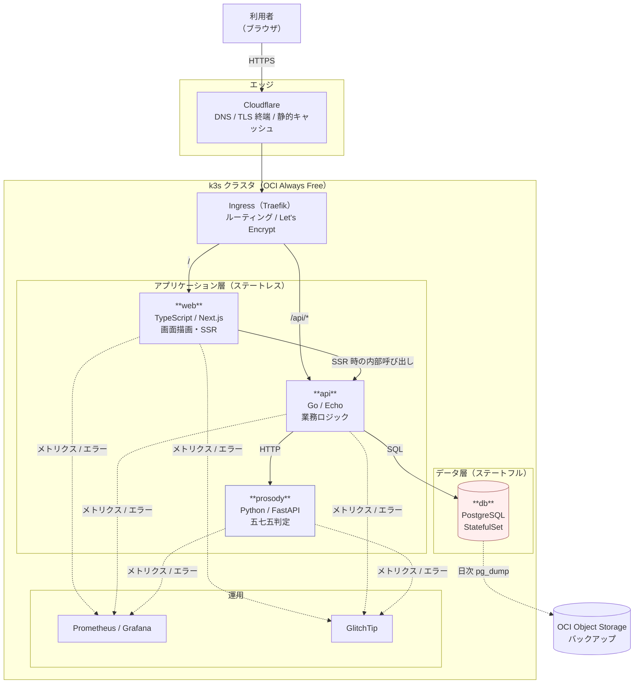
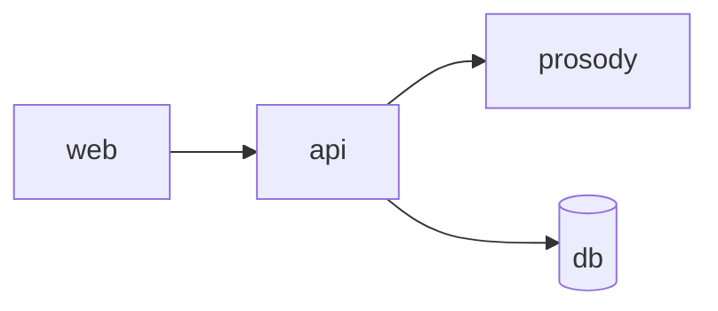
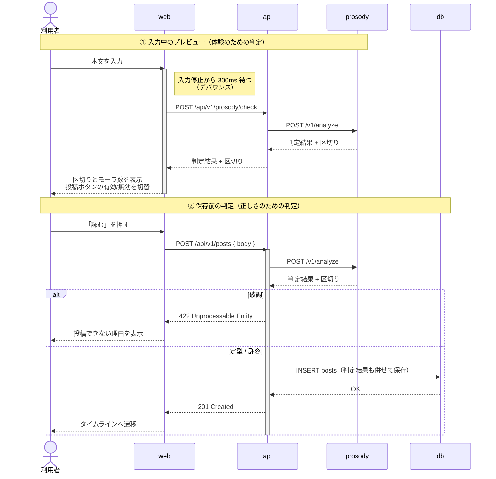
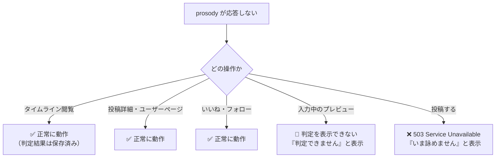
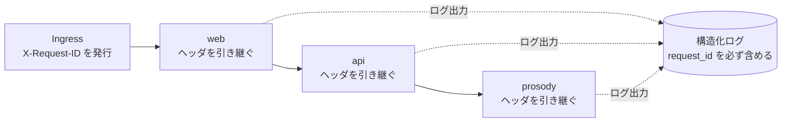

# 基本設計 01: システム構成

| 項目 | 内容 |
| --- | --- |
| ドキュメント種別 | 基本設計 |
| 前提 | [ADR-0002](../../adr/0002-tech-stack.md) / [ADR-0004](../../adr/0004-hosting-and-infrastructure.md) |
| 最終更新 | 2026-08-06 |

---

## 1. 全体構成

---

## 2. コンポーネントの責務

| コンポーネント | 責務 | 責務でないこと |
| --- | --- | --- |
| **web** | 画面の描画。SSR による初期表示。フォームの入力補助 | 業務ルールの判断。データの永続化。**判定結果の信頼** |
| **api** | 認証・認可。業務ロジック。データの永続化。prosody の呼び出し | 画面の描画。五七五判定そのもの |
| **prosody** | 本文を受け取り、判定結果と区切りを返す | 認証。永続化。**575 の業務ルールを知ること** |
| **db** | データの永続化 | ビジネスロジック（トリガ・ストアドプロシージャを使わない） |

### prosody に業務ルールを持たせない理由

prosody は「文字列を受け取り、音数律の判定結果を返す」だけの**純粋な変換器**とする。
以下のようなものは prosody に置かない。

- 「誰が投稿しようとしているか」
- 「破調だったら投稿を拒否する」という判断
- 投稿の保存

この境界を守ることで、prosody は**入力と出力だけでテストできる状態**を保てる。
DB もセッションも要らないため、単体で起動してベンチマークが取れる。

「破調なら拒否する」という判断は 575 の業務ルールであり、api の責務である。

---

## 3. 依存の方向

**この一方向を絶対に崩さない。**

| 制約 | 理由 |
| --- | --- |
| prosody は api を知らない | prosody を単体で起動・テストできる状態を保つため |
| prosody は db に接続しない | 状態を持たせないことで、いくつでも並べられるようにするため |
| api は web を知らない | api を web 以外（将来のモバイルアプリ等）からも使えるようにするため |
| web は db に直接接続しない | 認可を api の一箇所に集約するため |

---

## 4. 判定はどこで行われるか

判定は **2回** 行われる。これは冗長ではなく、目的が違う。

### なぜ2回判定するのか

| 回 | 目的 | 信頼できるか |
| --- | --- | --- |
| ① 入力中 | **体験**。ユーザーに「今どうなっているか」を見せる | ❌ 信頼しない |
| ② 保存前 | **正しさ**。破調を確実に弾く | ✅ これが唯一の正 |

①の結果をクライアントから受け取って保存に使ってはならない。
クライアントは改変できるため、①を信頼すると
`POST /api/v1/posts` に「判定OK」という嘘を添えるだけで破調が保存できてしまう。

この原則を [FR-02-05](../../requirements/01-requirements.md#fr-02-投稿詠む) として要件に明記している。

### 保存時に判定結果も保存する理由

区切り位置とモーラ数を `posts` に保存する。表示のたびに再判定しない。

| 理由 | 説明 |
| --- | --- |
| 表示コスト | タイムライン20件を表示するたびに20回の形態素解析を走らせるのは無駄 |
| 表示の安定性 | 辞書が更新されると同じ本文でも区切りが変わりうる。**投稿時点の区切りを固定する** |
| prosody 障害時の閲覧継続 | [NFR-02-03](../../requirements/01-requirements.md#nfr-02-可用性) の縮退運転。閲覧に prosody が不要になる |

---

## 5. 縮退運転

[NFR-02-03](../../requirements/01-requirements.md#nfr-02-可用性) に基づき、
prosody が全滅した場合の挙動を定義する。

**閲覧系は一切影響を受けない。** 投稿だけができなくなる。

api は prosody への呼び出しにタイムアウト（1秒）とサーキットブレーカーを設ける。
prosody が応答しないときに api のスレッドが詰まって、
閲覧系まで巻き添えになることを防ぐ。詳細は[詳細設計のエラー設計](../detail/03-error-handling.md)で扱う。

---

## 6. サービス間通信

| 経路 | プロトコル | 認証 | タイムアウト |
| --- | --- | --- | --- |
| ブラウザ → Cloudflare → Ingress | HTTPS | セッション Cookie（[ADR-0006](../../adr/0006-authentication.md)） | — |
| web → api | HTTP（クラスタ内） | 利用者の Cookie を転送 | 5秒 |
| api → prosody | HTTP + JSON（クラスタ内） | **なし**（クラスタ内部からのみ到達可能） | 1秒 |
| api → db | PostgreSQL プロトコル | パスワード（Secret から注入） | 3秒 |

### prosody に認証を設けない理由

prosody は Kubernetes の Service として**クラスタ内部にのみ公開**し、
Ingress からのルーティングを設定しない。外部から直接到達できない。

判定 API は状態を変更せず、機密情報も扱わないため、
クラスタ内での相互認証を導入する複雑度に見合わない。

ただし **NetworkPolicy で api からの通信のみを許可** し、
他の Pod から prosody へ到達できないようにする。

---

## 7. リクエスト ID の伝播

[NFR-05-02](../../requirements/01-requirements.md#nfr-05-保守性運用性) に基づき、
1つの利用者操作を全サービスのログで追跡できるようにする。

[ADR-0002](../../adr/0002-tech-stack.md) で「デバッグがサービスをまたぐ」ことを
デメリットとして受け入れた。その対処がこれである。
リクエスト ID がなければ、3サービスに分散したログから
1つの操作を再構成することが事実上不可能になる。

---

## 8. デプロイ単位

| Pod | レプリカ数（初期） | スケール条件 | 状態 |
| --- | --- | --- | --- |
| web | 2 | CPU 使用率 | ステートレス |
| api | 2 | CPU 使用率 | ステートレス |
| prosody | 2 | **CPU 使用率**（判定は CPU バウンド） | ステートレス |
| db | 1 | スケールしない | **ステートフル**（[ADR-0004 §6](../../adr/0004-hosting-and-infrastructure.md#6-nfr-02可用性に対する正直な評価) のとおり単一障害点） |

レプリカ数を 2 とするのは、[NFR-02-02](../../requirements/01-requirements.md#nfr-02-可用性)
（単一ノード障害での全断回避）を満たす最小値であるため。
各 Pod は異なるノードに配置する（Pod Anti-Affinity）。

---

## 関連ドキュメント

- [基本設計 02: ドメインモデルと状態遷移](02-domain-model.md)
- [基本設計 03: データベース設計](03-database.md)
- [基本設計 04: 画面設計](04-screens.md)
- [基本設計 05: API 設計](05-api.md)
- [ADR-0002: 言語・フレームワークの選定とサービス分割](../../adr/0002-tech-stack.md)
- [ADR-0004: ホスティング先とインフラ構成](../../adr/0004-hosting-and-infrastructure.md)
