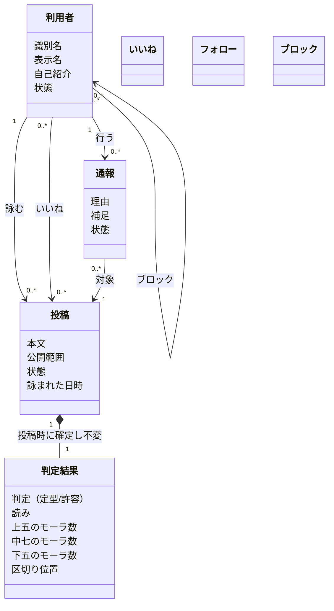
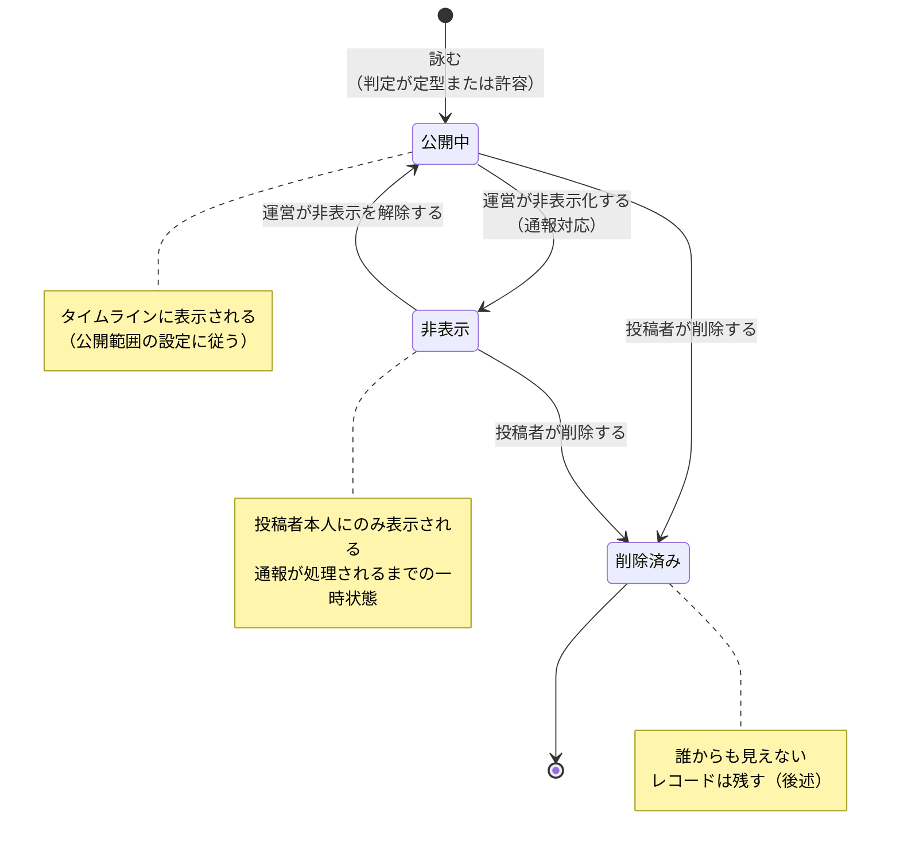
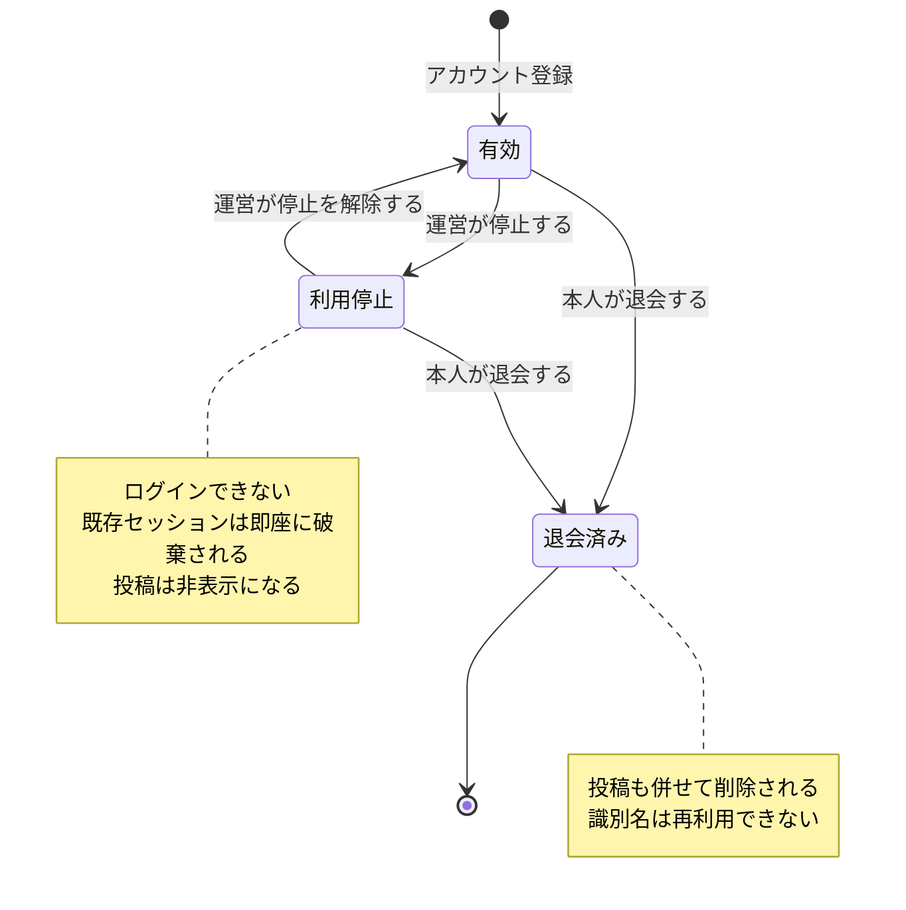
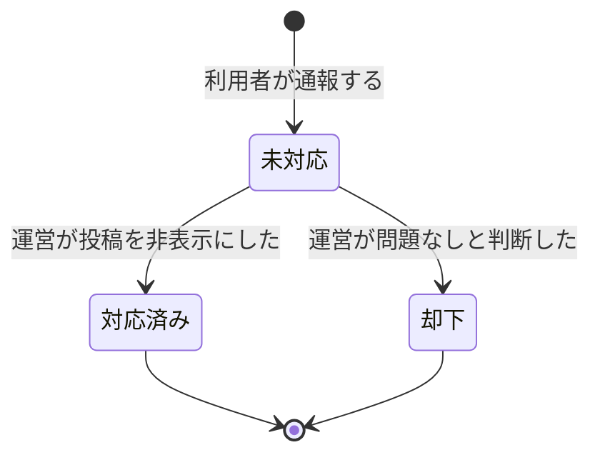
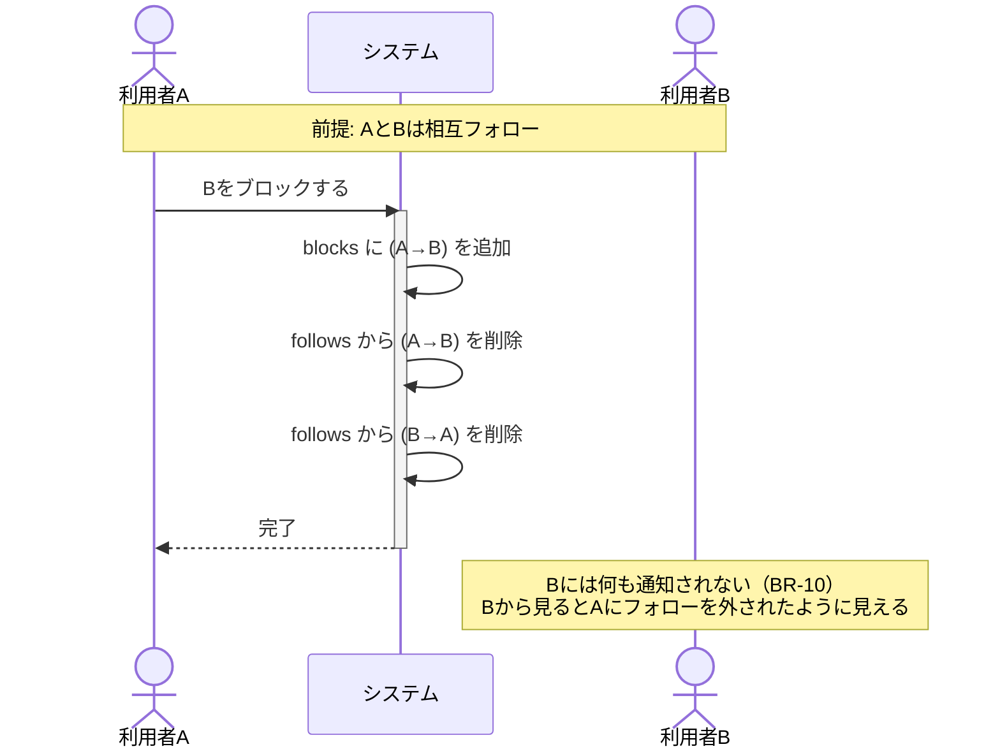

# 基本設計 02: ドメインモデルと状態遷移

| 項目 | 内容 |
| --- | --- |
| ドキュメント種別 | 基本設計 |
| 前提 | [要件定義書](../../requirements/01-requirements.md) |
| 最終更新 | 2026-08-06 |

---

## 1. ドメインモデル

575 に登場する概念と、その関係を示す。
用語の定義は [用語集](../../requirements/01-requirements.md#用語集) を参照。

### 判定結果が投稿の一部である理由

判定結果は投稿から独立した存在ではなく、**投稿と一体で不変**とする。

投稿は編集できない（[FR-02-07](../../requirements/01-requirements.md#fr-02-投稿詠む)）ため、
本文が変わらない以上、判定結果も変わってはならない。

辞書の更新によって同じ本文の判定が変わる可能性はあるが、
**過去の投稿の見え方が後から変わってはならない**。
「昨日は定型だった句が、今日見たら許容になっている」という状態は避ける。
これが [基本設計 01 §4](01-architecture.md#保存時に判定結果も保存する理由) で
判定結果を保存する理由の1つである。

---

## 2. 投稿の状態遷移

### 各状態の可視性

| 状態 | 投稿者本人 | 他の利用者 | 運営 |
| --- | --- | --- | --- |
| 公開中（全体公開） | 見える | 見える | 見える |
| 公開中（フォロワーのみ） | 見える | フォロワーのみ見える | 見える |
| 非表示 | 見える（非表示中である旨を表示） | 見えない | 見える |
| 削除済み | 見えない | 見えない | 見える（監査用） |

### 削除をレコードの物理削除にしない理由

「削除済み」を状態として持ち、行そのものは残す（論理削除）。

| 理由 | 説明 |
| --- | --- |
| 通報の追跡 | 通報された投稿を投稿者が削除して逃げた場合、通報の記録だけが残り対象が消えるのを防ぐ |
| いいねの整合性 | 物理削除すると、いいねの外部キーが宙に浮く |
| 誤削除の救済 | 運営側で復旧できる余地を残す |

ただし**論理削除は際限なくテーブルを肥大させる**。
一定期間（例: 90日）を過ぎた削除済み投稿を物理削除するバッチを別途用意する。
この期間の決定は実装フェーズで行う。

---

## 3. 利用者の状態遷移

### 利用停止時にセッションを破棄する

[ADR-0006](../../adr/0006-authentication.md) で
セッションを PostgreSQL に持つ方式を選んだ理由がここにある。

利用停止（[FR-05-04](../../requirements/01-requirements.md#fr-05-健全性)）を行うとき、
その利用者の `sessions` 行をすべて削除する。
次のリクエストから即座にログアウト状態になる。

### 退会後に識別名を再利用させない理由

識別名（`@handle`）を再利用可能にすると、
退会した利用者になりすました別人が同じ識別名を取得できてしまう。
過去の投稿への言及やリンクが、別人を指すようになる。

---

## 4. 通報の状態遷移

同一の投稿に対して複数の利用者が通報した場合、
通報レコードはそれぞれ独立して作られる。
運営は投稿単位で対応し、その投稿に紐づく未対応の通報をまとめて処理する。

**同一利用者による同一投稿への重複通報は受け付けない**（1人1投稿につき1件まで）。
連続通報による嫌がらせを防ぐため。

---

## 5. 主要なビジネスルール

モデル図に表現しきれないルールを列挙する。

### 投稿に関するルール

| # | ルール | 根拠 |
| --- | --- | --- |
| BR-01 | 判定が破調の本文は投稿できない | [FR-02-04](../../requirements/01-requirements.md#fr-02-投稿詠む) |
| BR-02 | 投稿は編集できない。削除のみ可能 | [FR-02-07](../../requirements/01-requirements.md#fr-02-投稿詠む) |
| BR-03 | 投稿を削除できるのは投稿者本人のみ | — |
| BR-04 | 判定結果は投稿時に確定し、以後変更されない | [§1](#判定結果が投稿の一部である理由) |

### 関係に関するルール

| # | ルール | 理由 |
| --- | --- | --- |
| BR-05 | 自分自身をフォローできない | 無意味であり、タイムラインの重複を招く |
| BR-06 | 自分自身をブロックできない | 自分の投稿が見えなくなる |
| BR-07 | 自分自身の投稿を通報できない | 削除すれば済む |
| BR-08 | ブロックすると、フォロー関係は双方向に解除される | ブロックしたのに相手のタイムラインに自分の投稿が流れ続けるのを防ぐ |
| BR-09 | ブロックした相手の投稿は、すべての画面で表示されない。**逆向きも同様**（[下記](#br-09-は双方向に効く)） | [FR-05-02](../../requirements/01-requirements.md#fr-05-健全性) |
| BR-10 | ブロックされた側は、ブロックされた事実を知らされない | 報復を誘発しないため |

### BR-09 は双方向に効く

FR-05-02 は「ブロックしたユーザーの投稿は表示されない」と一方向だけを述べているが、
**逆向き（ブロックされた側から見て、ブロックした側の投稿）も表示しない**。

| 理由 | 説明 |
| --- | --- |
| 片方向だと目的を達しない | ブロックされた側は投稿を読み続け、いいね・通報もできる。BR-08 が守ろうとした「見られたくない」意図が満たされない |
| 他の操作と食い違う | フォローはすでに、ブロックされた側からの操作を 404 にしている。投稿だけ見えるのは不整合 |
| 事実は漏れない | 404 は退会済み・存在しない投稿と区別がつかない（BR-10） |

実装では、閲覧者と投稿者のあいだに**どちらの向きでも**ブロックがあれば 404 を返す。
未ログインの閲覧はブロックの影響を受けない（誰でもない相手はブロックできない）。

> 2026-08-10（#36）に追記。BR-09 の適用範囲が一方向しか定まっておらず、
> 実装時に判断が必要になったため。

### BR-08 の設計意図

ブロックは「相手を見たくない」だけでなく、
**「相手に見られたくない」** 意図を含むことが多い。

フォロー関係を片方向だけ解除すると、
ブロックした側の投稿がブロックされた側のタイムラインに流れ続ける。
これはブロックの意図に反するため、双方向で解除する。

---

## 関連ドキュメント

- [基本設計 01: システム構成](01-architecture.md)
- [基本設計 03: データベース設計](03-database.md)
- [要件定義書](../../requirements/01-requirements.md)
- [ADR-0006: 認証方式](../../adr/0006-authentication.md)
