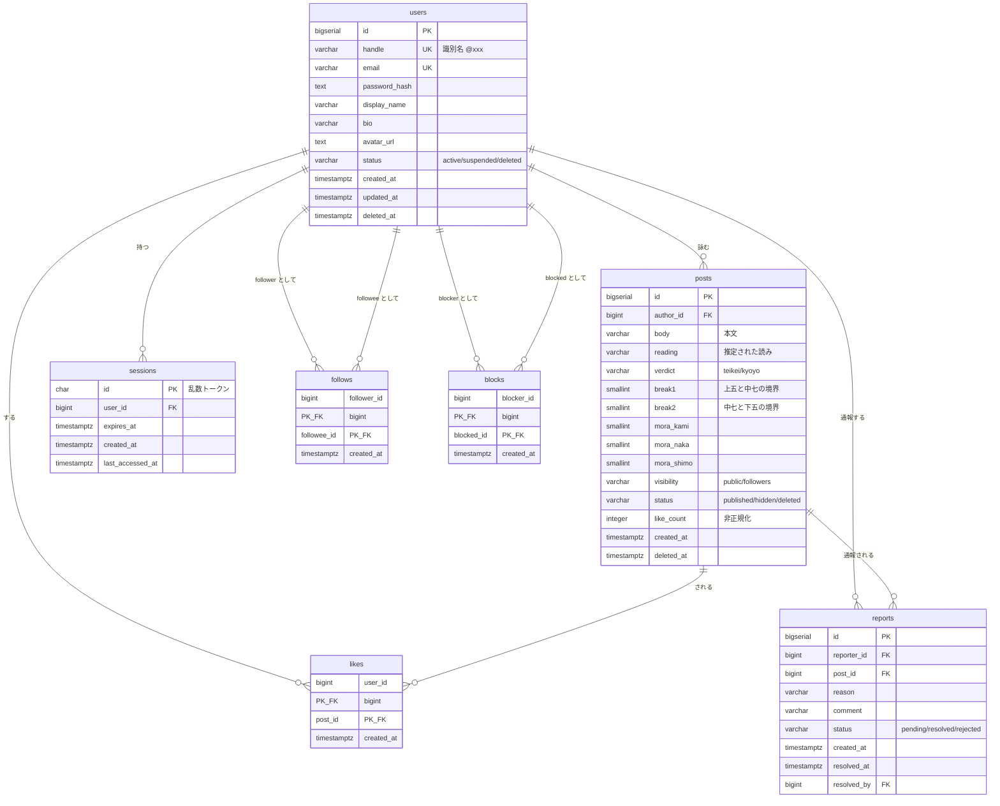

# 基本設計 03: データベース設計

| 項目 | 内容 |
| --- | --- |
| ドキュメント種別 | 基本設計 |
| DBMS | PostgreSQL（[ADR-0002](../../adr/0002-tech-stack.md)） |
| 前提 | [基本設計 02: ドメインモデル](02-domain-model.md) / [ADR-0005](../../adr/0005-timeline-strategy.md) |
| 最終更新 | 2026-08-06 |

---

## 1. ER 図



---

## 2. テーブル定義

### users

| カラム | 型 | 制約 | 説明 |
| --- | --- | --- | --- |
| id | BIGSERIAL | PK | |
| handle | VARCHAR(20) | NOT NULL, UNIQUE | 識別名。半角英数字とアンダースコアのみ。**退会後も再利用させない**（[BR](02-domain-model.md#退会後に識別名を再利用させない理由)）ため行を残す |
| email | VARCHAR(255) | NOT NULL, UNIQUE | |
| password_hash | TEXT | NOT NULL | ソルト付きハッシュ（[NFR-04-01](../../requirements/01-requirements.md#nfr-04-セキュリティ)） |
| display_name | VARCHAR(50) | NOT NULL | |
| bio | VARCHAR(200) | | 自己紹介。五七五である必要はない（[FR-01-03](../../requirements/01-requirements.md#fr-01-アカウント)） |
| avatar_url | TEXT | | |
| status | VARCHAR(10) | NOT NULL, CHECK | `active` / `suspended` / `deleted` |
| created_at | TIMESTAMPTZ | NOT NULL | |
| updated_at | TIMESTAMPTZ | NOT NULL | |
| deleted_at | TIMESTAMPTZ | | 退会日時 |

### sessions

| カラム | 型 | 制約 | 説明 |
| --- | --- | --- | --- |
| id | CHAR(43) | PK | 32バイトの乱数を base64url した文字列。**連番・推測可能な値を使わない**（[ADR-0006](../../adr/0006-authentication.md)） |
| user_id | BIGINT | NOT NULL, FK → users(id) | |
| expires_at | TIMESTAMPTZ | NOT NULL | |
| created_at | TIMESTAMPTZ | NOT NULL | |
| last_accessed_at | TIMESTAMPTZ | NOT NULL | スライディング期限の起点 |

### posts

| カラム | 型 | 制約 | 説明 |
| --- | --- | --- | --- |
| id | BIGSERIAL | PK | カーソルページネーションのカーソルを兼ねる（[§5](#5-カーソルページネーション)） |
| author_id | BIGINT | NOT NULL, FK → users(id) | |
| body | VARCHAR(100) | NOT NULL | 本文。上限の根拠は[後述](#body-の上限を100文字とする根拠) |
| reading | VARCHAR(100) | NOT NULL | prosody が推定したカタカナ読み。判定の根拠として保存する |
| verdict | VARCHAR(10) | NOT NULL, CHECK | `teikei`（定型）/ `kyoyo`（許容）。**`hacho`（破調）は保存されない** |
| break1 | SMALLINT | NOT NULL | 上五と中七の境界。`body` の文字位置 |
| break2 | SMALLINT | NOT NULL | 中七と下五の境界。`body` の文字位置 |
| mora_kami | SMALLINT | NOT NULL, CHECK (4〜6) | 上五のモーラ数 |
| mora_naka | SMALLINT | NOT NULL, CHECK (6〜8) | 中七のモーラ数 |
| mora_shimo | SMALLINT | NOT NULL, CHECK (4〜6) | 下五のモーラ数 |
| visibility | VARCHAR(10) | NOT NULL, CHECK | `public` / `followers` |
| status | VARCHAR(10) | NOT NULL, CHECK | `published` / `hidden` / `deleted` |
| like_count | INTEGER | NOT NULL, DEFAULT 0, CHECK (>= 0) | 非正規化（[§4](#4-いいね数の非正規化)） |
| created_at | TIMESTAMPTZ | NOT NULL | |
| deleted_at | TIMESTAMPTZ | | 論理削除の日時 |

#### 区切りを文字位置で持つ理由

区切り済みの3つの文字列（`kami_text` / `naka_text` / `shimo_text`）として持つ選択肢もあるが、
**本文が3箇所に重複して保存される**ことになる。

文字位置2つ（`break1` / `break2`）で持てば、本文は1つで済み、
`body[0:break1]` / `body[break1:break2]` / `body[break2:]` で復元できる。
重複がないため、不整合が構造的に発生しない。

#### モーラ数に CHECK 制約を張る理由

[ADR-0001](../../adr/0001-onsuritsu-tolerance.md) で決めた許容範囲を、
**データベースの制約としても表現する**。

アプリケーション側のバグで破調の投稿を保存しようとした場合、
DB が最後の砦として拒否する。
判定ロジックの誤りが、サイレントにデータを汚染するのを防ぐ。

ただし DB の CHECK では「ズレは最大1句」という条件までは表現しにくい。
これはアプリケーション側で担保する。

#### `body` の上限を100文字とする根拠

投稿は最大20モーラである（[ADR-0001](../../adr/0001-onsuritsu-tolerance.md) より 6+8+6=20 が理論上限。
実際に投稿可能なのは18モーラまで）。

文字数がモーラ数を上回るのは、**拗音**（「きょ」= 2文字で1モーラ）が並ぶ場合である。

```
全モーラが拗音の極端な例:  20モーラ × 2文字 = 40文字
句読点・記号・空白の余地:  + 数十文字
```

100文字あれば実用上あらゆるケースを収容できる。
一方で無制限にすると、判定を通らない巨大な文字列を送りつける攻撃の余地を残す。
API のバリデーション（[NFR-04-06](../../requirements/01-requirements.md#nfr-04-セキュリティ)）と
DB 制約の両方で上限を設ける。

### likes / follows / blocks

いずれも中間テーブルであり、複合主キーを持つ。

| テーブル | 主キー | CHECK 制約 | 根拠 |
| --- | --- | --- | --- |
| likes | (user_id, post_id) | — | 同じ投稿への二重いいねを主キーで防ぐ |
| follows | (follower_id, followee_id) | `follower_id <> followee_id` | [BR-05](02-domain-model.md#関係に関するルール) 自分をフォローできない |
| blocks | (blocker_id, blocked_id) | `blocker_id <> blocked_id` | [BR-06](02-domain-model.md#関係に関するルール) 自分をブロックできない |

**ビジネスルールのうち、制約で表現できるものは制約で表現する。**
アプリケーション側のチェックだけに頼ると、バグや別経路からの書き込みで破られる。

### reports

| カラム | 型 | 制約 | 説明 |
| --- | --- | --- | --- |
| id | BIGSERIAL | PK | |
| reporter_id | BIGINT | NOT NULL, FK → users(id) | |
| post_id | BIGINT | NOT NULL, FK → posts(id) | |
| reason | VARCHAR(20) | NOT NULL, CHECK | 通報理由の区分 |
| comment | VARCHAR(500) | | 補足 |
| status | VARCHAR(10) | NOT NULL, CHECK | `pending` / `resolved` / `rejected` |
| created_at | TIMESTAMPTZ | NOT NULL | |
| resolved_at | TIMESTAMPTZ | | |
| resolved_by | BIGINT | FK → users(id) | 対応した運営 |

**UNIQUE (reporter_id, post_id)** を張る。
同一利用者による同一投稿への重複通報を防ぐ（[基本設計 02 §4](02-domain-model.md#4-通報の状態遷移)）。

---

## 3. インデックス設計

インデックスは**必要な場所にだけ**張る。
インデックスは検索を速くする代わりに、書き込みを遅くし、ディスクを消費する。
「とりあえず張る」ことはしない。

### インデックス一覧

| # | テーブル | インデックス | 種別 | 用途 |
| --- | --- | --- | --- | --- |
| 1 | users | `(handle)` | UNIQUE | ユーザーページの表示、識別名の重複チェック |
| 2 | users | `(email)` | UNIQUE | ログイン |
| 3 | sessions | `(id)` | PK | **毎リクエストのセッション検証**。最も呼ばれる |
| 4 | sessions | `(user_id)` | 通常 | 利用停止時の一括削除 |
| 5 | sessions | `(expires_at)` | 通常 | 期限切れセッションの定期削除 |
| 6 | posts | `(id DESC) WHERE status='published' AND visibility='public'` | **部分** | 全体タイムライン |
| 7 | posts | `(author_id, id DESC) WHERE status='published'` | **部分** | フォロー中タイムライン、ユーザーページ |
| 8 | follows | `(follower_id, followee_id)` | PK | フォロー中タイムライン、フォロー中一覧 |
| 9 | follows | `(followee_id, follower_id DESC)` | 通常 | フォロワー一覧、フォロワー数 |
| 10 | likes | `(user_id, post_id)` | PK | いいね済みかの判定 |
| 11 | likes | `(post_id)` | 通常 | 投稿へのいいね一覧 |
| 12 | blocks | `(blocker_id, blocked_id)` | PK | タイムラインからの除外 |
| 13 | reports | `(reporter_id, post_id)` | UNIQUE | 重複通報の防止 |
| 14 | reports | `(created_at) WHERE status='pending'` | **部分** | 運営の通報一覧 |

#### #9 に follower_id を含める理由

フォロワー一覧は `followee_id` で絞り、`follower_id` の降順で返す。
`(followee_id)` だけでは順序が得られず、プランナは順序のために
`follows_pkey (follower_id, followee_id)` を逆順に走査する計画を選ぶ。

実測（PostgreSQL 18・`follows` 4,003 行・フォロワー3人の利用者）。

| 索引 | `follows` の走査 |
| --- | ---: |
| `(followee_id)` のみ | 25 buffers |
| `(followee_id, follower_id DESC)` | **6 buffers** |

絞り込みと順序を1つの索引で満たす。フォロワー数の数え上げも
先頭列が一致するため同じ索引で足りる。

### 部分インデックスを使う理由（#6・#7・#14）

タイムラインに出るのは `status='published'` の投稿だけである。
削除済み・非表示の投稿はインデックスに含める意味がない。

```
【通常のインデックス】
  全投稿（削除済み・非表示を含む）がインデックスに載る
  → 削除済み投稿が増えるほどインデックスが肥大し、検索が遅くなる

【部分インデックス】
  published の投稿だけが載る
  → 削除済み投稿がいくら増えてもインデックスは太らない
```

[基本設計 02](02-domain-model.md#削除をレコードの物理削除にしない理由) で
論理削除を採用したため、削除済みレコードは蓄積し続ける。
部分インデックスはその副作用を打ち消す。

通報テーブル（#14）も同様で、対応済みの通報は一覧に出ない。
運用が続くほど `resolved` が積み上がるが、部分インデックスなら影響を受けない。

### 主要クエリと使われるインデックス

#### 全体タイムライン

```sql
SELECT p.*
FROM posts p
WHERE p.status = 'published'
  AND p.visibility = 'public'
  AND p.id < :cursor
  AND NOT EXISTS (
        SELECT 1 FROM blocks b
        WHERE (b.blocker_id = :me AND b.blocked_id = p.author_id)
           OR (b.blocker_id = p.author_id AND b.blocked_id = :me)
      )
ORDER BY p.id DESC
LIMIT 20;
```

- `posts` の走査 → **#6**（部分インデックスを id DESC 方向にスキャン）
- ブロック判定 → **#12**（主キーへのピンポイント検索）

#### フォロー中タイムライン

```sql
SELECT p.*
FROM posts p
JOIN follows f
  ON f.followee_id = p.author_id
 AND f.follower_id = :me
WHERE p.status = 'published'
  AND p.id < :cursor
  AND NOT EXISTS (
        SELECT 1 FROM blocks b
        WHERE (b.blocker_id = :me AND b.blocked_id = p.author_id)
           OR (b.blocker_id = p.author_id AND b.blocked_id = :me)
      )
ORDER BY p.id DESC
LIMIT 20;
```

- フォロー一覧の取得 → **#8**（`follower_id` で前方一致）
- 各フォロイーの投稿 → **#7**（`author_id` + `id DESC`）

#### ブロックの除外は双方向に行う（#38 で訂正）

当初のクエリは `blocker_id = :me` の一方向しか除外していなかった。
[BR-09 を双方向と定めた](02-domain-model.md#br-09-は双方向に効く)ため、
**投稿者が閲覧者をブロックしている場合も除外する**。
片方向のままだと、ブロックされた側のタイムラインに相手の投稿が流れ続ける。

インデックス #12 は `(blocker_id, blocked_id)` の順だが、
追加した枝も `blocker_id` を等値で絞るため、**両方の枝で主キーを使える**。
逆順のインデックスを別途作る必要はない。

ただし、プランナが実際に主キーを選ぶかは `blocks` の行数に依存する。
数行しかない状態では Seq Scan を選ぶのが正しい判断であり、
**規模を伴う確認は実行計画の Issue で行う**。

#### 実行計画の確認を必須とする

上記2クエリは 575 で最も頻繁に実行される。
実装時に **`EXPLAIN ANALYZE` を取得し、記録に残す**。

| 確認項目 | 期待 |
| --- | --- |
| `posts` に Seq Scan が出ていないこと | Index Scan または Index Only Scan |
| `LIMIT 20` が効いて早期終了していること | 実際に読んだ行数が 20 前後に収まる |
| ソートが発生していないこと | インデックスの並び順で読めており `Sort` ノードが出ない |

データが少ないうちは Seq Scan の方が速く、プランナが Index Scan を選ばない。
**投入データを増やした状態で計測する**（目安として posts 10万行以上）。

---

## 4. いいね数の非正規化

`posts.like_count` は `likes` テーブルから数えれば求められる値であり、**正規化に反する**。
それでも持つ。

### 持たない場合に何が起きるか

タイムラインで20件の投稿を表示するたびに、20回の集計が走る。

```sql
SELECT COUNT(*) FROM likes WHERE post_id = ?   -- これが20回
```

`likes` は全ユーザーの全いいねが入る最大のテーブルになる。
人気のある投稿ほど行数が多く、集計が重くなる。
[NFR-01-02](../../requirements/01-requirements.md#nfr-01-性能) の 300ms を守れない。

### 非正規化の代償

**`likes` と `like_count` がずれる可能性**を抱え込む。

いいねの追加・削除のたびに2つの更新が必要になる。

```
1. likes に INSERT
2. posts.like_count を +1
```

片方だけが成功すると不整合になる。対策は以下。

| 対策 | 内容 |
| --- | --- |
| トランザクション | 上記2つを必ず同一トランザクションで実行する |
| アトミックな更新 | `UPDATE posts SET like_count = like_count + 1 WHERE id = ?` とする。アプリ側で読んで加算して書き戻す（read-modify-write）と、同時実行で更新が失われる |
| CHECK 制約 | `like_count >= 0` を DB で保証し、異常な減算を検出する |
| 定期的な突合 | `likes` の実数と `like_count` を照合し、ずれていたら補正するバッチを用意する |

**アトミックな更新は特に重要である。**
人気の投稿には同時に複数のいいねが飛ぶ。
read-modify-write で実装すると、同時に2人がいいねしたときに片方が消える。
詳細は[詳細設計](../detail/02-class-design.md)で扱う。

---

## 5. カーソルページネーション

[ADR-0005](../../adr/0005-timeline-strategy.md) のとおり、`OFFSET` を使わない。

### なぜ OFFSET を使わないか

```sql
-- 100ページ目を取得する
SELECT * FROM posts ORDER BY id DESC LIMIT 20 OFFSET 2000;
```

`OFFSET 2000` は **2000行を読み飛ばすために、2000行を実際に読む**。
ページが深くなるほど線形に遅くなる。
無限スクロール（[FR-03-03](../../requirements/01-requirements.md#fr-03-閲覧)）では
ユーザーがひたすら深いページへ進むため、この方式は破綻する。

```sql
-- カーソル方式
SELECT * FROM posts WHERE id < :cursor ORDER BY id DESC LIMIT 20;
```

こちらはインデックス上の位置に直接ジャンプするため、**何ページ目でも同じ速度**である。

### id をカーソルに使うことの前提とリスク

`BIGSERIAL` は単調増加するため、`id DESC` は `created_at DESC` とほぼ一致する。
そのため id をそのままカーソルに使える。

ただし**厳密には一致しない**。

```
【起こりうること】
  トランザクションAが id=100 を採番（まだコミットしていない）
  トランザクションBが id=101 を採番してコミット
  → 一瞬、101 だけが見える状態になる
  トランザクションAがコミット
  → 100 が後から見えるようになる

  この間にカーソルが 101 を通過していると、100 の投稿が読み飛ばされる
```

これは PostgreSQL のシーケンスがトランザクション外で採番されるために起きる、
カーソルページネーション一般の既知の問題である。

**575 ではこれを許容する。**

| 判断 | 理由 |
| --- | --- |
| 発生頻度が極めて低い | 同一ミリ秒に複数の投稿が発生し、かつその瞬間にカーソルが通過する必要がある |
| 影響が軽微 | 1件の投稿がタイムラインに出ないだけ。データは失われず、ユーザーページでは見える |
| 回避策のコストが高い | 完全に防ぐにはスナップショットを取るか、採番方式を変える必要があり、複雑度に見合わない |

将来、投稿頻度が上がって顕在化した場合に再検討する。

### id が推測可能であることについて

`BIGSERIAL` は連番のため、`/posts/1234` の隣に `/posts/1235` があると推測できる。

- **全体公開の投稿**は元々誰でも見られるため、推測されても問題にならない
- **フォロワー限定の投稿**は、id を推測されても**認可チェックで閲覧を拒否する**。
  推測によって漏れるのは「その id の投稿が存在する」という事実のみで、内容は漏れない

投稿の総数が推測できるという情報漏洩はあるが、
575 において投稿数は秘匿すべき情報ではない。

UUID を使えば推測を防げるが、**ソート可能でないためカーソルページネーションに使えない**。
ソート可能な UUIDv7 という選択肢もあるが、
上記のとおり守るべき秘密がないため、複雑度を足す理由がない。

---

## 6. マイグレーション方針

| 項目 | 方針 |
| --- | --- |
| ツール | Go のマイグレーションツールを用い、SQL ファイルをリポジトリで管理する |
| 適用 | api の起動時に自動適用せず、**明示的なコマンドで実行する**。複数の api Pod が同時に起動してマイグレーションが競合するのを防ぐ |
| ロールバック | すべてのマイグレーションに down を用意する |
| 破壊的変更 | カラム削除・リネームは、追加 → 移行 → 削除の3段階に分ける。1回のデプロイで完結させない |

---

## 関連ドキュメント

- [基本設計 01: システム構成](01-architecture.md)
- [基本設計 02: ドメインモデルと状態遷移](02-domain-model.md)
- [基本設計 05: API 設計](05-api.md)
- [ADR-0001: 字余り・字足らずの許容範囲](../../adr/0001-onsuritsu-tolerance.md)
- [ADR-0005: タイムラインの実現方式](../../adr/0005-timeline-strategy.md)
- [ADR-0006: 認証方式](../../adr/0006-authentication.md)
