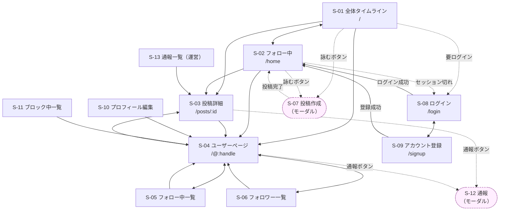
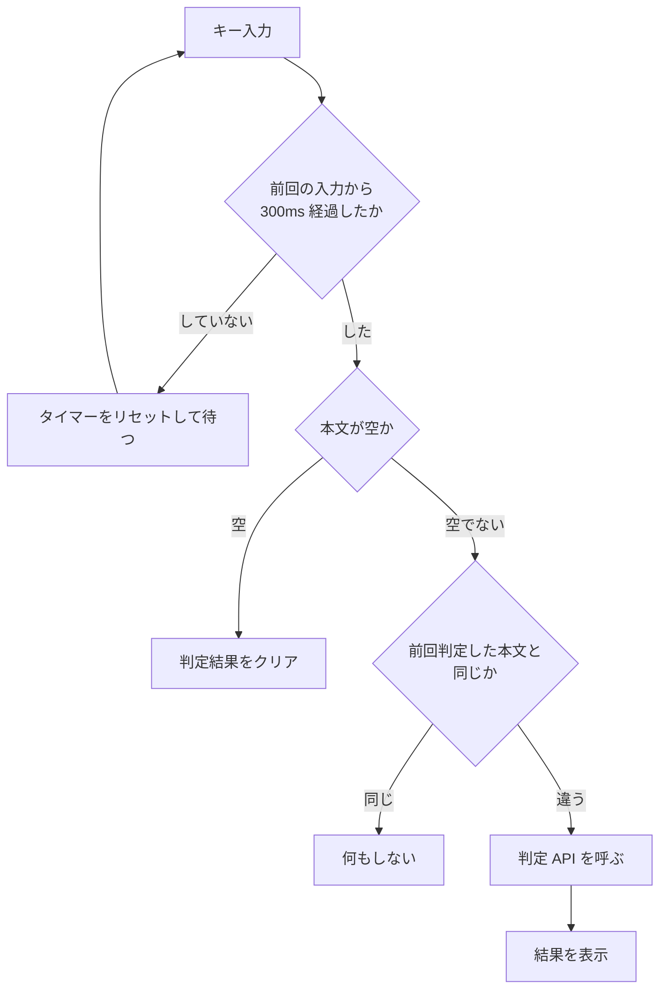

# 基本設計 04: 画面設計

| 項目 | 内容 |
| --- | --- |
| ドキュメント種別 | 基本設計 |
| 前提 | [要件定義書](../../requirements/01-requirements.md) |
| 最終更新 | 2026-08-06 |

---

## 1. 画面一覧

| ID | 画面 | パス | 未ログイン | 対応する要件 |
| --- | --- | --- | :---: | --- |
| S-01 | 全体タイムライン | `/` | ✅ 閲覧可 | [FR-03-01](../../requirements/01-requirements.md#fr-03-閲覧) |
| S-02 | フォロー中タイムライン | `/home` | ❌ | [FR-03-02](../../requirements/01-requirements.md#fr-03-閲覧) |
| S-03 | 投稿詳細 | `/posts/:id` | ✅ 閲覧可 | [FR-03-04](../../requirements/01-requirements.md#fr-03-閲覧) |
| S-04 | ユーザーページ | `/@:handle` | ✅ 閲覧可 | [FR-03-05](../../requirements/01-requirements.md#fr-03-閲覧) |
| S-05 | フォロー中一覧 | `/@:handle/following` | ✅ 閲覧可 | [FR-04-03](../../requirements/01-requirements.md#fr-04-交流) |
| S-06 | フォロワー一覧 | `/@:handle/followers` | ✅ 閲覧可 | [FR-04-03](../../requirements/01-requirements.md#fr-04-交流) |
| S-07 | 投稿作成 | モーダル | ❌ | [FR-02-03](../../requirements/01-requirements.md#fr-02-投稿詠む) |
| S-08 | ログイン | `/login` | ✅ | [FR-01-02](../../requirements/01-requirements.md#fr-01-アカウント) |
| S-09 | アカウント登録 | `/signup` | ✅ | [FR-01-01](../../requirements/01-requirements.md#fr-01-アカウント) |
| S-10 | プロフィール編集 | `/settings/profile` | ❌ | [FR-01-03](../../requirements/01-requirements.md#fr-01-アカウント) |
| S-11 | ブロック中一覧 | `/settings/blocks` | ❌ | [FR-05-02](../../requirements/01-requirements.md#fr-05-健全性) |
| S-12 | 通報 | モーダル | ❌ | [FR-05-01](../../requirements/01-requirements.md#fr-05-健全性) |
| S-13 | 通報一覧（運営） | `/admin/reports` | ❌ 運営のみ | [FR-05-03](../../requirements/01-requirements.md#fr-05-健全性) |

---

## 2. 画面遷移図



破線はモーダルの開閉、およびログインを要求される遷移を表す。
実線は通常のページ遷移である。

図に描かれていないが、**すべての画面からグローバルナビゲーション経由で
S-01 / S-02 / S-04（自分）/ S-10 へ遷移できる**ものとする。
すべて描くと線が交錯して読めなくなるため省略した。

---

## 3. 投稿作成画面（S-07）の設計

575 の中核となる画面のため、単独で詳述する。

### 画面の構成

```
┌────────────────────────────────────────┐
│  詠む                              ✕   │
├────────────────────────────────────────┤
│                                        │
│  ┌──────────────────────────────────┐  │
│  │ 今日もまた会議のための会議かな    │  │  ← 本文入力
│  │                                  │  │
│  └──────────────────────────────────┘  │
│                                        │
│  ┌──────────────────────────────────┐  │
│  │  今日もまた   / 会議のための /    │  │  ← 判定結果の表示
│  │    5音          7音               │  │     （区切りとモーラ数）
│  │  会議かな                         │  │
│  │    5音                            │  │
│  │                                   │  │
│  │  ✅ 定型                          │  │  ← 判定バッジ
│  └──────────────────────────────────┘  │
│                                        │
│  公開範囲: [ 全体公開 ▾ ]              │
│                            [ 詠む ]    │  ← 破調のとき無効
└────────────────────────────────────────┘
```

### 判定結果の表示パターン

| 判定 | バッジ | 投稿ボタン | 表示内容 |
| --- | --- | --- | --- |
| 定型 | ✅ 定型 | 有効 | 区切りと各句のモーラ数 |
| 許容 | 🔵 字余り / 字足らず | 有効 | 区切りと各句のモーラ数。ズレている句を強調 |
| 破調 | ⚠️ 破調 | **無効** | 現在のモーラ数と、あと何音必要かの案内 |
| 読み不明 | ❓ 読み方が分かりません | **無効** | 読めなかった語を明示する（[詳細設計 01 §4](../detail/01-prosody-algorithm.md#4-読みが取得できない場合)） |
| 判定不能 | ⚠️ 判定できません | **無効** | prosody 障害時（[基本設計 01 §5](01-architecture.md#5-縮退運転)） |

### なぜ区切りとモーラ数を必ず見せるのか

[要件定義 3.2](../../requirements/01-requirements.md#32-判定エンジンに対する品質要求) のとおり、
判定エンジンは 100% 正確にはなり得ない。

区切りとモーラ数を隠すと、破調と判定されたときにユーザーは
**なぜ弾かれたのか分からず、直しようがない**。

```
❌ 悪い例:  「五七五になっていません」
             → どこが悪いのか分からない

✅ 良い例:  今日もまた(5) / 会議のための(7) / 会議でしたね(6)
             ⚠️ 下五が1音多いようです
             → 直すべき場所が分かる
```

さらに、システムが読みを誤っている場合も、
読みを表示していればユーザーが気づける。
「システムは『一日』を イチニチ と読んだが、自分は ツイタチ のつもりだった」
という食い違いが可視化される。

これは [NFR-06-02](../../requirements/01-requirements.md#nfr-06-ユーザビリティ)
（単に「エラー」とだけ表示しない）の具体化である。

### 判定を呼ぶタイミング



**キーストロークごとに呼ばない。**
入力停止から 300ms 待つ（デバウンス）。

理由は2つある。

| 理由 | 説明 |
| --- | --- |
| 負荷 | 1文字ごとに判定すると、17文字の入力で17回の形態素解析が走る。prosody の CPU を無駄に消費する |
| 表示のちらつき | 入力途中の不完全な文に対する判定結果が高速で切り替わり、読めない |

300ms は「入力が一段落した」と判断できる最小の間隔として設定する。
実測して体感が悪ければ調整する。

さらに、**日本語入力の変換確定前（IME 変換中）は判定を呼ばない**。
変換中の文字列は最終的な本文ではないため、判定しても意味がない。

---

## 4. 投稿の表示形式

投稿は**必ず句ごとに改行して表示する**（[FR-03-06](../../requirements/01-requirements.md#fr-03-閲覧)）。

```
┌────────────────────────────────┐
│ 🙂 やまだ @yamada     2時間前  │
│                                │
│    今日もまた                  │
│    会議のための                │
│    会議かな                    │
│                                │
│    ✅ 定型                     │
│                                │
│    ♡ 12                    ⋯   │
└────────────────────────────────┘
```

改行位置は `posts.break1` / `posts.break2`（[基本設計 03](03-database.md#posts)）から復元する。
**表示のたびに再判定しない。**

一行で表示すると、五七五であることが視覚的に分からず、
「なぜこの SNS を使っているのか」が伝わらない。
形式そのものがプロダクトの価値であるため、それを見せる。

---

## 5. レスポンシブ対応

[NFR-06-01](../../requirements/01-requirements.md#nfr-06-ユーザビリティ) に基づき、
スマートフォンでの利用を主とする。

| ブレークポイント | レイアウト |
| --- | --- |
| 〜768px（スマートフォン） | 単一カラム。ナビゲーションは画面下部に固定 |
| 769px〜（PC・タブレット） | 2カラム。左にナビゲーション、右にコンテンツ |

投稿の表示は句ごとの改行が前提のため、
**横幅が狭くても崩れない**。これは五七五という制約の副次的な利点である。

---

## 6. スコープ外の画面

以下は [5.2 MVP 以降](../../requirements/01-requirements.md#52-mvp-以降第2版以降で検討) の機能に対応し、
本設計では扱わない。

- 通知一覧
- 検索結果
- お題一覧
- 読みの手動修正

ただし **グローバルナビゲーションの構造は、これらを後から追加できる形にしておく**。
後付けでナビゲーションを組み替えると、既存ユーザーの操作感を壊すため。

---

## 関連ドキュメント

- [基本設計 01: システム構成](01-architecture.md)
- [基本設計 03: データベース設計](03-database.md)
- [基本設計 05: API 設計](05-api.md)
- [要件定義書](../../requirements/01-requirements.md)
