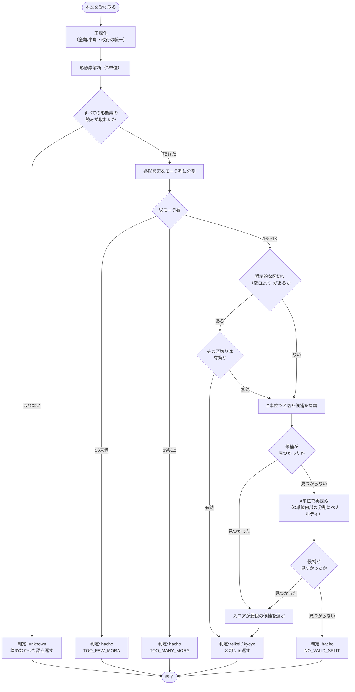
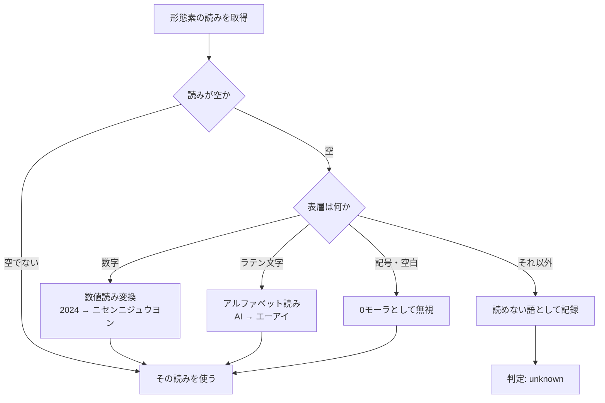
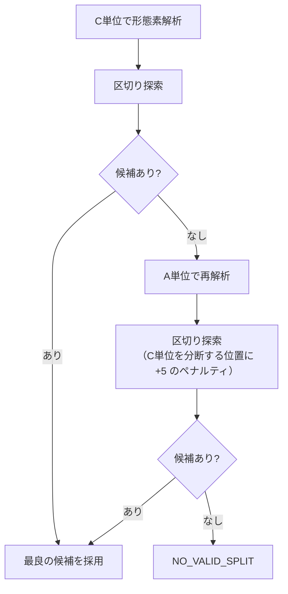

# 詳細設計 01: 五七五判定アルゴリズム

| 項目 | 内容 |
| --- | --- |
| ドキュメント種別 | 詳細設計 |
| 対象 | prosody（Python / FastAPI） |
| 前提 | [ADR-0001](../../adr/0001-onsuritsu-tolerance.md) / [ADR-0003](../../adr/0003-morphological-analyzer.md) |
| 最終更新 | 2026-08-06 |

本書は [要件定義 Q-07 / Q-08](../../requirements/01-requirements.md#10-未決事項) に対する回答である。

---

## 1. 全体の流れ



---

## 2. 正規化

形態素解析にかける前に、表記のゆれを吸収する。

| 処理 | 内容 | 理由 |
| --- | --- | --- |
| Unicode 正規化 | NFKC | 全角英数を半角に、半角カナを全角に統一する |
| 改行の統一 | `\r\n` / `\r` → `\n` | 環境による差異を吸収する |
| 連続する空白の圧縮 | 連続する空白を1つに | 明示的な区切りの判定（[§7](#7-明示的な区切りの尊重)）で誤検出しないため |
| 前後の空白の除去 | trim | |

**ひらがなをカタカナに変換しない。** 本文の表記はそのまま保つ。
カタカナ化は読み（`reading`）に対してのみ行う。
本文を書き換えると、投稿として表示するときに入力と異なるものが出てしまう。

---

## 3. モーラ分割規則

形態素解析で得た読み（カタカナ）を、モーラの列に分割する。

### 規則

| # | 規則 | 例 |
| --- | --- | --- |
| R1 | 原則としてカタカナ1文字を1モーラとする | `カ` → 1 |
| R2 | **小書きの母音・拗音**は、直前の文字と結合して1モーラとする | `キョ` → 1、`ファ` → 1 |
| R3 | **促音「ッ」**は単独で1モーラとする | `キッ` → `キ` `ッ` = 2 |
| R4 | **撥音「ン」**は単独で1モーラとする | `カン` → `カ` `ン` = 2 |
| R5 | **長音「ー」**は単独で1モーラとする | `カー` → `カ` `ー` = 2 |
| R6 | 記号・空白は0モーラとする | `、` → 0 |

> **R6 は解析器の読みより優先する。** SudachiDict-core は記号や空白にも読みを付ける
> （実測: `" "` → `キゴウ`、`※` → `キゴウ`）。読みを優先すると空白1つが3モーラになり、
> [§7 の明示的な区切り](#7-明示的な区切りの尊重)が成立しなくなる。
> 表層が記号・空白だけで構成される形態素は、読みを見ずに0モーラとする。

### R2 で結合する文字

```
ァ  ィ  ゥ  ェ  ォ  ャ  ュ  ョ  ヮ
```

**「ッ」「ン」「ー」はこの集合に含めない。** 見た目が小さい（ッ）ものもあるが、
これらは独立したモーラである。この取り違えが最も起きやすいバグであるため、
集合を明示的に定義する。

### 適用例

| 表記 | 読み | モーラ分割 | モーラ数 |
| --- | --- | --- | :---: |
| 東京 | `トウキョウ` | `ト` `ウ` `キョ` `ウ` | **4** |
| 学校 | `ガッコウ` | `ガ` `ッ` `コ` `ウ` | **4** |
| 新幹線 | `シンカンセン` | `シ` `ン` `カ` `ン` `セ` `ン` | **6** |
| コーヒー | `コーヒー` | `コ` `ー` `ヒ` `ー` | **4** |
| 出張 | `シュッチョウ` | `シュ` `ッ` `チョ` `ウ` | **4** |
| ファイル | `ファイル` | `ファ` `イ` `ル` | **3** |

`シュッチョウ`（6文字）が **4モーラ** になる点が、
「文字数を数える」実装との決定的な違いである。

### 実装

```python
COMBINING = set("ァィゥェォャュョヮ")   # 直前と結合する
INDEPENDENT = set("ッンー")            # 単独で1モーラ（COMBINING に含めない）

def split_morae(reading: str) -> list[str]:
    """カタカナの読みをモーラの列に分割する。"""
    morae: list[str] = []
    for ch in reading:
        if ch in COMBINING and morae:
            # 直前のモーラに結合する
            morae[-1] += ch
        elif is_ignorable(ch):
            # 記号・空白は 0 モーラ（R6）
            continue
        else:
            morae.append(ch)
    return morae
```

`COMBINING` の文字が先頭に来た場合（`morae` が空）は、
結合先がないため単独のモーラとして扱う。
正常な読みでは起こらないが、異常な入力でクラッシュさせない。

---

## 4. 読みが取得できない場合

形態素解析は必ず読みを返すとは限らない。
数字・ラテン文字・未知の固有名詞などで読みが空になることがある。

### 対処の優先順位



### 数値読み変換

| 入力 | 読み | モーラ数 |
| --- | --- | :---: |
| `1` | `イチ` | 2 |
| `10` | `ジュウ` | **2** |
| `2024` | `ニセンニジュウヨン` | **8** |

> `ジュウ` は `ジュ` / `ウ` の2モーラである（[§3 の規則 R2](#3-モーラ分割規則)により
> 拗音は2文字で1モーラ）。`ニセンニジュウヨン` は
> `ニ` `セ` `ン` `ニ` `ジュ` `ウ` `ヨ` `ン` の8モーラ。
> 本表は当初モーラ数ではなく**文字数**を載せていたため訂正した。

音便（`300` → `サンビャク`、`600` → `ロッピャク`、`8000` → `ハッセン`）を伴う。
これを取りこぼすとモーラ数がずれ、判定結果が変わる。

助数詞との連濁（`1本` → `イッポン`）までは対応しない。
形態素解析器が `1本` を1形態素として読みを返す場合はそれに従い、
返さない場合は `イチホン` として扱う。**これは既知の誤差として受け入れる。**

#### この変換は SudachiDict-core では動かない

上のフローチャートのとおり、読みが空でない場合は**解析器の読みを優先する**。
実測すると SudachiDict-core は数字にも読みを付けるため、この変換には到達しない。

```
入力 2024
  SudachiDict-core が返す読み: ニレイニヨン（6モーラ）
  本節の数値読み変換:         ニセンニジュウヨン（8モーラ）
```

**数値読み変換は、解析器が読みを返さない場合の予備である。**
[ADR-0003](../../adr/0003-morphological-analyzer.md) で解析器を差し替え可能にしたため、
読みを返さない解析器に交換したときに必要になる。

どちらの読みを採るべきかは音数律の判定結果を変えるが、
**現時点では解析器の読みを優先する方針を維持する。** 実際の投稿で
数字を含む句がどう扱われるかを観測してから判断する（[#9](https://github.com/yama-shu/575-sns/issues/9) 以降）。

### 判定不能（`unknown`）を破調と区別する理由

読みが取れない場合に「破調」と返してはならない。

```
❌ 悪い:  「五七五になっていません」
          → ユーザーは正しく詠んでいるかもしれない。直しようがない

✅ 良い:  「『甃』の読み方が分かりませんでした」
          → 何が問題か分かる。別の表記に変える判断ができる
```

[要件定義 3.2](../../requirements/01-requirements.md#32-判定エンジンに対する品質要求) の
「判定結果は必ずユーザーに開示する。ブラックボックスにしない」に対応する。

将来 [FR-02-09](../../requirements/01-requirements.md#fr-02-投稿詠む)（読みの手動修正）を
実装すれば、この状態からユーザーが読みを補って投稿できるようになる。

---

## 5. 総モーラ数による早期判定

区切りを探索する前に、総モーラ数だけで結論が出る場合がある。

### 有効な総モーラ数は 16・17・18 のみ

[ADR-0001](../../adr/0001-onsuritsu-tolerance.md) の決定により、投稿可能な組み合わせは7通りに限られる。

| 判定 | 組み合わせ | 総モーラ数 |
| --- | --- | :---: |
| 定型 | 5+7+5 | 17 |
| 許容 | 4+7+5 / 5+6+5 / 5+7+4 | 16 |
| 許容 | 6+7+5 / 5+8+5 / 5+7+6 | 18 |

したがって **総モーラ数が 16 未満または 19 以上なら、区切りを探すまでもなく破調** である。

```python
if total < 16:
    return Hacho(reason="TOO_FEW_MORA", total_mora=total)
if total > 18:
    return Hacho(reason="TOO_MANY_MORA", total_mora=total)
```

これは [ADR-0001](../../adr/0001-onsuritsu-tolerance.md#案3-についての補足-合計モーラ数の制約は不要である) で
「合計の制約は各句の制約から自動的に導かれる」と確認した性質の、実装上の帰結である。
ADR での分析が、そのまま早期リターンの根拠になっている。

### この早期判定の効果

破調の入力の大半は、総モーラ数の時点で弾かれる。
「今日は疲れた」（8モーラ）のような短い入力に対して、
無駄な区切り探索を行わずに済む。

---

## 6. 区切り探索

### 問題の定式化

形態素 `t[0..n-1]` があり、それぞれのモーラ数が `m[0..n-1]` であるとする。
累積モーラ数を `C[k] = m[0] + ... + m[k-1]`（`C[0] = 0`、`C[n] = total`）とする。

区切り位置 `(i, j)`（`0 < i < j < n`）に対して、

```
上五 = C[i]
中七 = C[j] - C[i]
下五 = C[n] - C[j]
```

これが [ADR-0001](../../adr/0001-onsuritsu-tolerance.md) の2条件を満たすものを候補とする。

```python
def is_valid(kami: int, naka: int, shimo: int) -> bool:
    # 条件1: 各句が許容範囲に収まる
    if not (4 <= kami <= 6 and 6 <= naka <= 8 and 4 <= shimo <= 6):
        return False
    # 条件2: 規定値から外れている句が高々1つ
    deviations = (kami != 5) + (naka != 7) + (shimo != 5)
    return deviations <= 1
```

### 探索

```python
candidates = []
for i in range(1, n):
    kami = C[i]
    if kami > 6:
        break          # 累積は単調増加。これ以上 i を進めても上五が範囲外
    if kami < 4:
        continue
    for j in range(i + 1, n):
        naka = C[j] - C[i]
        if naka > 8:
            break      # 同様に j を進めても中七が範囲外
        shimo = C[n] - C[j]
        if is_valid(kami, naka, shimo):
            candidates.append((i, j))
```

### 計算量

`n` は形態素の数である。総モーラ数が18以下に限られるため、
**`n` が18を超えることはない**（1形態素は最低1モーラ）。

素朴な二重ループは `O(n²)` = 最大 324 回の判定であり、
`break` による枝刈りを入れればさらに減る。

動的計画法などの高度な手法は不要である。
入力サイズが構造的に上限を持つため、素朴な実装で十分に速い。
**ここで最適化に凝るのは、[NFR-01-01](../../requirements/01-requirements.md#nfr-01-性能) の
150ms の予算配分を見誤っている。** 支配的なのは形態素解析であり、探索ではない。

---

## 7. 明示的な区切りの尊重

ユーザーが空白で区切って入力した場合、それを意図として扱う。

```
入力: 「今日もまた 会議のための 会議かな」
       ← ユーザーはここで切るつもり
```

空白がちょうど2つあり、その位置で分割した結果が
[§6](#6-区切り探索) の `is_valid` を満たすなら、**その区切りを採用する**。
スコアリングによる探索を行わない。

満たさない場合は空白を無視して通常の探索に進む。
ユーザーの意図が有効でないときに、
「あなたの指定では破調です」と突き放すのではなく、
別の区切りで成立するならそれを提示する方が親切である。

---

## 8. 候補のスコアリング

複数の候補が見つかったとき、どれを選ぶか。

### 例: 同じ本文に複数の区切りがありうる

```
「はるののにでははなが さいてゆれてる」のような入力では、
形態素の切れ目次第で複数の (i, j) が valid になりうる。
```

### スコア

**スコアが小さいほど良い**とする。

```
スコア = ズレ数 × 100 + 区切りコスト(i) + 区切りコスト(j)
```

`× 100` は、ズレ数が区切りコストより**常に優先される**ようにするための重みである。
区切りコストの合計は後述のとおり最大でも 20 程度にしかならないため、
ズレ数が1つでも少ない候補が必ず勝つ。

これにより **「定型に区切れるなら、多少不自然でも定型を選ぶ」** という挙動になる。
ユーザーにとって「定型」と判定される方が価値が高いためである。

### 区切りコスト

形態素 `t[k-1]` と `t[k]` の間で切ることのコストを定義する。

| 状況 | コスト | 理由 |
| --- | --- | --- |
| 直前が句読点（`、` `。`） | **0** | 最も自然な切れ目 |
| 直前が助詞・助動詞 | **0** | 文節の切れ目。`古池や / 蛙…` |
| 直後が助詞・助動詞 | **4** | 語とその助詞を分断する。`会議 / のための` は不自然 |
| 直前が接頭辞 | **4** | `お / 弁当` を分断する |
| 直後が接尾辞 | **4** | `山田 / さん` を分断する |
| 直前・直後がともに名詞 | **2** | 複合名詞を分断している可能性がある |
| 直後が動詞の活用語尾・補助動詞 | **3** | `飛び込ん / でいる` を分断する |
| 上記以外 | **1** | 特に問題ない切れ目 |

コストは経験的に設定した値であり、**唯一の正解はない**。
実装後に実際の投稿で不自然な区切りが観測されたら調整する。
調整したことは記録に残す。

### 適用例

```
本文: 「古池や蛙飛び込む水の音」
形態素（C単位）: 古池 / や / 蛙 / 飛び込む / 水 / の / 音
モーラ:          3   / 1  / 3  /   5     / 2  / 1 / 2   （計17）

候補A: 古池や | 蛙飛び込む | 水の音   → 4 / 8 / 5
   ズレ数 2 → is_valid が false。候補にならない

候補B: 古池や蛙 | 飛び込む水 | の音   → 7 / 7 / 3
   上五・下五が範囲外 → false

… 実際には 5/7/5 に区切れる形態素境界が存在しないため、
   この句は C単位では NO_VALID_SPLIT となる（後述の A単位で再探索）
```

**この例は重要である。** 俳句として明らかに正しい句が、
形態素の切れ目が合わないという理由で弾かれうる。
これが [§9](#9-段階的探索c単位--a単位) の段階的探索を必要とする理由である。

---

## 9. 段階的探索（C単位 → A単位）

[ADR-0003](../../adr/0003-morphological-analyzer.md#分割粒度cにおける-sudachi-の優位) で
Sudachi の分割単位を切り替えられることを選定理由に挙げた。その活用がここである。



### なぜ C単位から始めるのか

A単位は分割が細かく、区切り候補が多い。
最初から A単位で探索すれば候補は見つかりやすいが、
**複合語の途中で切れやすくなる**。

```
「選挙管理委員会」
  C単位: 選挙管理委員会          （切れない）
  A単位: 選挙 / 管理 / 委員 / 会  （どこでも切れてしまう）

  A単位で探索すると「選挙管理 | 委員会…」のような区切りが生まれうる
```

C単位で成立するならそれが最も自然である。
成立しない場合に限って、より細かい粒度を許す。

### C単位を分断する位置へのペナルティ

A単位で探索するとき、その区切りが
「C単位では1つの形態素だったもの」の内部にあるなら **+5** のペナルティを加える。

これにより、A単位でも「なるべく C単位の境界で切る」候補が優先される。

---

## 10. 出力

```python
@dataclass(frozen=True)
class Segment:
    text: str        # 本文のうちこの句にあたる部分
    reading: str     # その読み
    mora: int        # モーラ数
    expected: int    # 期待されるモーラ数（5 / 7 / 5）
    diff: int        # mora - expected

@dataclass(frozen=True)
class AnalysisResult:
    verdict: Verdict            # teikei / kyoyo / hacho / unknown
    reading: str                # 全体の読み
    total_mora: int
    segments: list[Segment] | None   # hacho / unknown のときは None
    reason: str | None               # hacho / unknown のときの理由
    unreadable: list[str] | None     # unknown のとき、読めなかった語
```

`break1` / `break2`（[基本設計 03](../basic/03-database.md#posts) が保存する文字位置）は、
`segments[0].text` と `segments[1].text` の長さから api 側で算出する。

---

## 11. 既知の限界

本アルゴリズムが原理的に解決できない問題を明示する。
[要件定義 C-03](../../requirements/01-requirements.md#9-制約と前提) の具体化である。

| # | 限界 | 例 | 影響 |
| --- | --- | --- | --- |
| L1 | 同表記異読を解決できない | 「一日」= イチニチ / ツイタチ | モーラ数が変わり、判定が誤る |
| L2 | 文脈による読みの変化に追随できない | 「行った」= イッタ / オコナッタ | 同上 |
| L3 | 助数詞の連濁に対応しない | 「1本」= イッポン / イチホン | 1〜2モーラの誤差 |
| L4 | 固有名詞の読みは辞書依存 | 人名・地名の難読 | `unknown` になるか、誤読する |
| L5 | 詩的な読み下しに対応しない | 意図的に字数を合わせるための特殊な読み | 破調と判定される |

### これらへの対処方針

**アルゴリズムで解決しようとしない。**

L1・L2 は文脈理解を要し、形態素解析の枠組みでは原理的に解けない。
統計的な曖昧性解消を入れても完全にはならず、
複雑度に見合う精度向上が得られる見込みが薄い。

代わりに **ユーザーに逃げ道を用意する**。

1. 判定結果とともに **推定した読みを必ず表示する**（[基本設計 04](../basic/04-screens.md#なぜ区切りとモーラ数を必ず見せるのか)）
   → ユーザーが誤読に気づける
2. 読みを手動で修正できるようにする（[FR-02-09](../../requirements/01-requirements.md#fr-02-投稿詠む)・第2版）
   → 気づいたユーザーが直せる

「機械が完璧に読む」ことを目指すのではなく、
「機械が読んだ結果を人が確認・修正できる」形にする。

---

## 関連ドキュメント

- [詳細設計 02: クラス設計](02-class-design.md)
- [詳細設計 03: エラー設計](03-error-handling.md)
- [詳細設計 04: テスト設計](04-test-design.md)
- [ADR-0001: 字余り・字足らずの許容範囲](../../adr/0001-onsuritsu-tolerance.md)
- [ADR-0003: 形態素解析器の選定](../../adr/0003-morphological-analyzer.md)
- [基本設計 05: API 設計](../basic/05-api.md)
