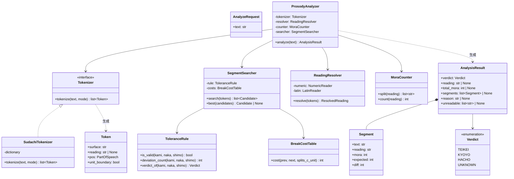
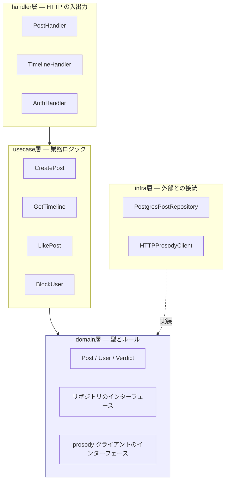
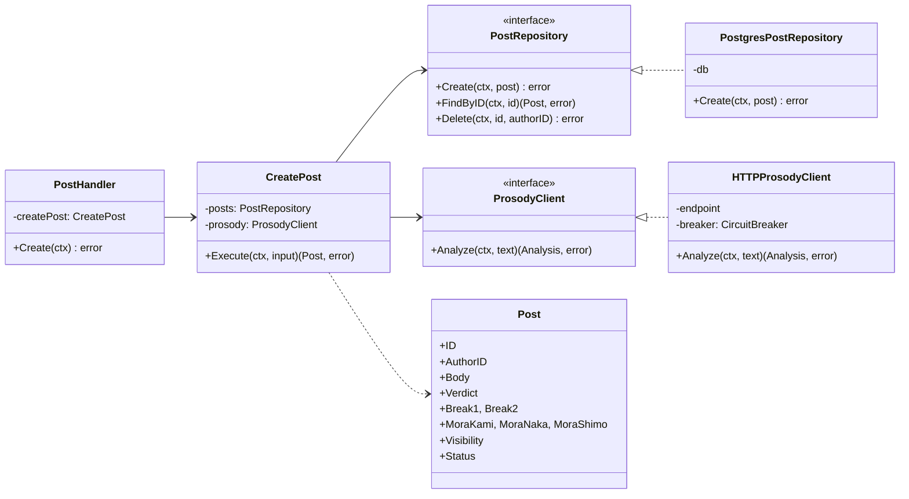
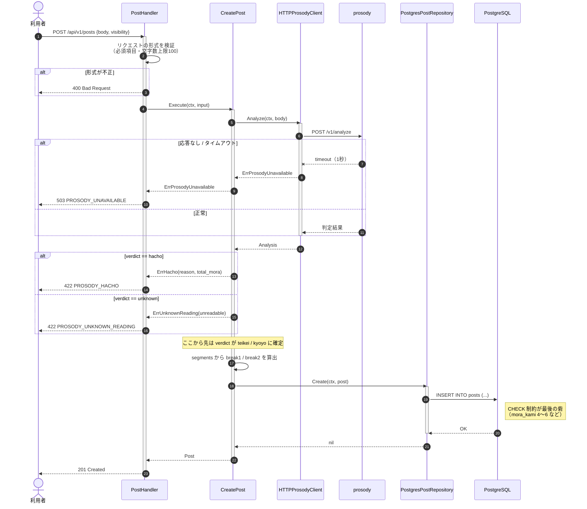
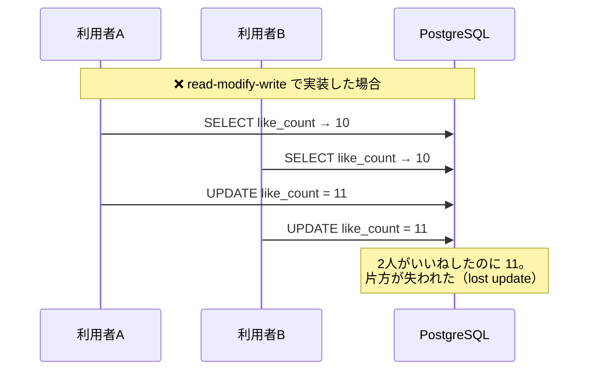
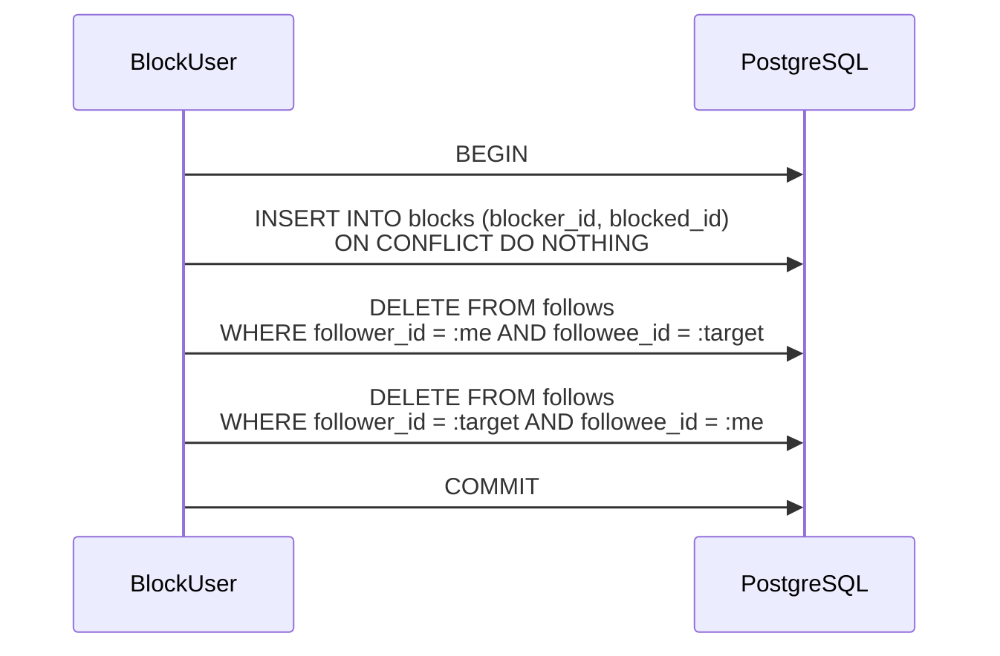
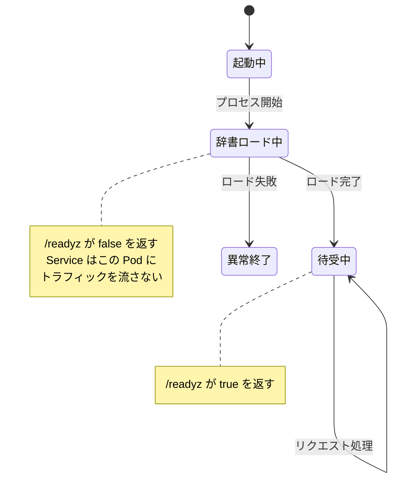

# 詳細設計 02: クラス設計

| 項目 | 内容 |
| --- | --- |
| ドキュメント種別 | 詳細設計 |
| 前提 | [基本設計 01](../basic/01-architecture.md) / [詳細設計 01](01-prosody-algorithm.md) |
| 最終更新 | 2026-08-06 |

---

## 1. prosody のクラス構成



### クラスごとの責務

| クラス | 責務 | 依存 |
| --- | --- | --- |
| `ProsodyAnalyzer` | 全体の流れの制御のみ。個々の計算は行わない | 4つの協力者 |
| `Tokenizer` | 文を形態素に分割し、読みと品詞を付与する（インターフェース） | なし |
| `SudachiTokenizer` | Sudachi を用いた `Tokenizer` の実装 | SudachiPy |
| `ReadingResolver` | 読みが空の形態素を補完する（数値・ラテン文字） | なし |
| `MoraCounter` | 読みをモーラ列に分割し、数える | なし |
| `ToleranceRule` | [ADR-0001](../../adr/0001-onsuritsu-tolerance.md) の許容ルールの判定 | なし |
| `BreakCostTable` | 区切り位置の不自然さをコスト化する | なし |
| `SegmentSearcher` | 区切り候補の探索と、最良候補の選択 | `ToleranceRule` / `BreakCostTable` |

### 設計上の主要な判断

#### `Tokenizer` をインターフェースにする

[ADR-0003](../../adr/0003-morphological-analyzer.md#解析器を差し替え可能にする) の決定を実装に落としたもの。

`MoraCounter` / `SegmentSearcher` / `ToleranceRule` は
**SudachiPy の存在を一切知らない**。
`Token` という自前の型にだけ依存する。

これにより、解析器を差し替えるときの影響が `SudachiTokenizer` 1クラスに閉じる。
また単体テストで解析器のモックを注入でき、
**辞書のロードなしにアルゴリズムをテストできる**（[詳細設計 04](04-test-design.md)）。

#### `ToleranceRule` を独立させる

許容ルールは [ADR-0001](../../adr/0001-onsuritsu-tolerance.md) の決定そのものであり、
**将来変更される可能性が最も高い部分**である。

ADR-0001 自身が「リリース後の実データを見てから緩和を判断するのが望ましい」と述べている。
そのとき変更するのがこのクラス1つで済むよう、探索ロジックから分離する。

#### `ProsodyAnalyzer` に計算を持たせない

`ProsodyAnalyzer` は流れを制御するだけで、
モーラの数え方も許容ルールも知らない。

```python
class ProsodyAnalyzer:
    def analyze(self, text: str) -> AnalysisResult:
        normalized = normalize(text)
        tokens = self.tokenizer.tokenize(normalized, mode=Mode.C)

        resolved = self.resolver.resolve(tokens)
        if resolved.unreadable:
            return AnalysisResult.unknown(unreadable=resolved.unreadable)

        total = sum(t.mora for t in resolved.tokens)
        if total < 16:
            return AnalysisResult.hacho("TOO_FEW_MORA", total)
        if total > 18:
            return AnalysisResult.hacho("TOO_MANY_MORA", total)

        best = self.searcher.best_for(resolved.tokens, normalized)
        if best is None:
            # C単位で見つからなければ A単位で再探索（詳細設計 01 §9）
            fine = self.resolver.resolve(
                self.tokenizer.tokenize(normalized, mode=Mode.A)
            )
            best = self.searcher.best_for(fine.tokens, normalized,
                                          coarse_boundaries=resolved.boundaries)
        if best is None:
            return AnalysisResult.hacho("NO_VALID_SPLIT", total)

        return AnalysisResult.from_candidate(best)
```

このメソッドを読めば [詳細設計 01 §1](01-prosody-algorithm.md#1-全体の流れ) の
フローチャートがそのまま追える状態を保つ。

---

## 2. api のパッケージ構成

Go 側は、層ごとに責務を分ける。



### 依存の向き

**すべての依存は domain 層へ向かう。** domain 層は何にも依存しない。

| 層 | 依存してよいもの | 依存してはいけないもの |
| --- | --- | --- |
| handler | usecase, domain | infra |
| usecase | domain | handler, infra の具体型 |
| domain | **なし** | すべて |
| infra | domain | handler, usecase |

`usecase` は「PostgreSQL に保存する」ことを知らない。
`domain` が定義した `PostRepository` インターフェースに対して操作するだけである。
実際の PostgreSQL 実装は `infra` にあり、起動時に注入される。

これにより **usecase の単体テストで DB が不要になる**。

### 投稿作成のクラス関係



---

## 3. 投稿作成のシーケンス



### このシーケンスで守っていること

| # | 内容 | 根拠 |
| --- | --- | --- |
| 1 | クライアントから判定結果を受け取らない。必ずサーバーで再判定する | [FR-02-05](../../requirements/01-requirements.md#fr-02-投稿詠む) |
| 2 | prosody が落ちていても 503 で明確に返し、api は詰まらない | [NFR-02-03](../../requirements/01-requirements.md#nfr-02-可用性) |
| 3 | `hacho` と `unknown` を別のエラーとして返す | [詳細設計 01 §4](01-prosody-algorithm.md#判定不能unknownを破調と区別する理由) |
| 4 | 形式の検証（400）と業務ルールの検証（422）を分けている | [基本設計 05](../basic/05-api.md#http-ステータスコードの使い分け) |
| 5 | DB の CHECK 制約を最後の砦として残している | [基本設計 03](../basic/03-database.md#モーラ数に-check-制約を張る理由) |

---

## 4. いいねの排他制御

[基本設計 03 §4](../basic/03-database.md#4-いいね数の非正規化) で
`posts.like_count` を非正規化した。その更新には並行実行の考慮が要る。

### 何が問題か



### 対処

**アプリケーション側で読んで加算しない。DB 内で加算する。**

```sql
BEGIN;
  INSERT INTO likes (user_id, post_id, created_at)
  VALUES ($1, $2, now())
  ON CONFLICT (user_id, post_id) DO NOTHING;

  -- 実際に INSERT された場合のみカウントを増やす
  UPDATE posts
     SET like_count = like_count + 1
   WHERE id = $2
     AND EXISTS (...);   -- 直前の INSERT が成立したか
COMMIT;
```

| 手法 | 効果 |
| --- | --- |
| `like_count = like_count + 1` | 行ロックの下で読み書きが行われ、更新の喪失が起きない |
| `ON CONFLICT DO NOTHING` | 二重いいねを主キーで弾く。エラーにせず冪等にする（[基本設計 05](../basic/05-api.md#交流) で `PUT` を選んだ理由と対応） |
| トランザクション | `likes` と `like_count` を必ず同時に確定させる |
| `CHECK (like_count >= 0)` | 取り消し側で減算が過剰になった場合に DB が検出する |

### なぜアプリケーション側でロックしないか

api は複数インスタンスで動く（[基本設計 01 §8](../basic/01-architecture.md#8-デプロイ単位)）。
プロセス内のミューテックスは**他のインスタンスには効かない**。

分散ロックを導入する選択肢もあるが、
DB の行ロックで解決できる問題に対して、
別の仕組み（と、そのための追加コンポーネント）を持ち込む理由がない。

---

## 5. ブロック時の複合更新

[BR-08](../basic/02-domain-model.md#関係に関するルール)（ブロックするとフォローが双方向に解除される）は、
3つの更新をまとめて行う必要がある。



3つが**すべて成功するか、すべて失敗するか**でなければならない。

途中で失敗すると「ブロックしたのにフォローが残っている」状態になり、
ブロックの意図（相手のタイムラインに自分の投稿を流さない）が破られる。

**通知は送らない**（[BR-10](../basic/02-domain-model.md#関係に関するルール)）。
ブロックされた側から見ると、単にフォローを外されたように見える。

---

## 6. prosody の辞書ロードと排他

prosody は起動時に辞書をメモリへ展開する。
これは**プロセスにつき1回だけ**行われなければならない。



| 論点 | 対処 |
| --- | --- |
| 複数のリクエストが同時に辞書を初期化しようとする | **アプリケーション起動時に同期的にロードする**。リクエスト到達時の遅延初期化にしない |
| ロード中にリクエストが来る | `/readyz` が `false` を返し、Service がトラフィックを流さない（[基本設計 05](../basic/05-api.md#get-readyz)） |
| ロードに失敗した | プロセスを異常終了させる。半端に起動して全リクエストを失敗させ続けるより、起動しない方がよい |
| 辞書オブジェクトの共有 | ロード後は**読み取り専用**として扱う。書き換えないため、読み取りに排他は不要 |

**遅延初期化にしない理由**が重要である。
「最初のリクエストが来たときにロードする」実装にすると、
複数のリクエストが同時に到着したときに二重ロードが起きうる。
それを防ぐためのロックは、以後すべてのリクエストで取得され続けるオーバーヘッドになる。

起動時に同期ロードすれば、この問題自体が発生しない。
`/readyz` と組み合わせることで、ロード中にトラフィックが来ることもない。

---

## 関連ドキュメント

- [詳細設計 01: 五七五判定アルゴリズム](01-prosody-algorithm.md)
- [詳細設計 03: エラー設計](03-error-handling.md)
- [詳細設計 04: テスト設計](04-test-design.md)
- [基本設計 03: データベース設計](../basic/03-database.md)
- [基本設計 05: API 設計](../basic/05-api.md)
