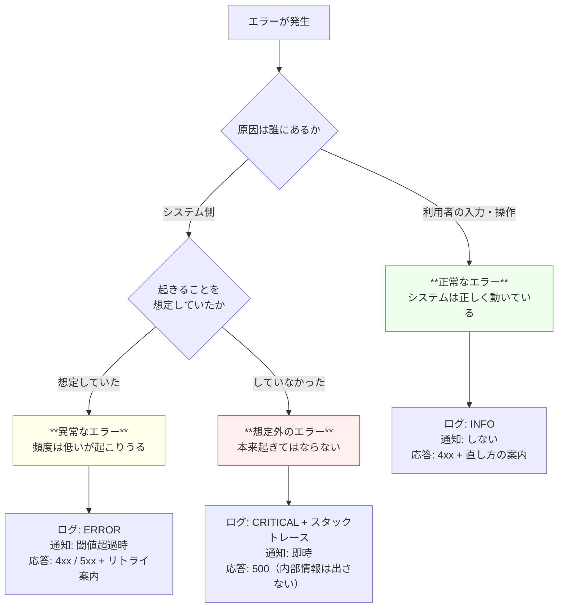
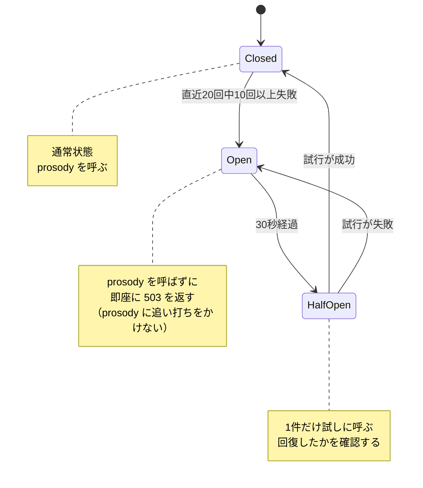
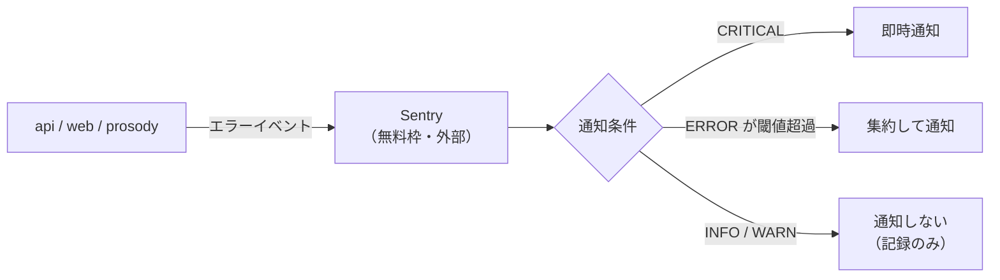

# 詳細設計 03: エラー設計

| 項目 | 内容 |
| --- | --- |
| ドキュメント種別 | 詳細設計 |
| 前提 | [基本設計 05](../basic/05-api.md) / [NFR-05](../../requirements/01-requirements.md#nfr-05-保守性運用性) |
| 最終更新 | 2026-08-06 |

---

## 1. エラーを3つに分類する

すべてのエラーを同じように扱ってはならない。
「ログに出して 500 を返す」を一律に適用すると、
**ユーザー入力ミスの通知で埋め尽くされ、本当の障害が埋もれる。**

575 では起こりうる異常系を次の3つに分類し、それぞれ別の扱いをする。



### 分類の定義

| 分類 | 定義 | 例 |
| --- | --- | --- |
| **正常なエラー** | 利用者の入力・操作に起因する。**プログラム上はエラーだが、システムとしては正常な状態** | 破調の本文で投稿しようとした / 識別名が使用済み / 未ログインで投稿しようとした |
| **異常なエラー** | システム起因だが、起こりうると予見していたもの。頻度は低いが必ず起きる | DB との接続が切れた / prosody が応答しない / ディスクが埋まった |
| **想定外のエラー** | 本来起きてはならないもの。データの不整合や不変条件の違反 | `verdict` が `hacho` の投稿が DB に存在した / nil 参照 |

### 想定外のエラーには即時対応が要る

想定外のエラーは、**回復手段が定義されていない**。
定義されていれば「異常なエラー」に分類されているはずである。

したがって想定外のエラーが出たときにできることは、

1. これ以上壊れないよう処理を中断する
2. 原因を追える情報を残す
3. **人に知らせる**

の3つだけである。自動での回復を試みてはならない。
何が起きているか分からない状態での自動リカバリは、被害を拡大させる。

---

## 2. エラー一覧

### 正常なエラー

| `error.code` | HTTP | 発生条件 | ログ | 利用者への文言 |
| --- | :---: | --- | :---: | --- |
| `PROSODY_HACHO` | 422 | 判定が破調 | INFO | 五七五になっていません（+ 現在の音数） |
| `PROSODY_UNKNOWN_READING` | 422 | 読めない語がある | INFO | 「○○」の読み方が分かりませんでした |
| `VALIDATION_FAILED` | 400 | 必須項目の欠落・型不正・文字数超過 | INFO | 項目ごとの具体的な指摘 |
| `UNAUTHENTICATED` | 401 | 未ログイン / セッション切れ | INFO | ログインしてください |
| `FORBIDDEN` | 403 | 他人の投稿を削除しようとした等 | **WARN** | この操作は行えません |
| `NOT_FOUND` | 404 | 対象が存在しない / 削除済み | INFO | 見つかりませんでした |
| `HANDLE_TAKEN` | 409 | 識別名が使用済み | INFO | この識別名は使われています |
| `CANNOT_FOLLOW_SELF` | 422 | 自分をフォロー（[BR-05](../basic/02-domain-model.md#関係に関するルール)） | INFO | 自分はフォローできません |
| `BLOCKED_USER` | 422 | ブロック中の相手への操作 | INFO | この相手には行えません |
| `ALREADY_REPORTED` | 409 | 同一投稿への重複通報 | INFO | すでに通報済みです |
| `RATE_LIMITED` | 429 | レート制限超過 | **WARN** | 時間をおいてお試しください |

`FORBIDDEN` と `RATE_LIMITED` だけ WARN にしている。
これらは**攻撃の兆候でありうる**ためである。
正当な利用でも発生しうるので通知はしないが、
急増したら気づけるようログレベルを上げておく。

### 異常なエラー

| `error.code` | HTTP | 発生条件 | ログ | 対処 |
| --- | :---: | --- | :---: | --- |
| `PROSODY_UNAVAILABLE` | 503 | prosody が応答しない / サーキットブレーカー開放中 | ERROR | 投稿のみ停止。閲覧は継続（[基本設計 01 §5](../basic/01-architecture.md#5-縮退運転)） |
| `DATABASE_UNAVAILABLE` | 503 | DB に接続できない | ERROR | 全機能が停止。即時通知 |
| `DATABASE_TIMEOUT` | 503 | クエリがタイムアウト | ERROR | 該当リクエストのみ失敗 |
| `UPSTREAM_TIMEOUT` | 504 | 下流サービスのタイムアウト | ERROR | 1回リトライ後に返す |

### 想定外のエラー

| `error.code` | HTTP | 発生条件 | ログ | 対処 |
| --- | :---: | --- | :---: | --- |
| `INTERNAL_ERROR` | 500 | 上記以外のすべて | **CRITICAL** | 即時通知。スタックトレースを記録 |

**500 のレスポンスに内部情報を含めない。**

```json
{
  "error": {
    "code": "INTERNAL_ERROR",
    "message": "エラーが発生しました",
    "details": { "request_id": "01JXY..." }
  }
}
```

スタックトレース・SQL 文・ファイルパス・内部のホスト名を返してはならない。
攻撃者にシステム構造の手がかりを与える。

代わりに **`request_id` を返す**。
利用者が問い合わせてきたとき、この ID でログを検索すれば
該当リクエストの全サービスの記録が引ける（[基本設計 01 §7](../basic/01-architecture.md#7-リクエスト-id-の伝播)）。

---

## 3. ログ設計

### 形式

[NFR-05-01](../../requirements/01-requirements.md#nfr-05-保守性運用性) に基づき、
**構造化データ（JSON）** で1行1レコードとして出力する。

```json
{
  "timestamp": "2026-08-06T12:34:56.789+09:00",
  "level": "ERROR",
  "service": "api",
  "version": "1.4.2",
  "request_id": "01JXYZABCDEF0123456789",
  "user_id": "1234",
  "method": "POST",
  "path": "/api/v1/posts",
  "status": 503,
  "duration_ms": 1032,
  "event": "prosody_call_failed",
  "error_code": "PROSODY_UNAVAILABLE",
  "message": "prosody への呼び出しがタイムアウトしました",
  "error_detail": "context deadline exceeded",
  "stacktrace": null
}
```

### 必須フィールド

| フィールド | 必須 | 用途 |
| --- | :---: | --- |
| `timestamp` | ✅ | ミリ秒まで。タイムゾーン付き |
| `level` | ✅ | `DEBUG` / `INFO` / `WARN` / `ERROR` / `CRITICAL` |
| `service` | ✅ | `web` / `api` / `prosody`。3サービスのログが混ざるため必須 |
| `request_id` | ✅ | **サービスをまたいで1つの操作を追跡する鍵** |
| `event` | ✅ | 機械的に検索・集計するためのイベント名（スネークケース） |
| `message` | ✅ | 人間が読む説明 |
| `user_id` | 認証時 | 誰の操作か。**未認証時は含めない** |
| `stacktrace` | CRITICAL 時 | 発生箇所の特定（[NFR-05-02](../../requirements/01-requirements.md#nfr-05-保守性運用性)） |

### `message` で検索させない

`event` を別に持つのは、**`message` が変わってもログの集計が壊れないようにする**ため。

```
❌ message で集計:  "prosody への呼び出しがタイムアウトしました" を grep
                    → 文言を直した瞬間に集計が 0 件になる

✅ event で集計:    event == "prosody_call_failed" を数える
                    → 文言を変えても壊れない
```

これは [基本設計 05](../basic/05-api.md#エラーレスポンス) で
`error.code` と `message` を分けた理由と同じ原則である。

### ログに出してはいけないもの

| 出さないもの | 理由 |
| --- | --- |
| パスワード（平文・ハッシュとも） | 漏洩時の被害が直接的 |
| セッション ID | 盗まれるとなりすましが可能 |
| メールアドレス | 個人情報。`user_id` で代替する |
| リクエストボディの全文 | 投稿本文が含まれる。必要なら長さのみ記録する |

**ログは本番環境の外に出る可能性がある**（バックアップ、調査のためのエクスポート）。
出力の時点で機密を含めない。

### 出力先

| 出力 | 内容 |
| --- | --- |
| 標準出力 | アプリケーションログ（上記の JSON） |
| 標準エラー出力 | ランタイムのパニック・クラッシュ出力 |

コンテナ環境では両方が収集されるため、運用上の差はほとんどない。
それでも分けるのは、**ローカル開発でアプリの正常なログとクラッシュを見分けやすくする**ためである。

ファイルには書かない。コンテナのローカルディスクに書いたログは、
Pod が再起動した瞬間に消える。

---

## 4. prosody 呼び出しの防御

[基本設計 05 §5](../basic/05-api.md#5-api--prosody-呼び出しの扱い) の詳細。

### なぜ防御が要るのか

prosody が遅くなったとき、何もしないと api まで巻き込まれる。

```
prosody の応答が 30 秒かかるようになる
  → api のリクエスト処理が 30 秒間ブロックされる
  → api の接続プールが埋まる
  → タイムライン取得のリクエストも処理できなくなる
  → 判定だけの障害が、サービス全体の障害になる
```

これを防ぐのが [NFR-02-03](../../requirements/01-requirements.md#nfr-02-可用性) の縮退運転である。
**prosody の障害を prosody の中に閉じ込める。**

### サーキットブレーカー



`Open` 状態で**呼び出さずに即座に失敗させる**ことが重要である。

死んでいると分かっているサービスを呼び続けると、
- api 側: タイムアウトを待つ分だけリソースを消費する
- prosody 側: 再起動して回復しようとしているところに負荷がかかる

の両方で状況が悪化する。

### タイムアウトとリトライ

| 項目 | 値 | 理由 |
| --- | --- | --- |
| タイムアウト | 1秒 | [NFR-01-01](../../requirements/01-requirements.md#nfr-01-性能) の 150ms に対し十分な余裕。1秒かかるのは異常 |
| リトライ | 1回 | 判定は副作用がないため安全にリトライできる |
| リトライ間隔 | 100ms + ジッタ | 全クライアントが同時にリトライして波を作らないようにする |

**リトライを1回に限る理由**: 過負荷で遅くなっている相手に対して、
リトライは追加の負荷である。回数を増やすほど回復を妨げる。

---

## 5. エラー通知

[NFR-05-03](../../requirements/01-requirements.md#nfr-05-保守性運用性) に基づき、
想定外のエラーを人に届ける。



| 分類 | 通知 | 理由 |
| --- | --- | --- |
| 正常なエラー | **しない** | 利用者の入力ミスで通知が飛んだら、通知が意味を失う |
| 異常なエラー | 閾値超過時 | 単発の DB タイムアウトで起こされる必要はない。継続していれば知りたい |
| 想定外のエラー | **即時** | 定義上、放置してよいものではない |

### 通知を絞ることが最も重要である

エラー通知の設計で最も失敗しやすいのは、**送りすぎ**である。

1日に100件の通知が来る仕組みは、実質的に通知が無い仕組みと同じになる。
人は見なくなり、本当に重要な1件が埋もれる。

**「これが来たら必ず対応する」ものだけを通知する。**
それ以外は記録に留め、必要なときに検索する。

### 同種のエラーの集約

同じエラーが1分間に1000件発生しても、通知は1件にまとめる。
Sentry はスタックトレースの類似性でエラーをグループ化するため、
これは既定の挙動で満たされる。

なお、収集先は [ADR-0007](../../adr/0007-hosting-conoha-vps.md) で
GlitchTip のセルフホストから Sentry の無料枠へ変更した。
どちらも同じ SDK・同じプロトコルで動くため、**アプリケーション側の実装は変わらない**。
DSN の向き先が変わるだけである。

---

## 6. web 側のエラー表示

[NFR-06-02](../../requirements/01-requirements.md#nfr-06-ユーザビリティ)
（「なぜできないか」が分かる形で提示する）に対応する。

| `error.code` | 表示 |
| --- | --- |
| `PROSODY_HACHO` | 区切りと各句の音数を示し、**どこを直せばよいか**を案内する |
| `PROSODY_UNKNOWN_READING` | 読めなかった語を明示する。別の表記を試すよう促す |
| `VALIDATION_FAILED` | 該当する入力欄の直下に、項目ごとの指摘を出す |
| `PROSODY_UNAVAILABLE` | 「いま詠むことができません」。**閲覧はできることを明記する** |
| `UNAUTHENTICATED` | ログイン画面へ誘導する。**入力中の本文を失わせない** |
| `INTERNAL_ERROR` | 汎用の文言 + `request_id` を表示し、問い合わせ時に伝えられるようにする |

### `UNAUTHENTICATED` で入力内容を保持する理由

長時間かけて推敲した五七五が、
「詠む」を押した瞬間のセッション切れで消えるのは、
575 において最も避けたい体験である。

投稿の下書きはローカルに保持し、
再ログイン後に復元する。

---

## 7. エラー設計のテスト

異常系は**意図的に起こさないとテストできない**。
[詳細設計 04](04-test-design.md) で以下を必須とする。

| テスト対象 | 起こし方 |
| --- | --- |
| prosody タイムアウト | モックを遅延させる |
| サーキットブレーカーの開放 | 連続失敗させ、状態遷移を確認する |
| DB 接続断 | コンテナを停止する |
| 想定外のエラー | 意図的に不変条件を破ったデータを投入する |

**「異常系のコードは動かしたことがない」状態にしない。**
異常系こそ、それが必要になった瞬間には確実に動かなければならない。

---

## 関連ドキュメント

- [詳細設計 01: 五七五判定アルゴリズム](01-prosody-algorithm.md)
- [詳細設計 02: クラス設計](02-class-design.md)
- [詳細設計 04: テスト設計](04-test-design.md)
- [基本設計 05: API 設計](../basic/05-api.md)
