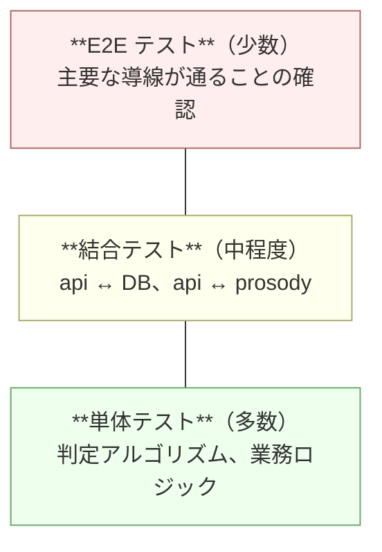

# 詳細設計 04: テスト設計

| 項目 | 内容 |
| --- | --- |
| ドキュメント種別 | 詳細設計 |
| 前提 | [詳細設計 01](01-prosody-algorithm.md) / [詳細設計 02](02-class-design.md) / [NFR-05-04](../../requirements/01-requirements.md#nfr-05-保守性運用性) |
| 最終更新 | 2026-08-06 |

---

## 1. テスト方針

### 何を確かめたいのか

テストの目的は「動かしてみたら動いた」ことの確認ではない。
**「問題がないと言い切れる根拠」をつくる**ことである。

そのためには「どういう入力を通せば問題がないと言えるか」の理屈が要る。
575 では、以下の2つの手法でその理屈を立てる。

| 手法 | 適用先 |
| --- | --- |
| **同値分割** | 入力を「同じ結果になるはずのグループ」に分け、各グループから代表を選ぶ |
| **境界値分析** | グループの境目と、その両隣を必ず試す |

### テストの配分



**判定アルゴリズムは単体テストに寄せる。**
入力が文字列、出力が判定結果という純粋関数に近い形（[詳細設計 02](02-class-design.md#tokenizer-をインターフェースにする)）に
設計してあるため、DB もネットワークも要らずに網羅的にテストできる。

### カバレッジ目標

[NFR-05-04](../../requirements/01-requirements.md#nfr-05-保守性運用性) に基づく。

| 対象 | C1（分岐網羅） | 理由 |
| --- | :---: | --- |
| **prosody 全体** | **100%** | プロダクトの中核。入出力が純粋で、妥協する技術的理由がない |
| api の usecase 層 | 90% | リポジトリをモックすれば到達可能 |
| api の infra 層 | 70% | 外部依存が多く、結合テストで補う |
| web | 60% | 画面の描画は E2E で確認する方が費用対効果が高い |

**カバレッジは目的ではなく指標である。**
100% でもテストケースの質が低ければ意味がない。
本書で洗い出すテストケースを通した結果として、カバレッジがついてくる形にする。

---

## 2. 許容ルールのテスト設計

`ToleranceRule`（[詳細設計 02](02-class-design.md#1-prosody-のクラス構成)）は
[ADR-0001](../../adr/0001-onsuritsu-tolerance.md) の決定そのものを実装したクラスであり、
**575 で最も重要なテスト対象**である。

### 同値分割

入力は上五・中七・下五のモーラ数の3つ組。各句を次のように分割する。

| 句 | 下限未満 | 下限 | 規定値 | 上限 | 上限超過 |
| --- | :---: | :---: | :---: | :---: | :---: |
| 上五（規定5） | ≤3 | 4 | 5 | 6 | ≥7 |
| 中七（規定7） | ≤5 | 6 | 7 | 8 | ≥9 |
| 下五（規定5） | ≤3 | 4 | 5 | 6 | ≥7 |

さらに **ズレ数**という第2の軸がある。

| ズレ数 | 期待される判定 |
| :---: | --- |
| 0 | 定型 |
| 1 | 許容 |
| 2以上 | 破調 |

### 境界値テストケース

#### TC-TR-01〜05: 上五の境界（中七=7 / 下五=5 に固定）

| # | 上五 | 中七 | 下五 | 期待 | 境界の意味 |
| --- | :---: | :---: | :---: | --- | --- |
| TC-TR-01 | **3** | 7 | 5 | `hacho` | 下限の1つ外 |
| TC-TR-02 | **4** | 7 | 5 | `kyoyo` | **下限ちょうど** |
| TC-TR-03 | **5** | 7 | 5 | `teikei` | 規定値 |
| TC-TR-04 | **6** | 7 | 5 | `kyoyo` | **上限ちょうど** |
| TC-TR-05 | **7** | 7 | 5 | `hacho` | 上限の1つ外 |

#### TC-TR-06〜10: 中七の境界（上五=5 / 下五=5 に固定）

| # | 上五 | 中七 | 下五 | 期待 | 境界の意味 |
| --- | :---: | :---: | :---: | --- | --- |
| TC-TR-06 | 5 | **5** | 5 | `hacho` | 下限の1つ外 |
| TC-TR-07 | 5 | **6** | 5 | `kyoyo` | **下限ちょうど** |
| TC-TR-08 | 5 | **7** | 5 | `teikei` | 規定値 |
| TC-TR-09 | 5 | **8** | 5 | `kyoyo` | **上限ちょうど** |
| TC-TR-10 | 5 | **9** | 5 | `hacho` | 上限の1つ外 |

#### TC-TR-11〜15: 下五の境界（上五=5 / 中七=7 に固定）

| # | 上五 | 中七 | 下五 | 期待 | 境界の意味 |
| --- | :---: | :---: | :---: | --- | --- |
| TC-TR-11 | 5 | 7 | **3** | `hacho` | 下限の1つ外 |
| TC-TR-12 | 5 | 7 | **4** | `kyoyo` | **下限ちょうど** |
| TC-TR-13 | 5 | 7 | **5** | `teikei` | 規定値 |
| TC-TR-14 | 5 | 7 | **6** | `kyoyo` | **上限ちょうど** |
| TC-TR-15 | 5 | 7 | **7** | `hacho` | 上限の1つ外 |

#### TC-TR-16〜21: ズレ数の境界 ← 最重要

**各句は範囲内なのに、組み合わせとして不正になるケース。**

| # | 上五 | 中七 | 下五 | 各句の範囲 | ズレ数 | 期待 |
| --- | :---: | :---: | :---: | :---: | :---: | --- |
| TC-TR-16 | 5 | 7 | 5 | すべて内 | 0 | `teikei` |
| TC-TR-17 | 4 | 7 | 5 | すべて内 | 1 | `kyoyo` |
| TC-TR-18 | **4** | **6** | 5 | **すべて内** | **2** | **`hacho`** |
| TC-TR-19 | **6** | **8** | 5 | **すべて内** | **2** | **`hacho`** |
| TC-TR-20 | **4** | 7 | **6** | **すべて内** | **2** | **`hacho`** |
| TC-TR-21 | **4** | **6** | **4** | **すべて内** | **3** | **`hacho`** |

**TC-TR-18〜21 が、このテスト設計で最も重要である。**

各句を個別にチェックするだけの実装（`4 <= kami <= 6` などを並べただけ）は、
TC-TR-01〜15 をすべて通過しながら **TC-TR-18〜21 で落ちる**。

[ADR-0001](../../adr/0001-onsuritsu-tolerance.md#案3-についての補足-合計モーラ数の制約は不要である) で
「条件は2つある」と明示した第2条件（ズレ数の制限）が、
実装から抜け落ちる典型的なバグである。
このテストケース群がその検出器になる。

#### 投稿可能な7パターンの網羅

[ADR-0001](../../adr/0001-onsuritsu-tolerance.md#判定結果の一覧全パターン) が
「投稿可能なのは7通りのみ」と明示している。この7通りをすべてテストする。

| # | 上五 | 中七 | 下五 | 期待 |
| --- | :---: | :---: | :---: | --- |
| TC-TR-22 | 5 | 7 | 5 | `teikei` |
| TC-TR-23 | 4 | 7 | 5 | `kyoyo` |
| TC-TR-24 | 6 | 7 | 5 | `kyoyo` |
| TC-TR-25 | 5 | 6 | 5 | `kyoyo` |
| TC-TR-26 | 5 | 8 | 5 | `kyoyo` |
| TC-TR-27 | 5 | 7 | 4 | `kyoyo` |
| TC-TR-28 | 5 | 7 | 6 | `kyoyo` |

仕様が有限の集合として定義されているため、**網羅が可能**である。
これは [ADR-0001](../../adr/0001-onsuritsu-tolerance.md) がルールを
2条件に絞り込んだことの副産物である。

---

## 3. モーラ分割のテスト設計

`MoraCounter` は [詳細設計 01 §3](01-prosody-algorithm.md#3-モーラ分割規則) の
規則 R1〜R6 を実装する。**規則ごとにテストを対応させる。**

| # | 規則 | 入力（読み） | 期待するモーラ列 | 数 |
| --- | --- | --- | --- | :---: |
| TC-MC-01 | R1 | `カ` | `カ` | 1 |
| TC-MC-02 | R1 | `カキクケコ` | `カ` `キ` `ク` `ケ` `コ` | 5 |
| TC-MC-03 | R2 拗音 | `キョ` | `キョ` | 1 |
| TC-MC-04 | R2 外来語 | `ファ` | `ファ` | 1 |
| TC-MC-05 | R2 | `ヴァ` | `ヴァ` | 1 |
| TC-MC-06 | R2 | `クヮ` | `クヮ` | 1 |
| TC-MC-07 | R3 促音 | `キッ` | `キ` `ッ` | 2 |
| TC-MC-08 | R4 撥音 | `カン` | `カ` `ン` | 2 |
| TC-MC-09 | R5 長音 | `カー` | `カ` `ー` | 2 |
| TC-MC-10 | R6 記号 | `カ、キ` | `カ` `キ` | 2 |
| TC-MC-11 | 複合 | `トウキョウ` | `ト` `ウ` `キョ` `ウ` | 4 |
| TC-MC-12 | 複合 | `シュッチョウ` | `シュ` `ッ` `チョ` `ウ` | 4 |
| TC-MC-13 | 複合 | `シンカンセン` | `シ` `ン` `カ` `ン` `セ` `ン` | 6 |
| TC-MC-14 | 複合 | `コーヒー` | `コ` `ー` `ヒ` `ー` | 4 |

### 誤りやすい点を狙ったケース

| # | 入力 | 期待 | 狙い |
| --- | --- | :---: | --- |
| TC-MC-15 | `ッ` | 1 | **「ッ」を結合対象に入れる誤り**の検出。`COMBINING` に `ッ` を含めると 0 になる |
| TC-MC-16 | `ン` | 1 | 同上 |
| TC-MC-17 | `ー` | 1 | 同上 |
| TC-MC-18 | `ャ`（単独） | 1 | 結合対象が先頭に来た異常系。クラッシュしないこと |
| TC-MC-19 | `""`（空） | 0 | 空文字列でクラッシュしないこと |
| TC-MC-20 | `キョキョキョ` | 3 | 拗音の連続 |

TC-MC-15〜17 は、[詳細設計 01](01-prosody-algorithm.md#r2-で結合する文字) で
「最も起きやすいバグ」と指摘した誤りをそのまま検出する。

### 性質ベースのテスト

個別のケースに加えて、**入力を問わず常に成り立つ性質**を検証する。

| # | 性質 |
| --- | --- |
| TC-MC-P1 | 分割したモーラを連結すると、記号を除いた元の読みに一致する（文字を落とさない・増やさない） |
| TC-MC-P2 | モーラ数 ≤ 読みの文字数（結合はするが分裂はしない） |
| TC-MC-P3 | 読みが空でなく記号だけでもないなら、モーラ数 ≥ 1 |

ランダムなカタカナ列を大量に生成して検証する。
個別ケースでは思いつかない入力の組み合わせを拾える。

---

## 4. 区切り探索のテスト設計

`SegmentSearcher` は入力（形態素列）の組み立てが必要なため、
`Tokenizer` をモックして**形態素列を直接与える**（[詳細設計 02](02-class-design.md#tokenizer-をインターフェースにする)）。
辞書のロードなしにテストできる。

| # | 状況 | 期待 |
| --- | --- | --- |
| TC-SS-01 | 有効な区切りが存在しない | `None` を返す |
| TC-SS-02 | 有効な区切りがちょうど1つ | その候補を返す |
| TC-SS-03 | 有効な候補が複数、ズレ数が同じ | **区切りコストが小さい方**を返す |
| TC-SS-04 | 定型候補と許容候補が両方ある | **定型を返す**（重み100が効いていること） |
| TC-SS-05 | 形態素が2つしかない | `None`（3つに分けられない） |
| TC-SS-06 | 形態素が3つ、ちょうど 5/7/5 | 定型を返す |
| TC-SS-07 | 総モーラ 16 で有効な区切りあり | `kyoyo` |
| TC-SS-08 | 総モーラ 18 で有効な区切りあり | `kyoyo` |

### 段階的探索（C単位 → A単位）

| # | 状況 | 期待 |
| --- | --- | --- |
| TC-SS-09 | C単位で候補が見つかる | **A単位の探索を行わない**（呼び出し回数を検証） |
| TC-SS-10 | C単位では見つからず、A単位で見つかる | A単位の結果を返す |
| TC-SS-11 | どちらでも見つからない | `hacho` / `NO_VALID_SPLIT` |
| TC-SS-12 | A単位で複数候補。C単位の境界を跨ぐものと跨がないもの | **跨がない方**を返す（+5 のペナルティが効いていること） |

TC-SS-09 は「C単位で足りるときに無駄な再解析をしない」ことの確認である。
性能に直結するため、結果だけでなく**呼び出し回数**を検証する。

### 明示的な区切り

| # | 入力 | 期待 |
| --- | --- | --- |
| TC-SS-13 | 空白2つで区切られ、その区切りが有効 | **その区切りを採用**（探索しない） |
| TC-SS-14 | 空白2つで区切られるが、その区切りが無効 | 空白を無視して通常探索へ |
| TC-SS-15 | 空白が1つだけ | 通常探索へ |
| TC-SS-16 | 空白が3つ以上 | 通常探索へ |

---

## 5. 読み解決のテスト設計

| # | 入力 | 期待 |
| --- | --- | --- |
| TC-RR-01 | 通常の日本語 | 形態素解析の読みをそのまま使う |
| TC-RR-02 | `1` | `イチ` |
| TC-RR-03 | `10` | `ジュウ` |
| TC-RR-04 | `2024` | `ニセンニジュウヨン` |
| TC-RR-05 | `0` | `ゼロ` |
| TC-RR-06 | ラテン文字 `AI` | アルファベット読みへフォールバック |
| TC-RR-07 | 記号のみ `！？` | 0モーラ |
| TC-RR-08 | 読めない語を含む | `unknown` + `unreadable` に該当語 |
| TC-RR-09 | 読めない語が複数 | `unreadable` にすべて含まれる |

**TC-RR-08 は `hacho` ではなく `unknown` を返すこと**を検証する。
この2つを取り違えると、[詳細設計 01 §4](01-prosody-algorithm.md#判定不能unknownを破調と区別する理由) で
避けようとした「正しく詠んだのに『五七五になっていません』と言われる」体験が発生する。

---

## 6. 判定エンジン全体の受け入れテスト

実際の文を入力し、期待どおりの判定になることを確認する。
**辞書を含めた統合の確認**であり、単体テストとは目的が異なる。

| # | 本文 | 期待 |
| --- | --- | --- |
| TC-AC-01 | 今日もまた会議のための会議かな | `teikei` / 5-7-5 |
| TC-AC-02 | 今日は疲れた | `hacho` / `TOO_FEW_MORA` |
| TC-AC-03 | （20モーラを超える長文） | `hacho` / `TOO_MANY_MORA` |
| TC-AC-04 | 17モーラだが五七五に切れない文 | `hacho` / `NO_VALID_SPLIT` |
| TC-AC-05 | 字余りの句 | `kyoyo` |
| TC-AC-06 | 空文字列 | `hacho` / `TOO_FEW_MORA` |
| TC-AC-07 | 空白のみ | `hacho` / `TOO_FEW_MORA` |
| TC-AC-08 | 絵文字を含む | 絵文字を0モーラとして扱い判定できる |
| TC-AC-09 | 100文字ちょうど | 処理できる（上限値） |
| TC-AC-10 | 101文字 | api 側のバリデーションで 400 |

### 既知の限界に対するテスト

[詳細設計 01 §11](01-prosody-algorithm.md#11-既知の限界) で挙げた限界は、
**「直す」のではなく「現状の挙動を固定する」テスト**を書く。

| # | 入力 | 現状の挙動 | 位置づけ |
| --- | --- | --- | --- |
| TC-LM-01 | 「一日」を含む句 | `イチニチ` として数える | L1。仕様として記録する |
| TC-LM-02 | 「1本」を含む句 | `イチホン` として数える | L3。既知の誤差 |

これらは**失敗するテストとして書かない**。
現在の挙動を記録し、意図せず変わったときに気づくためのものである。
将来改善したらテストを更新する。

---

## 7. api のテスト設計

### usecase 層（単体）

リポジトリと prosody クライアントをモックする（[詳細設計 02](02-class-design.md#依存の向き)）。
DB もネットワークも不要。

| # | 対象 | 状況 | 期待 |
| --- | --- | --- | --- |
| TC-UC-01 | CreatePost | prosody が `teikei` を返す | 投稿が保存される |
| TC-UC-02 | CreatePost | prosody が `hacho` を返す | **保存されない** / `ErrHacho` |
| TC-UC-03 | CreatePost | prosody が `unknown` を返す | 保存されない / `ErrUnknownReading` |
| TC-UC-04 | CreatePost | prosody がタイムアウト | 保存されない / `ErrProsodyUnavailable` |
| TC-UC-05 | DeletePost | 他人の投稿を削除しようとする | `ErrForbidden` |
| TC-UC-06 | BlockUser | ブロック実行 | blocks に追加 + follows が**双方向**に削除される |
| TC-UC-07 | FollowUser | 自分自身をフォロー | `ErrCannotFollowSelf` |
| TC-UC-08 | LikePost | 同じ投稿に2回いいね | 2回目もエラーにならず、`like_count` は1のまま |

TC-UC-02 の「**保存されない**」の検証が重要である。
「エラーが返る」だけでなく、**リポジトリの `Create` が呼ばれていない**ことを確認する。
エラーを返しつつ保存してしまう実装を検出できる。

### 結合テスト（api + DB）

実際の PostgreSQL に対して実行する。

| # | 対象 | 期待 |
| --- | --- | --- |
| TC-IT-01 | いいねの同時実行 | 100並列でいいねしても `like_count` が100になる（[詳細設計 02 §4](02-class-design.md#4-いいねの排他制御)） |
| TC-IT-02 | ブロックのトランザクション | 途中で失敗させると、blocks も follows も変更されていない |
| TC-IT-03 | モーラ数の CHECK 制約 | 範囲外の値を直接 INSERT すると DB が拒否する |
| TC-IT-04 | 自己フォローの CHECK 制約 | `follower_id = followee_id` の INSERT が拒否される |
| TC-IT-05 | 重複通報の UNIQUE 制約 | 同一 (reporter, post) の2件目が拒否される |
| TC-IT-06 | カーソルページネーション | 全件を重複・欠落なく取得できる |
| TC-IT-07 | ブロック中の投稿の除外 | タイムラインに含まれない |

**TC-IT-01 は必ず並列で実行する。** 逐次実行では
[詳細設計 02 §4](02-class-design.md#4-いいねの排他制御) の更新喪失を検出できない。

### 異常系テスト

[詳細設計 03 §7](03-error-handling.md#7-エラー設計のテスト) の要求に対応する。

| # | 状況 | 起こし方 | 期待 |
| --- | --- | --- | --- |
| TC-ER-01 | prosody タイムアウト | モックを2秒遅延 | 1秒で打ち切り 503 |
| TC-ER-02 | サーキットブレーカー開放 | 20回中10回失敗させる | `Open` に遷移し、以後は呼ばずに即 503 |
| TC-ER-03 | サーキットブレーカー回復 | 開放後30秒待って成功させる | `HalfOpen` → `Closed` |
| TC-ER-04 | prosody 停止中の閲覧 | prosody を止める | **タイムライン取得は 200 を返す**（縮退運転） |
| TC-ER-05 | DB 接続断 | DB を止める | 503 / `DATABASE_UNAVAILABLE` |
| TC-ER-06 | 500 のレスポンス内容 | 意図的にパニックさせる | スタックトレースが**含まれない**こと |

**TC-ER-04 が縮退運転の要である。**
[NFR-02-03](../../requirements/01-requirements.md#nfr-02-可用性) を満たしていることの唯一の証明になる。

---

## 8. 性能テスト

[NFR-01](../../requirements/01-requirements.md#nfr-01-性能) の検証。

### 測定対象と条件

| # | 対象 | 条件 | 目標 |
| --- | --- | --- | --- |
| TC-PF-01 | `POST /prosody/check` | 17モーラ前後の文、同時50接続 | **P95 < 150ms** |
| TC-PF-02 | `GET /timelines/home` | posts 10万件、follows 平均100件、同時50接続 | **P95 < 300ms** |
| TC-PF-03 | `GET /timelines/public` | 同上 | P95 < 300ms |

### 測定にあたって記録すること

測定結果だけを残しても、後から再現できない。以下をセットで記録する。

- 測定対象（どの API か）
- 測定方法（使用したツールとその設定）
- 測定条件（同時接続数・リクエストサイズ・実行時間・投入データ量）
- 測定環境の構築方法（再現できる形で）
- 構築された測定環境（スペック）
- 測定結果（P50 / P95 / P99 / エラー率）

### データ量を確保して測定する

[基本設計 03](../basic/03-database.md#実行計画の確認を必須とする) のとおり、
**データが少ないとプランナが Seq Scan を選ぶ**ため、
インデックスが効いているかを確認できない。

posts 10万件以上を投入した状態で `EXPLAIN ANALYZE` を取得し、**結果を記録に残す**。

| 確認項目 | 期待 |
| --- | --- |
| `posts` の走査方法 | Index Scan / Index Only Scan（Seq Scan でないこと） |
| 実際に読んだ行数 | LIMIT 20 に対して 20 前後 |
| `Sort` ノード | 出現しないこと（インデックス順で読めていること） |

### インデックスなしとの比較

インデックスを外した状態でも測定し、**効果を数値で示す**。

「インデックスを張った」だけでは、それが効いている証拠にならない。
張る前と後の比較があって初めて、その設計判断が正しかったと言える。

---

## 9. テストケースの管理

| 項目 | 方針 |
| --- | --- |
| 管理場所 | テストコードそのもの。表計算ソフトで別管理しない |
| 対応付け | **テストの識別子に本書のケース ID を含める**（下記） |
| 追加のタイミング | 不具合を修正するときは、**まずその不具合を再現するテストを書く**。修正はその後 |
| 削除 | 仕様変更で不要になったテストは消す。コメントアウトで残さない |

ケース ID をテストの識別子に含めることで、
**本書とテストコードが双方向に辿れる**（[docs/README.md](../../README.md#リンク) のリンク方針）。

### ケース ID の埋め込み方

本書のケース表は「入力の組み合わせが違うだけで、確認内容は同じ」ものが多い。
そのため**表形式のテスト**（Python なら `pytest.mark.parametrize`、
Go なら Table-Driven Test）を基本とし、**各行の識別子にケース ID を与える**。

```python
BOUNDARY_CASES = [
    pytest.param(3, 7, 5, HACHO, id="TC_TR_01"),  # 上五が下限の1つ外
    pytest.param(4, 7, 5, KYOYO, id="TC_TR_02"),  # 上五が下限ちょうど
]
```

こうすると本書の表とテストコードの表が1対1で並び、
差分を見れば「どのケースが増えたか・消えたか」が分かる。

| 手段 | 例 |
| --- | --- |
| ケース ID で絞り込む | `pytest -k "TC_TR_18 or TC_TR_19"` |
| テストコードから設計書を引く | ケース ID を本書内で検索する |

ケースが1件しかない、あるいは確認内容が行ごとに異なる場合は、
**関数名にケース ID を含める**（例: `test_TC_ER_04_prosody停止中でも閲覧できる`）。

ケース ID は `-k` の式で扱えるよう、本書のハイフン区切り（`TC-TR-18`）ではなく
アンダースコア区切り（`TC_TR_18`）で書く。

**ID にケースの説明を含めない。** pytest は識別子の非 ASCII 文字を
`上五` のようにエスケープするため、日本語の説明を入れると出力が読めなくなる。
説明は行末のコメントに置く。

---

## 10. スコープ外のテスト

以下は初版では実施しない。実施しない判断を記録として残す。

| 項目 | 理由 |
| --- | --- |
| 負荷試験（限界性能の測定） | 想定規模（[NFR-01-03](../../requirements/01-requirements.md#nfr-01-性能) 同時1,000）に対して、P95 の測定で十分。限界値を知る必要が現時点でない |
| 長時間の耐久試験 | メモリリークの検出には有効だが、初版では監視で代替する |
| ブラウザ互換性の網羅 | 主要ブラウザの最新版のみ対象とする |
| セキュリティ診断 | 実施したいが、無償の範囲で行える静的解析（依存パッケージの脆弱性チェック）に留める |

---

## 関連ドキュメント

- [詳細設計 01: 五七五判定アルゴリズム](01-prosody-algorithm.md)
- [詳細設計 02: クラス設計](02-class-design.md)
- [詳細設計 03: エラー設計](03-error-handling.md)
- [ADR-0001: 字余り・字足らずの許容範囲](../../adr/0001-onsuritsu-tolerance.md)
- [基本設計 03: データベース設計](../basic/03-database.md)
