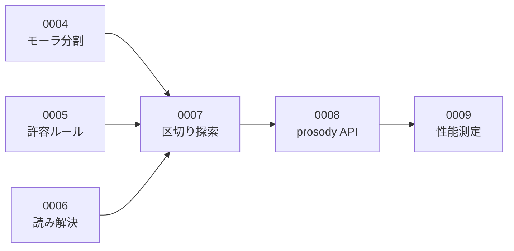

# Issue 起票ドラフト

このディレクトリは **GitHub Issues に起票する前の下書き** を置く場所です。

## 使い方

1. ここのファイルを1つ開く
2. 冒頭のメタ情報（タイトル・ラベル・マイルストーン）を GitHub の Issue 作成画面に転記する
3. `---` から下の本文をそのまま Issue の本文欄に貼り付ける
4. 起票したら、このファイルの先頭に Issue 番号（`#12` など）を追記する

> **1ファイル = 1 Issue** です。ファイルの中身は加工せずそのまま貼れる状態に保ちます。

## ファイル名の付け方

```
NNNN-種別-短い説明.md
```

`NNNN` はこのディレクトリ内での連番です（GitHub の Issue 番号とは一致しません）。

例: `0007-feat-implement-mora-counter.md`

## 種別

| 種別 | 用途 | ラベル |
| --- | --- | --- |
| `spec` | 仕様の検討・決定 | `spec` |
| `feat` | 機能の実装 | `feature` |
| `fix` | 不具合の修正 | `bug` |
| `docs` | ドキュメントの作成・更新 | `documentation` |
| `infra` | 環境構築・CI/CD | `infrastructure` |
| `perf` | 性能改善 | `performance` |
| `test` | 機能実装に紐づかないテスト（E2E など） | `test` |
| `chore` | その他の雑務 | `chore` |

単体テストは実装と不可分のため `feat` の完了条件に含める。
`test` は E2E のように、特定の機能ではなく導線全体を対象とするものに使う。

タイトルの時点で「これは何のチケットか」が一目で分かるよう、
種別を接頭辞としてタイトルにも付けます。

```
feat: モーラ数カウンタを実装する
fix: 促音が含まれる句のモーラ数が1つ多く数えられる
spec: 字余り・字足らずの許容範囲を決める
```

---

## テンプレート

### 実装チケット（`feat` / `fix` / `infra` など）

```markdown
## 背景・目的

<!-- なぜこれをやるのか。誰が困っているのか。やらないとどうなるか -->

## やること

<!-- 何をするのか。作業の範囲を明確に -->

- [ ]
- [ ]

## 完了条件

<!-- 「どうなったら終わりか」を検証可能な形で。曖昧な表現を使わない -->

- [ ]
- [ ]

## やらないこと

<!-- スコープ外を明示する。書かないと際限なく膨らむ -->

## 参考

<!-- 関連する設計ドキュメント・ADR・他の Issue へのリンク -->
```

### 不具合チケット（`fix`）

不具合の場合は上記に加えて、**再現に必要な情報をすべて** 記載します。
「一部を抜粋したエラーメッセージ」では原因の切り分けができません。

```markdown
## 何が起きたか

## 期待する挙動

## 再現手順

1.
2.
3.

## 発生環境

| 項目 | 値 |
| --- | --- |
| OS / バージョン |  |
| ブラウザ / バージョン |  |
| サービス / バージョン |  |
| 発生日時 |  |

## エラーログ・スクリーンショット

<!-- 全文を貼る。抜粋しない -->

## 切り分けの経過

<!-- 仮説と検証を時系列で。ここが最も重要 -->
```

---

## 書くときのルール

### 完了条件は検証可能に書く

| ❌ 悪い例 | ✅ 良い例 |
| --- | --- |
| モーラ数が正しく数えられること | 拗音・促音・撥音・長音を含む30件のテストケースがすべて通ること |
| 高速に動作すること | 判定 API のレスポンスタイムが P95 で 150ms 未満であること |
| ちゃんとエラーになること | 破調の本文を POST したとき HTTP 422 と判定内訳が返ること |

### 検討の経過はコメント欄に残す

Issue の本文（概要欄）は、**最新の状態に更新し続ける**ものです。
一方で「どう考えて、何を試して、なぜその結論に至ったか」は、
コメント欄に**時系列で追記**します。

本文を上書きしてしまうと経過が消えます。
経過が消えたチケットは、後から読んでも「結論だけあって理由が分からない」状態になります。

大きな設計判断に至った場合は、コメントに残したうえで
[ADR](../adr/README.md) に清書します。

### 双方向にリンクする

- Issue 本文 → 関連する設計ドキュメント・ADR へのリンク
- コミットメッセージ → `#12` の形式で Issue 番号を記載
- Pull Request → 対応する Issue へのリンク
- Issue → 対応する Pull Request へのリンク

片方向だけだと、逆から辿れなくなります。

---

## 一覧

### M0 開発基盤

| # | 種別 | タイトル | 起票済み |
| --- | --- | --- | :---: |
| [0001](0001-spec-design-phase-record.md) | `spec` | 要件定義・基本設計・詳細設計を行う | [#1](https://github.com/yama-shu/575-sns/issues/1) |
| [0002](0002-infra-local-dev-environment.md) | `infra` | docker compose でローカル開発環境を構築する | [#2](https://github.com/yama-shu/575-sns/issues/2) |
| [0003](0003-infra-ci-pipeline.md) | `infra` | CI パイプラインを構築する | [#3](https://github.com/yama-shu/575-sns/issues/3) |

### M1 判定エンジン

依存関係があるため、この順に着手する。

| # | 種別 | タイトル | 依存 | 起票済み |
| --- | --- | --- | --- | :---: |
| [0004](0004-feat-mora-counter.md) | `feat` | モーラ分割・カウント処理を実装する | — | [#4](https://github.com/yama-shu/575-sns/issues/4) |
| [0005](0005-feat-tolerance-rule.md) | `feat` | 五七五の許容ルール判定を実装する | — | [#5](https://github.com/yama-shu/575-sns/issues/5) |
| [0006](0006-feat-tokenizer-and-reading-resolver.md) | `feat` | 形態素解析の抽象化と読み解決を実装する | — | [#6](https://github.com/yama-shu/575-sns/issues/6) |
| [0007](0007-feat-segment-searcher.md) | `feat` | 五七五の区切り探索を実装する | 0004, 0005, 0006 | [#7](https://github.com/yama-shu/575-sns/issues/7) |
| [0008](0008-feat-prosody-api.md) | `feat` | prosody の判定 API とヘルスチェックを実装する | 0007 | [#8](https://github.com/yama-shu/575-sns/issues/8) |
| [0009](0009-perf-prosody-benchmark.md) | `perf` | 判定エンジンの性能を測定し NFR-01-01 を検証する | 0008 | [#9](https://github.com/yama-shu/575-sns/issues/9) |



0004・0005・0006 は互いに独立しているため、並行して着手できる。

### M2 API 基盤（起票済みのもの）

| # | 種別 | タイトル | 起票済み |
| --- | --- | --- | :---: |
| — | `feat` | データベースのスキーマとマイグレーション基盤を実装する | [#20](https://github.com/yama-shu/575-sns/issues/20) |
| [0010](0010-feat-authentication.md) | `feat` | 認証（登録・ログイン・ログアウト・セッション）を実装する | [#25](https://github.com/yama-shu/575-sns/issues/25) |
| [0011](0011-feat-prosody-client.md) | `feat` | prosody クライアントと判定エンドポイントを実装する | [#28](https://github.com/yama-shu/575-sns/issues/28) |
| [0012](0012-feat-post-crud.md) | `feat` | 投稿の作成・取得・削除を実装する | [#30](https://github.com/yama-shu/575-sns/issues/30) |
| [0013](0013-chore-session-cleanup-job.md) | `chore` | 期限切れセッションを削除する定期ジョブを実装する | [#32](https://github.com/yama-shu/575-sns/issues/32) |

### M3 タイムラインと交流（起票済みのもの）

| # | 種別 | タイトル | 起票済み |
| --- | --- | --- | :---: |
| [0014](0014-feat-follow.md) | `feat` | フォロー・アンフォローを実装する | [#34](https://github.com/yama-shu/575-sns/issues/34) |
| [0015](0015-feat-report-and-block.md) | `feat` | 通報・ブロックを実装する | [#36](https://github.com/yama-shu/575-sns/issues/36) |
| [0016](0016-feat-timeline.md) | `feat` | タイムライン取得（全体 / フォロー中）を実装する | [#38](https://github.com/yama-shu/575-sns/issues/38) |
| [0017](0017-perf-timeline-explain.md) | `perf` | タイムラインの実行計画を確認しインデックスの効果を検証する | [#40](https://github.com/yama-shu/575-sns/issues/40) |
| [0018](0018-feat-like.md) | `feat` | いいねを実装する（アトミックな件数更新） | [#43](https://github.com/yama-shu/575-sns/issues/43) |
| [0019](0019-perf-timeline-lateral.md) | `perf` | フォロー中タイムラインを `LATERAL` で書き換える | [#41](https://github.com/yama-shu/575-sns/issues/41) |

### M4 画面（起票済みのもの）

| # | 種別 | タイトル | 起票済み |
| --- | --- | --- | :---: |
| [0020](0020-infra-api-openapi.md) | `infra` | api の OpenAPI 定義を作り、web の型を生成する | [#46](https://github.com/yama-shu/575-sns/issues/46) |
| [0021](0021-feat-auth-screens.md) | `feat` | ログイン・登録画面を実装する | [#48](https://github.com/yama-shu/575-sns/issues/48) |
| [0022](0022-feat-timeline-screens.md) | `feat` | タイムライン画面を実装する（無限スクロール） | [#50](https://github.com/yama-shu/575-sns/issues/50) |
| [0023](0023-feat-compose-screen.md) | `feat` | 投稿作成を実装する（リアルタイム判定・デバウンス） | [#52](https://github.com/yama-shu/575-sns/issues/52) |
| [0024](0024-fix-reading-priority.md) | `fix` | 読みの解決の優先順位を直す（読めない語と数字） | [#53](https://github.com/yama-shu/575-sns/issues/53) |
| [0025](0025-fix-screen-defects.md) | `fix` | 画面の不具合を直す（句の間隔・狭い画面のヘッダー・ハイドレーション） | [#56](https://github.com/yama-shu/575-sns/issues/56) |
| [0026](0026-feat-user-profile-api.md) | `feat` | プロフィールとユーザーの投稿一覧を返す API を実装する | [#58](https://github.com/yama-shu/575-sns/issues/58) |
| [0027](0027-feat-post-and-user-pages.md) | `feat` | 投稿詳細とユーザーページを実装する | [#60](https://github.com/yama-shu/575-sns/issues/60) |
| [0028](0028-feat-profile-edit.md) | `feat` | プロフィール編集を実装する | [#62](https://github.com/yama-shu/575-sns/issues/62) |
| [0029](0029-feat-report-modal.md) | `feat` | 通報のモーダルを実装する | [#64](https://github.com/yama-shu/575-sns/issues/64) |

### MVP 後（起票済みのもの）

| # | 種別 | タイトル | 起票済み |
| --- | --- | --- | :---: |
| [0030](0030-spec-image-post.md) | `spec` | 画像の投稿を検討する | [#66](https://github.com/yama-shu/575-sns/issues/66) |

### M5 公開（起票済みのもの）

| # | 種別 | タイトル | 起票済み |
| --- | --- | --- | :---: |
| — | `docs` | ホスティング先を ConoHa VPS 単一ノードへ変更する | [#19](https://github.com/yama-shu/575-sns/issues/19) |

> **#19 / #20 にはドラフトがない。** GitHub 上で直接起票したため、
> `#` 欄が空になっている。以降はドラフトを作ってから起票する。

---

## 未起票のバックログ

以下は着手が近づいた時点でドラフトを作成する。
**先に全部を詳細化しない。** 前のマイルストーンの結果で内容が変わるため、
早く書いた分だけ書き直しになる。

### M2 API 基盤

| 種別 | タイトル |
| --- | --- |
| `feat` | レート制限を実装する（[NFR-04-05](../requirements/01-requirements.md#nfr-04-セキュリティ) / [基本設計 05](../design/basic/05-api.md#レート制限)） |

> **レート制限は先に ADR が必要になる可能性が高い。**
> [基本設計 05](../design/basic/05-api.md#レート制限) は制限値を定めているが、実装方法を定めていない。
> プロセス内のカウンタで実装すると、複数インスタンスでは合計が制限値の N 倍になり、
> [NFR-03-02](../requirements/01-requirements.md#nfr-03-拡張性)（サーバーのメモリに状態を持たない）にも反する。
> 対象エンドポイントは M2（`auth` / `prosody/check` / `posts`）と
> M3（その他 300回/分）にまたがるため、M2 で仕組みを作り M3 で対象を追加する。

### M3 タイムラインと交流

関係（フォロー・ブロック）から先に着手する。
タイムラインを先に作ると、フォローとブロックの条件を後から足すことになり、
**後から絞る実装は忘れられる**（[BR-09](../design/basic/02-domain-model.md#関係に関するルール)
「ブロックした相手の投稿はすべての画面で表示されない」）。

| 順 | 種別 | タイトル | 依存 |
| :---: | --- | --- | --- |
| 1 | `feat` | フォロー・アンフォローを実装する（[0014](0014-feat-follow.md) / [#34](https://github.com/yama-shu/575-sns/issues/34)） | — |
| 2 | `feat` | 通報・ブロックを実装する（[0015](0015-feat-report-and-block.md) / [#36](https://github.com/yama-shu/575-sns/issues/36)） | 1（BR-08 の双方向解除） |
| 3 | `feat` | タイムライン取得（全体 / フォロー中）を実装する（[0016](0016-feat-timeline.md) / [#38](https://github.com/yama-shu/575-sns/issues/38)） | 1, 2 |
| 4 | `perf` | タイムラインの実行計画を確認しインデックスの効果を検証する（[0017](0017-perf-timeline-explain.md) / [#40](https://github.com/yama-shu/575-sns/issues/40)） | 3 |
| 5 | `feat` | いいねを実装する（アトミックな件数更新）（[0018](0018-feat-like.md) / [#43](https://github.com/yama-shu/575-sns/issues/43)） | — |
| 6 | `perf` | フォロー中タイムラインを `LATERAL` で書き換える（[0019](0019-perf-timeline-lateral.md) / [#41](https://github.com/yama-shu/575-sns/issues/41)） | 4 |

> **`blocks` の除外は [#40](https://github.com/yama-shu/575-sns/issues/40) で確認済み。**
> 549 行のテーブルを1回だけ読んで保持する計画になり、追加のインデックスは不要と判断した。
> 数万行規模になったときの計画は、その時点で再測定する。
| — | `feat` | フォロー中一覧・フォロワー一覧・ブロック中一覧を実装する（FR-04-03） | 下記 |

> **一覧はカーソルの設計が未決。** [基本設計 03 §5](../design/basic/03-database.md#5-カーソルページネーション)
> のカーソル方式は `posts.id`（`BIGSERIAL`）を前提としているが、`follows` の主キーは
> `(follower_id, followee_id)` の複合で、単調増加する一意な列が無い。
> `created_at` は一意でないため、同時刻のフォローが複数あるとカーソルが飛ばす・重複する。
> 何をカーソルにするかを決めてから着手する。

> **`GET /posts/:id` がブロックを考慮していない。** [#30](https://github.com/yama-shu/575-sns/issues/30)
> の時点でブロック機能が無かったため未対応であり、BR-09 に反する。
> [#36](https://github.com/yama-shu/575-sns/issues/36) で対応する。

### M4 画面

[基本設計 04 §1](../design/basic/04-screens.md) の 13 画面に対応させる。
着手順は依存で決める。**API の契約を先に固める。**

| 順 | 種別 | タイトル | 対応する画面 |
| :---: | --- | --- | --- |
| 1 | `infra` | api の OpenAPI 定義を作り、web の型を生成する（[0020](0020-infra-api-openapi.md) / [#46](https://github.com/yama-shu/575-sns/issues/46)） | 全画面の前提 |
| 2 | `feat` | ログイン・登録画面を実装する（[0021](0021-feat-auth-screens.md) / [#48](https://github.com/yama-shu/575-sns/issues/48)） | S-08 / S-09 |
| 3 | `feat` | タイムライン画面を実装する（無限スクロール）（[0022](0022-feat-timeline-screens.md) / [#50](https://github.com/yama-shu/575-sns/issues/50)） | S-01 / S-02 |
| 4 | `feat` | 投稿作成を実装する（リアルタイム判定・デバウンス）（[0023](0023-feat-compose-screen.md) / [#52](https://github.com/yama-shu/575-sns/issues/52)） | S-07 |
| 5 | `feat` | プロフィールとユーザーの投稿一覧を返す API を実装する（[0026](0026-feat-user-profile-api.md) / [#58](https://github.com/yama-shu/575-sns/issues/58)） | S-04 の前提 |
| 6 | `feat` | 投稿詳細・ユーザーページを実装する（[0027](0027-feat-post-and-user-pages.md) / [#60](https://github.com/yama-shu/575-sns/issues/60)） | S-03 / S-04 |
| 7 | `feat` | プロフィール編集を実装する（[0028](0028-feat-profile-edit.md) / [#62](https://github.com/yama-shu/575-sns/issues/62)） | S-10 |
| 8 | `feat` | 通報のモーダルを実装する（[0029](0029-feat-report-modal.md) / [#64](https://github.com/yama-shu/575-sns/issues/64)） | S-12 |
| 9 | `feat` | フォロー中一覧・フォロワー一覧・ブロック中一覧を実装する | S-05 / S-06 / S-11 |
| 10 | `feat` | 運営向けの通報一覧を実装する | S-13 |
| 11 | `test` | E2E テストで主要な導線を確認する（[詳細設計 04 §1](../design/detail/04-test-design.md)） | — |

> **1 を最初に行う。** [基本設計 05 §6](../design/basic/05-api.md#6-openapi-定義) は
> 「api は定義ファイルを手で書き、web はその定義から型を生成する」としているが、
> **api の OpenAPI 定義がまだ無い**。定義なしで画面を作ると、
> web が手書きの型を持つことになり、api の変更に追随できない。

> **S-05 / S-06 / S-11 / S-12 がバックログから漏れていた**（画面一覧との突合で判明）。
> 8 と 7 として追加した。8 は API 側の一覧（カーソル未決）にも依存する。

> **9（運営向け）は権限の設計から必要になる。** `users` に運営を示す列が無く、
> `/api/v1/admin/*` も未実装である。画面だけでは完結しない。

E2E は画面が揃ってから着手する。API だけの段階で書くと、
画面の実装時に書き直しになる。

### M5 公開

[ADR-0007 の移行計画](../adr/0007-hosting-conoha-vps.md#6-決定)にもとづき、時期で分ける。
移行は **2026年8月下旬を予定する。変動の可能性がある。**
現行 1 GB の契約更新日は 2026-09-11 であり、それまでは
**1 GB のまま進められる作業を前倒しする**。

#### 第1期（2026-08-09 〜 移行まで）— 現行 1 GB とローカルで進める

| 種別 | タイトル |
| --- | --- |
| `infra` | ドメインと DNS の扱いを決める（取得済みドメインのサブドメインを使うか） |
| `infra` | **K8s マニフェストをローカルの kind / k3d で作成し実証する**（`resources` 必須。`replicas` を決め打ちにしない） |
| `infra` | CD パイプラインを構築する（GitHub Actions → GHCR → VPS が pull） |
| `infra` | Cloudflare・R2・Sentry を準備する |
| `infra` | docker compose + Caddy で暫定公開し、Let's Encrypt で HTTPS 化する |

#### 移行（2026年8月下旬 予定・変動あり）

| 種別 | タイトル |
| --- | --- |
| `infra` | ConoHa VPS 2 GB を**新規契約**し（軽量 OS）、oil_game と 575 を移設する |

#### 第2期（移行後）— 2 GB

| 種別 | タイトル |
| --- | --- |
| `infra` | 旧 1 GB を 2026-09-11 の更新日で終了させる |
| `infra` | VPS に k3s（単一ノード）を構築し、第1期のマニフェストを適用する |
| `infra` | 監視（Prometheus + Grafana）を構築し、エラー収集を Sentry に繋ぐ |
| `perf` | 本番構成で性能を再測定する |
| `infra` | DB のバックアップ（pg_dump → Cloudflare R2）とリストア手順を整備し、実際にリストアを訓練する |
| `chore` | 論理削除したレコードを物理削除する定期ジョブを実装する |

物理削除は公開の必須条件ではないが、保持し続けると
[基本設計 03](../design/basic/03-database.md) の部分インデックスが肥大する。
バックアップ・監視と同じ運用整備としてまとめて扱う。

### Should（Must がすべて終わってから）

要件定義で `Should` としたもの。Must を優先し、余力がある場合に着手する。

| 種別 | タイトル | 要件 | 備考 |
| --- | --- | --- | --- |
| `feat` | 退会を実装する（投稿も併せて削除する） | [FR-01-04](../requirements/01-requirements.md#fr-01-アカウント) | `DELETE /api/v1/me`。API 設計あり |
| `feat` | パスワード再設定を実装する | [FR-01-05](../requirements/01-requirements.md#fr-01-アカウント) | **API 設計が未着手。** メール送信基盤も無いため、先に方式の検討が必要 |

---

## 関連ドキュメント

- [ドキュメント地図](../README.md)
- [要件定義書](../requirements/01-requirements.md)
- [ADR 一覧](../adr/README.md)
