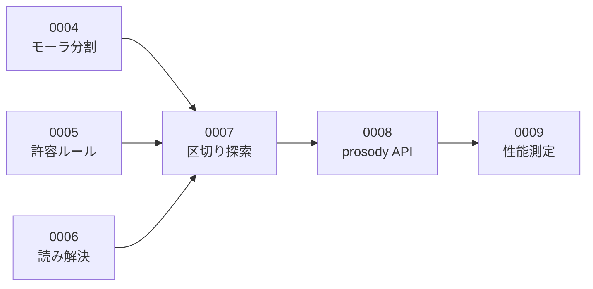

# Issue 起票ドラフト

このディレクトリは **GitHub Issues に起票する前の下書き** を置く場所です。

## 使い方

1. ここのファイルを1つ開く
2. 冒頭のメタ情報（タイトル・ラベル・マイルストーン）を GitHub の Issue 作成画面に転記する
3. `---` から下の本文をそのまま Issue の本文欄に貼り付ける
4. 起票したら、このファイルの先頭に Issue 番号（`#12` など）を追記する

> **1ファイル = 1 Issue** です。ファイルの中身は加工せずそのまま貼れる状態に保ちます。

## ファイル名の付け方

```
NNNN-種別-短い説明.md
```

`NNNN` はこのディレクトリ内での連番です（GitHub の Issue 番号とは一致しません）。

例: `0007-feat-implement-mora-counter.md`

## 種別

| 種別 | 用途 | ラベル |
| --- | --- | --- |
| `spec` | 仕様の検討・決定 | `spec` |
| `feat` | 機能の実装 | `feature` |
| `fix` | 不具合の修正 | `bug` |
| `docs` | ドキュメントの作成・更新 | `documentation` |
| `infra` | 環境構築・CI/CD | `infrastructure` |
| `perf` | 性能改善 | `performance` |
| `chore` | その他の雑務 | `chore` |

タイトルの時点で「これは何のチケットか」が一目で分かるよう、
種別を接頭辞としてタイトルにも付けます。

```
feat: モーラ数カウンタを実装する
fix: 促音が含まれる句のモーラ数が1つ多く数えられる
spec: 字余り・字足らずの許容範囲を決める
```

---

## テンプレート

### 実装チケット（`feat` / `fix` / `infra` など）

```markdown
## 背景・目的

<!-- なぜこれをやるのか。誰が困っているのか。やらないとどうなるか -->

## やること

<!-- 何をするのか。作業の範囲を明確に -->

- [ ]
- [ ]

## 完了条件

<!-- 「どうなったら終わりか」を検証可能な形で。曖昧な表現を使わない -->

- [ ]
- [ ]

## やらないこと

<!-- スコープ外を明示する。書かないと際限なく膨らむ -->

## 参考

<!-- 関連する設計ドキュメント・ADR・他の Issue へのリンク -->
```

### 不具合チケット（`fix`）

不具合の場合は上記に加えて、**再現に必要な情報をすべて** 記載します。
「一部を抜粋したエラーメッセージ」では原因の切り分けができません。

```markdown
## 何が起きたか

## 期待する挙動

## 再現手順

1.
2.
3.

## 発生環境

| 項目 | 値 |
| --- | --- |
| OS / バージョン |  |
| ブラウザ / バージョン |  |
| サービス / バージョン |  |
| 発生日時 |  |

## エラーログ・スクリーンショット

<!-- 全文を貼る。抜粋しない -->

## 切り分けの経過

<!-- 仮説と検証を時系列で。ここが最も重要 -->
```

---

## 書くときのルール

### 完了条件は検証可能に書く

| ❌ 悪い例 | ✅ 良い例 |
| --- | --- |
| モーラ数が正しく数えられること | 拗音・促音・撥音・長音を含む30件のテストケースがすべて通ること |
| 高速に動作すること | 判定 API のレスポンスタイムが P95 で 150ms 未満であること |
| ちゃんとエラーになること | 破調の本文を POST したとき HTTP 422 と判定内訳が返ること |

### 検討の経過はコメント欄に残す

Issue の本文（概要欄）は、**最新の状態に更新し続ける**ものです。
一方で「どう考えて、何を試して、なぜその結論に至ったか」は、
コメント欄に**時系列で追記**します。

本文を上書きしてしまうと経過が消えます。
経過が消えたチケットは、後から読んでも「結論だけあって理由が分からない」状態になります。

大きな設計判断に至った場合は、コメントに残したうえで
[ADR](../adr/README.md) に清書します。

### 双方向にリンクする

- Issue 本文 → 関連する設計ドキュメント・ADR へのリンク
- コミットメッセージ → `#12` の形式で Issue 番号を記載
- Pull Request → 対応する Issue へのリンク
- Issue → 対応する Pull Request へのリンク

片方向だけだと、逆から辿れなくなります。

---

## 一覧

### M0 開発基盤

| # | 種別 | タイトル | 起票済み |
| --- | --- | --- | :---: |
| [0001](0001-spec-design-phase-record.md) | `spec` | 要件定義・基本設計・詳細設計を行う | [#1](https://github.com/yama-shu/575-sns/issues/1) |
| [0002](0002-infra-local-dev-environment.md) | `infra` | docker compose でローカル開発環境を構築する | [#2](https://github.com/yama-shu/575-sns/issues/2) |
| [0003](0003-infra-ci-pipeline.md) | `infra` | CI パイプラインを構築する | [#3](https://github.com/yama-shu/575-sns/issues/3) |

### M1 判定エンジン

依存関係があるため、この順に着手する。

| # | 種別 | タイトル | 依存 | 起票済み |
| --- | --- | --- | --- | :---: |
| [0004](0004-feat-mora-counter.md) | `feat` | モーラ分割・カウント処理を実装する | — | [#4](https://github.com/yama-shu/575-sns/issues/4) |
| [0005](0005-feat-tolerance-rule.md) | `feat` | 五七五の許容ルール判定を実装する | — | [#5](https://github.com/yama-shu/575-sns/issues/5) |
| [0006](0006-feat-tokenizer-and-reading-resolver.md) | `feat` | 形態素解析の抽象化と読み解決を実装する | — | [#6](https://github.com/yama-shu/575-sns/issues/6) |
| [0007](0007-feat-segment-searcher.md) | `feat` | 五七五の区切り探索を実装する | 0004, 0005, 0006 | [#7](https://github.com/yama-shu/575-sns/issues/7) |
| [0008](0008-feat-prosody-api.md) | `feat` | prosody の判定 API とヘルスチェックを実装する | 0007 | [#8](https://github.com/yama-shu/575-sns/issues/8) |
| [0009](0009-perf-prosody-benchmark.md) | `perf` | 判定エンジンの性能を測定し NFR-01-01 を検証する | 0008 | [#9](https://github.com/yama-shu/575-sns/issues/9) |



0004・0005・0006 は互いに独立しているため、並行して着手できる。

### M2 API 基盤（起票済みのもの）

| # | 種別 | タイトル | 起票済み |
| --- | --- | --- | :---: |
| — | `feat` | データベースのスキーマとマイグレーション基盤を実装する | [#20](https://github.com/yama-shu/575-sns/issues/20) |
| [0010](0010-feat-authentication.md) | `feat` | 認証（登録・ログイン・ログアウト・セッション）を実装する | [#25](https://github.com/yama-shu/575-sns/issues/25) |

### M5 公開（起票済みのもの）

| # | 種別 | タイトル | 起票済み |
| --- | --- | --- | :---: |
| — | `docs` | ホスティング先を ConoHa VPS 単一ノードへ変更する | [#19](https://github.com/yama-shu/575-sns/issues/19) |

> **#19 / #20 にはドラフトがない。** GitHub 上で直接起票したため、
> `#` 欄が空になっている。以降はドラフトを作ってから起票する。

---

## 未起票のバックログ

以下は着手が近づいた時点でドラフトを作成する。
**先に全部を詳細化しない。** 前のマイルストーンの結果で内容が変わるため、
早く書いた分だけ書き直しになる。

### M2 API 基盤

| 種別 | タイトル |
| --- | --- |
| `feat` | prosody クライアントを実装する（タイムアウト / リトライ / サーキットブレーカー） |
| `feat` | 投稿の作成・取得・削除を実装する |
| `feat` | レート制限を実装する（[NFR-04-05](../requirements/01-requirements.md#nfr-04-セキュリティ) / [基本設計 05](../design/basic/05-api.md#レート制限)） |
| `chore` | 期限切れセッションを削除する定期ジョブを実装する |

> **レート制限は先に ADR が必要になる可能性が高い。**
> [基本設計 05](../design/basic/05-api.md#レート制限) は制限値を定めているが、実装方法を定めていない。
> プロセス内のカウンタで実装すると、複数インスタンスでは合計が制限値の N 倍になり、
> [NFR-03-02](../requirements/01-requirements.md#nfr-03-拡張性)（サーバーのメモリに状態を持たない）にも反する。
> 対象エンドポイントは M2（`auth` / `prosody/check` / `posts`）と
> M3（その他 300回/分）にまたがるため、M2 で仕組みを作り M3 で対象を追加する。

### M3 タイムラインと交流

| 種別 | タイトル |
| --- | --- |
| `feat` | タイムライン取得（全体 / フォロー中）を実装する |
| `perf` | タイムラインの実行計画を確認しインデックスの効果を検証する |
| `feat` | いいねを実装する（アトミックな件数更新） |
| `feat` | フォロー・アンフォローを実装する |
| `feat` | 通報・ブロックを実装する |

### M4 画面

| 種別 | タイトル |
| --- | --- |
| `feat` | 投稿作成画面を実装する（リアルタイム判定・デバウンス） |
| `feat` | タイムライン画面を実装する（無限スクロール） |
| `feat` | 投稿詳細・ユーザーページを実装する |
| `feat` | ログイン・登録・プロフィール編集を実装する |
| `feat` | 運営向けの通報一覧を実装する |

### M5 公開

[ADR-0007 の移行計画](../adr/0007-hosting-conoha-vps.md#6-決定)にもとづき、時期で分ける。
現行 1 GB の契約更新日（2026-09-11）に合わせて移設するため、
それまでは **1 GB のまま進められる作業を前倒しする**。

#### 第1期（2026-08-09 〜 09-07）— 現行 1 GB とローカルで進める

| 種別 | タイトル |
| --- | --- |
| `infra` | ドメインと DNS の扱いを決める（取得済みドメインのサブドメインを使うか） |
| `infra` | **K8s マニフェストをローカルの kind / k3d で作成し実証する**（`resources` 必須。`replicas` を決め打ちにしない） |
| `infra` | CD パイプラインを構築する（GitHub Actions → GHCR → VPS が pull） |
| `infra` | Cloudflare・R2・Sentry を準備する |
| `infra` | docker compose + Caddy で暫定公開し、Let's Encrypt で HTTPS 化する |

#### 移行（2026-09-08 頃）

| 種別 | タイトル |
| --- | --- |
| `infra` | ConoHa VPS 2 GB を**新規契約**し（軽量 OS）、oil_game と 575 を移設する |

#### 第2期（2026-09-11 以降）— 2 GB

| 種別 | タイトル |
| --- | --- |
| `infra` | 旧 1 GB を解約する |
| `infra` | VPS に k3s（単一ノード）を構築し、第1期のマニフェストを適用する |
| `infra` | 監視（Prometheus + Grafana）を構築し、エラー収集を Sentry に繋ぐ |
| `perf` | 本番構成で性能を再測定する |
| `infra` | DB のバックアップ（pg_dump → Cloudflare R2）とリストア手順を整備し、実際にリストアを訓練する |

---

## 関連ドキュメント

- [ドキュメント地図](../README.md)
- [要件定義書](../requirements/01-requirements.md)
- [ADR 一覧](../adr/README.md)
