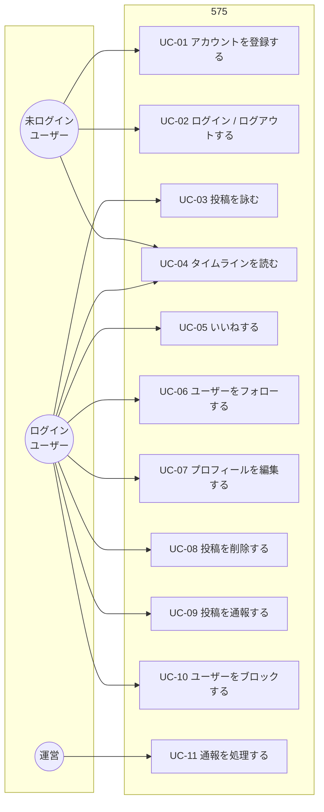
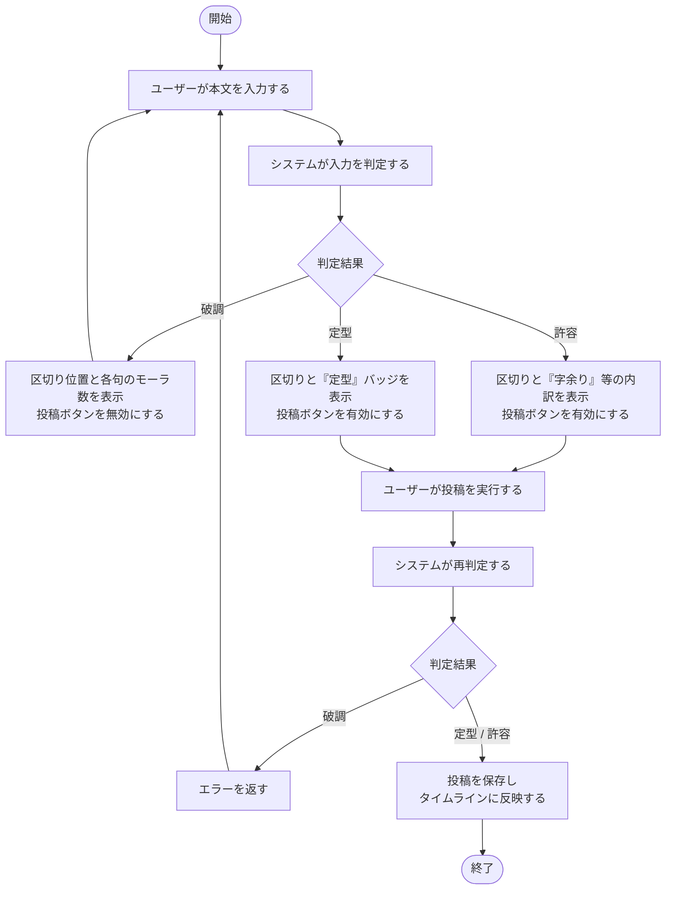

# 575 要件定義書

| 項目 | 内容 |
| --- | --- |
| ドキュメント種別 | 要件定義書 |
| プロダクト名 | 575（ゴーシチゴー） |
| バージョン | 0.1 |
| 状態 | ドラフト（レビュー前） |
| 最終更新 | 2026-08-06 |

## 目次

- [1. このドキュメントについて](#1-このドキュメントについて)
- [2. 背景と課題](#2-背景と課題)
- [3. コンセプト](#3-コンセプト)
- [4. ターゲットユーザー](#4-ターゲットユーザー)
- [5. スコープ](#5-スコープ)
- [6. ユースケース](#6-ユースケース)
- [7. 機能要件](#7-機能要件)
- [8. 非機能要件](#8-非機能要件)
- [9. 制約と前提](#9-制約と前提)
- [10. 未決事項](#10-未決事項)
- [用語集](#用語集)

---

## 1. このドキュメントについて

本書は 575 が **何を実現するか** を定義する。
**どう実現するか**（アーキテクチャ・技術選定・アルゴリズム）は基本設計・詳細設計で扱い、
本書では扱わない。

決定に至る検討の経緯は [ADR](../adr/README.md) に分離して記録する。
本書には決定した結論のみを書く。

---

## 2. 背景と課題

### 2.1 既存 SNS で起きていること

一般的なテキスト SNS は投稿長の上限こそあれ、**形式上の制約はほぼ無い**。
その結果として、以下が観測される。

| 課題 | 内容 |
| --- | --- |
| 投稿の衝動性 | 思いついたことを推敲なく即座に投稿できる。感情的な投稿・攻撃的な投稿が生まれやすい |
| 読む側の負荷 | 1投稿あたりの情報量が不揃いで、タイムラインを読み続けるコストが高い |
| 創作性の欠如 | 「書く」こと自体には何の面白さもなく、内容の面白さだけが勝負になる |

### 2.2 仮説

**形式に強い制約を課すと、上記3点が同時に改善する。**

- 五七五に収めるには必ず推敲が要る → 衝動的な投稿が物理的に不可能になる
- 全投稿がほぼ同じ長さになる → タイムラインが均質になり、読む負荷が下がる
- 制約そのものがゲームになる → 「書く」行為に面白さが生まれる

制約として五七五を選ぶ理由は、日本語話者にとって
**学習コストがゼロに近い唯一の詩形**であるため。ルール説明が不要で、
誰もが「なんとなく分かる」状態から始められる。

### 2.3 このプロダクトが俳句 SNS ではない理由

俳句には季語・切れ字・文語といった規範があり、これらは**学習コストが高い**。
それを課した時点で 2.2 の前提（学習コストがゼロ）が崩れ、既存の俳句コミュニティの
焼き直しになる。

575 が課す制約は **音数律だけ** とする。投稿内容は仕事の愚痴でも、
昼食の報告でも、政治的でない限り何でもよい。

---

## 3. コンセプト

> **言いたいことは、五七五で。**

日常のつぶやきを五七五に押し込める SNS。

### 3.1 プロダクトの中核

575 の中核は **五七五判定エンジン** である。
「投稿できる／できない」を機械的に判定するこの機能の品質が、プロダクトの価値を直接決める。

判定は次の3値を返す。

| 判定 | 意味 | 投稿 |
| --- | --- | --- |
| **定型** | 5 / 7 / 5 に過不足なく区切れる | 可（バッジ付与） |
| **許容** | 字余り・字足らずが許容範囲に収まる | 可 |
| **破調** | 許容範囲を超える | **不可** |

許容範囲の具体的な数値は [ADR-0001](../adr/0001-onsuritsu-tolerance.md) で定義する。

### 3.2 判定エンジンに対する品質要求

判定エンジンは 100% 正確にはなり得ない。日本語の読みは文脈依存であり、
「一日」が「イチニチ」か「ツイタチ」かは機械には確定できない。

したがって次を要件とする。

- **偽陽性（本当は破調なのに通す）より、偽陰性（本当は定型なのに弾く）の方が有害** とする。
  ユーザーが正しく詠んだ句を弾かれる体験は、離脱に直結する。
- 判定結果は**必ずユーザーに開示する**（どこで区切ったか、各句が何モーラか）。
  ブラックボックスにしない。
- 読みの推定が誤っている場合、**ユーザーが読みを手動で修正できる**手段を用意する。

---

## 4. ターゲットユーザー

### 4.1 想定する利用者

#### U1: 五七五で表現したい人

- 川柳・俳句に親しみがある
- 思いついた句を出す場を求めている
- 形式が共有されない場では反応が得られにくい

#### U2: 短い言葉で読み書きしたい人

- 情報量の多いタイムラインを負担に感じる
- 長文のやり取りを避けたい

#### U3: 制約のある表現を楽しむ人

- 言葉遊び・大喜利など、決まりのある創作を好む
- 「この内容を17音に収める」こと自体を楽しむ

### 4.2 ターゲット外

- 俳句の作法を学びたい人（季語・切れ字の指導は行わない）
- 長文で議論をしたい人（構造的に不可能）
- 日本語以外での投稿を求める人（音数律が日本語固有のため、初版では非対応）

---

## 5. スコープ

### 5.1 MVP（初版リリースに含める）

「**1人で投稿して、他人の投稿を読んで、反応できる**」までを最小の価値とする。
これが成立しなければ SNS として動作しないため、これ未満には削れない。

- アカウント登録・ログイン
- 五七五判定つきの投稿
- タイムライン閲覧（全体／フォロー中）
- いいね
- フォロー
- ユーザーページ
- 通報・ブロック（UGC を扱う以上、初版から必須）

### 5.2 MVP 以降（第2版以降で検討）

- 返歌（投稿への返信。返信も五七五である必要がある）
- お題機能（週替わりのテーマ）
- 全文検索
- 通知
- 読みの手動修正 UI
- モバイルアプリ
- 画像の投稿

### 5.3 スコープ外（当面やらない）

| 項目 | 理由 |
| --- | --- |
| 動画の投稿 | 「言葉だけで勝負する」というコンセプトに反する |
| DM（個人間メッセージ） | 運営負荷（通報対応）に対して価値が見合わない |
| 日本語以外の言語 | 音数律が日本語固有。他言語は別プロダクトとして考えるべき |
| 収益化（広告・課金） | 初版は検証が目的。ユーザー数が一定に達してから検討する |

---

## 6. ユースケース

未ログインユーザーも UC-04（タイムライン閲覧）は可能とする。
登録前に「どんな場なのか」を見られないと、登録の判断ができないため。

### UC-03「投稿を詠む」の詳細フロー

本プロダクトの中核となるユースケースのため、ここだけ詳細に記述する。

**A8 で再判定する理由**: A2 の判定は入力体験のために行うものであり、
クライアント側の表示を信用して保存してはならない。保存前にサーバー側で必ず再判定する。
詳細は基本設計で扱う。

---

## 7. 機能要件

優先度は MoSCoW 法による。
**Must** = MVP に必須、**Should** = MVP に入れたい、**Could** = 第2版以降、**Won't** = 当面やらない。

### FR-01 アカウント

| ID | 要件 | 優先度 |
| --- | --- | --- |
| FR-01-01 | ユーザーはメールアドレスとパスワードでアカウントを登録できる | Must |
| FR-01-02 | ユーザーはログイン・ログアウトできる | Must |
| FR-01-03 | ユーザーは表示名・自己紹介・アイコンを設定できる。自己紹介は五七五である必要はない | Must |
| FR-01-04 | ユーザーはアカウントを削除できる。削除時は投稿も併せて削除される | Should |
| FR-01-05 | ユーザーはパスワードを再設定できる | Should |

### FR-02 投稿（詠む）

| ID | 要件 | 優先度 |
| --- | --- | --- |
| FR-02-01 | システムは入力された本文が五七五に収まるかを判定し、**定型／許容／破調** の3値を返す | Must |
| FR-02-02 | システムは判定結果とともに、**句の区切り位置と各句のモーラ数**を返す | Must |
| FR-02-03 | ユーザーは入力中にリアルタイムで判定結果を確認できる | Must |
| FR-02-04 | ユーザーは判定が**定型または許容**の場合にのみ投稿できる | Must |
| FR-02-05 | システムは投稿の保存前にサーバー側で判定を再実行し、破調の投稿を拒否する | Must |
| FR-02-06 | 投稿には判定結果（定型／許容）と区切り位置が保存され、表示時に利用される | Must |
| FR-02-07 | ユーザーは自分の投稿を削除できる。投稿の編集はできない | Must |
| FR-02-08 | ユーザーは投稿ごとに公開範囲（全体公開／フォロワーのみ）を選べる | Should |
| FR-02-09 | システムが推定した読みが誤っている場合、ユーザーは読みを手動で修正できる | Could |
| FR-02-10 | ユーザーは他の投稿に対して返歌（五七五での返信）ができる | Could |

**FR-02-07 で編集を許さない理由**: 編集を許すと、いいねが付いた後に内容を差し替える
なりすまし的な使い方が可能になる。また「一度詠んだら直せない」制約は、
2.2 の「推敲を促す」という狙いと整合する。

### FR-03 閲覧

| ID | 要件 | 優先度 |
| --- | --- | --- |
| FR-03-01 | ユーザーは全体タイムライン（全公開投稿の新着順）を閲覧できる | Must |
| FR-03-02 | ユーザーはフォロー中タイムライン（フォローしたユーザーの投稿）を閲覧できる | Must |
| FR-03-03 | タイムラインは無限スクロールで過去に遡れる | Must |
| FR-03-04 | ユーザーは投稿詳細ページを閲覧できる | Must |
| FR-03-05 | ユーザーは任意のユーザーページ（投稿一覧・プロフィール）を閲覧できる | Must |
| FR-03-06 | 投稿は句ごとに改行して表示され、区切りが視覚的に分かる | Must |
| FR-03-07 | ユーザーは投稿を全文検索できる | Could |

### FR-04 交流

| ID | 要件 | 優先度 |
| --- | --- | --- |
| FR-04-01 | ユーザーは投稿にいいねできる。取り消しもできる | Must |
| FR-04-02 | ユーザーは他ユーザーをフォロー・アンフォローできる | Must |
| FR-04-03 | ユーザーは自分のフォロー・フォロワー一覧を閲覧できる | Must |
| FR-04-04 | ユーザーはいいね・フォローを通知として受け取れる | Could |

### FR-05 健全性

| ID | 要件 | 優先度 |
| --- | --- | --- |
| FR-05-01 | ユーザーは投稿を通報できる。通報理由を選択できる | Must |
| FR-05-02 | ユーザーは他ユーザーをブロックできる。ブロックしたユーザーの投稿は表示されない | Must |
| FR-05-03 | 運営は通報された投稿を確認し、非表示化できる | Must |
| FR-05-04 | 運営はユーザーを利用停止にできる | Should |

**FR-05 を MVP から外せない理由**: UGC（ユーザー生成コンテンツ）を扱うサービスは、
公開した時点で不適切投稿への対処義務が発生する。将来モバイルアプリとして配信する場合、
主要なアプリストアのガイドラインでも通報・ブロック機能は審査上の必須要件になる。
後付けは事実上不可能なため初版に含める。

---

## 8. 非機能要件

### NFR-01 性能

| ID | 要件 | 目標値 | 根拠 |
| --- | --- | --- | --- |
| NFR-01-01 | 五七五判定のレスポンスタイム | P95 < 150ms | 入力中にリアルタイム実行するため。150ms を超えると「引っかかる」体感になる |
| NFR-01-02 | タイムライン取得のレスポンスタイム | P95 < 300ms | 一般的な Web ページの体感許容範囲 |
| NFR-01-03 | 同時接続ユーザー数 | 1,000 | 初版の想定規模。スケールアウトで拡張可能な設計とする |

判定はデバウンス（入力停止後に実行）を前提とし、キーストロークごとには実行しない。

### NFR-02 可用性

| ID | 要件 | 目標値 |
| --- | --- | --- |
| NFR-02-01 | サービス稼働率 | 99.5%（月間ダウンタイム 3.6時間以内） |
| NFR-02-02 | 単一サーバーの障害でサービス全体が停止しないこと | 冗長構成を前提とする |
| NFR-02-03 | 判定エンジンが停止した場合、閲覧機能は継続して利用できること | 投稿のみ不可となる縮退運転 |

**NFR-02-03 の意図**: 判定エンジンは 575 の中で最も重い処理であり、
最初に落ちる可能性が高い。ここが落ちたときにタイムラインまで見られなくなる設計は避ける。

### NFR-03 拡張性

| ID | 要件 |
| --- | --- |
| NFR-03-01 | アプリケーションサーバーはステートレスとし、水平スケールできること |
| NFR-03-02 | セッション・キャッシュ等の状態はサーバーのメモリ・ローカルストレージに保持しないこと |
| NFR-03-03 | 判定エンジンとアプリケーションサーバーは独立してスケールできること |

**NFR-03-03 の意図**: 判定は CPU バウンド、タイムライン取得は I/O バウンドで、
負荷特性がまったく異なる。同一プロセスに同居させるとスケール単位を分けられない。

### NFR-04 セキュリティ

| ID | 要件 |
| --- | --- |
| NFR-04-01 | パスワードはソルト付きハッシュで保存する。平文・可逆暗号での保存を行わない |
| NFR-04-02 | 全通信を HTTPS とする |
| NFR-04-03 | SQL インジェクション対策として、クエリは必ずプレースホルダを用いる |
| NFR-04-04 | XSS 対策として、ユーザー入力は表示時に必ずエスケープする |
| NFR-04-05 | 認証・投稿・判定の各 API にレート制限を設ける |
| NFR-04-06 | すべての外部入力（クエリパラメータ・リクエストボディ）にバリデーションを行う |
| NFR-04-07 | 認証情報・秘密鍵をリポジトリにコミットしない |

### NFR-05 保守性・運用性

| ID | 要件 |
| --- | --- |
| NFR-05-01 | ログは構造化データ形式で出力し、監視システムで解析可能にする |
| NFR-05-02 | エラーログには発生箇所を特定できる情報（タイムスタンプ・スタックトレース・リクエスト ID）を含める |
| NFR-05-03 | 想定外のエラーは運営に通知される仕組みと連携できる設計とする |
| NFR-05-04 | 単体テストのカバレッジ（C1）は 80% 以上を目標とする。判定エンジンは 100% を目標とする |
| NFR-05-05 | 開発環境は新規参加者が初日に構築でき、壊れても初日に復旧できること |

**NFR-05-04 で判定エンジンだけ 100% を求める理由**: 判定エンジンはプロダクトの
中核であり、かつ入出力が純粋関数的（入力文字列 → 判定結果）でテストしやすい。
ここでカバレッジを妥協する技術的理由がない。

### NFR-06 ユーザビリティ

| ID | 要件 |
| --- | --- |
| NFR-06-01 | スマートフォンでの利用を主とし、レスポンシブ対応する |
| NFR-06-02 | 判定結果は「なぜ投稿できないか」が分かる形で提示する。単に「エラー」とだけ表示しない |
| NFR-06-03 | 主要な操作はキーボードのみで完結できる |

---

## 9. 制約と前提

| ID | 内容 |
| --- | --- |
| C-01 | 開発は1名で行う。工数見積もりはこれを前提とする |
| C-02 | 日本語のみを対象とする。多言語対応は行わない |
| C-03 | 読みの推定精度には原理的な上限があり、100% にはならない（[3.2](#32-判定エンジンに対する品質要求) 参照） |
| C-04 | 初版は収益化を行わない。インフラ・ツールは **OSS のセルフホストまたは恒久的な無料枠を優先** し、有償サービスは代替手段がない場合に限って採用する。期間限定の無料トライアルに依存する構成は取らない |
| C-05 | 技術選定を行う際は、評価軸に必ず費用を含め、「無料枠で足りるか」「無料枠を超えたとき何が起きるか」まで検討する |

---

## 10. 未決事項

本書の時点で決まっていなかった事項と、その決着状況。
決定はすべて [ADR](../adr/README.md) に記録する。

| ID | 事項 | 状態 | 決定内容 |
| --- | --- | --- | --- |
| Q-01 | 字余り・字足らずの許容範囲の具体的な数値 | ✅ 決定 | [ADR-0001](../adr/0001-onsuritsu-tolerance.md) — 各句 4〜6 / 6〜8 / 4〜6 かつズレは最大1句 |
| Q-02 | 使用する言語・フレームワーク | ✅ 決定 | [ADR-0002](../adr/0002-tech-stack.md) — web(TypeScript) / api(Go) / prosody(Python) の3サービス |
| Q-03 | 形態素解析器の選定 | ✅ 決定 | [ADR-0003](../adr/0003-morphological-analyzer.md) — SudachiPy + SudachiDict-core |
| Q-04 | タイムラインの実現方式（Pull 型 / Push 型） | ✅ 決定 | [ADR-0005](../adr/0005-timeline-strategy.md) |
| Q-05 | 認証方式（セッション / JWT） | ✅ 決定 | [ADR-0006](../adr/0006-authentication.md) |
| Q-06 | ホスティング先とインフラ構成 | ✅ 決定 | [ADR-0007](../adr/0007-hosting-conoha-vps.md) — ConoHa VPS 2 GB + 単一ノード k3s（[ADR-0004](../adr/0004-hosting-and-infrastructure.md) を置換） |
| Q-07 | モーラの具体的な数え方（拗音・促音・撥音・長音・数字・英字） | ✅ 決定 | [詳細設計: 判定アルゴリズム](../design/detail/01-prosody-algorithm.md) |
| Q-08 | 区切り位置の探索方法 | ✅ 決定 | [詳細設計: 判定アルゴリズム](../design/detail/01-prosody-algorithm.md) |

---

## 用語集

本リポジトリ全体で使用する用語を定義する。他ドキュメントはここへリンクする。

### 音数律に関する用語

| 用語 | 読み | 定義 |
| --- | --- | --- |
| **モーラ** | — | 日本語における音の長さの単位。「拍」とも言う。仮名1文字がおおむね1モーラだが、拗音（キャ・キュ・キョ等）は2文字で1モーラ、促音「ッ」・撥音「ン」・長音「ー」はそれぞれ1モーラとして数える。例:「東京」＝トウキョウ＝**4モーラ** |
| **音数律** | おんすうりつ | 詩において、各行のモーラ数を一定の型に揃える規則。五七五は日本語の代表的な音数律 |
| **句** | く | 五七五を構成する3つのまとまり。それぞれ**上五**（かみご）・**中七**（なかしち）・**下五**（しもご）と呼ぶ |
| **定型** | ていけい | 上五5・中七7・下五5 に過不足なく収まっている状態 |
| **字余り** | じあまり | 句のモーラ数が規定より多い状態 |
| **字足らず** | じたらず | 句のモーラ数が規定より少ない状態 |
| **破調** | はちょう | 字余り・字足らずが許容範囲を超えた状態。575 では投稿を拒否する |
| **区切り** | くぎり | 本文を上五・中七・下五に分割する位置 |
| **読み** | よみ | 表記された本文を音として読み下したもの。モーラ数を数えるにはまず読みを確定する必要がある |
| **形態素解析** | けいたいそかいせき | 文を意味を持つ最小単位（形態素）に分割し、品詞や読みを付与する処理 |

### プロダクトに関する用語

| 用語 | 定義 |
| --- | --- |
| **詠む**（よむ） | 575 において投稿することを指す。UI 上の表記も「投稿する」ではなく「詠む」を用いる |
| **返歌**（へんか） | 他ユーザーの投稿に対する、五七五での返信。第2版以降の機能 |
| **判定エンジン** | 本文を受け取り、定型／許容／破調の判定と区切り位置を返すコンポーネント |
| **タイムライン** | 投稿を時系列で並べた一覧。全体タイムラインとフォロー中タイムラインの2種類がある |

---

## 関連ドキュメント

- [ドキュメント地図](../README.md)
- [ADR 一覧](../adr/README.md)
- [Issue 起票ドラフト](../issues/README.md)
